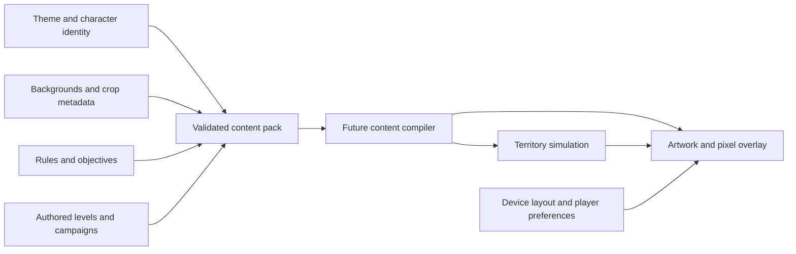

# Xonix content authoring kit

Version 0.1.0 · 12 September 2026

A reusable foundation for **FPV FRONT**, **UKRAINE ATLAS**, **1994 FOREVER**, **NAVI NETWORK**, and future families. It contains nine AI-agent skills, 124 prompt templates (56 base, 16 asset variations, 16 animation variants, 16 character-collection templates and 20 ability/world templates), four draft content packs, a versioned schema and primitive catalog, and working local authoring checks. The base catalog also contains 28 additional variation options.

The authoring tools exist and run. The [media library tool](media/README.md) imports originals, registers derivatives and binds visual variants. Four media templates contain 108 planned assets and 124 bindings, separate from the four game-content draft packs. An [actual concept library](library/round-06-fpv/README.md) demonstrates source/derivative registration. The territory simulation, level editor, procedural generator, platform builds and production asset collection are still to be implemented. Current packs describe planned assets; the concept boards are visual references, not exported game assets.

## Start here

| Need | Open |
|---|---|
| Understand the current direction and next proof | [Round 09 classes and world](../docs/round-09-classes-and-world.md) · [Deeper gameplay plan](../docs/round-08-gameplay-plan.md) |
| Create or revise a theme | [Theme Designer](skills/xonix-theme-designer/SKILL.md) |
| Generate/edit backgrounds, sprites, UI, effects or marketing art | [Asset Creator](skills/xonix-asset-creator/SKILL.md) |
| Preserve/import supplied art or create optional styled variants | [Background Stylist](skills/xonix-background-stylist/SKILL.md) · [Working media CLI](media/README.md) |
| Design levels, difficulty and objectives | [Level Designer](skills/xonix-level-designer/SKILL.md) |
| Plan music, stems and sound effects | [Audio Director](skills/xonix-audio-director/SKILL.md) |
| Plan modular animation and inspect playback | [Animation Director](skills/xonix-animation-director/SKILL.md) · [Motion lab](motion-lab/README.md) |
| Organize selectable/earned characters and apply cosmetic variants | [Character Collection](skills/xonix-character-collection/SKILL.md) · [Collection prompt guide](prompts/round-08-character-collections.md) |
| Design classes, equipment and supported ability variations | [Ability Designer](skills/xonix-ability-designer/SKILL.md) · [Ability/world prompt guide](prompts/round-09-abilities-and-world.md) |
| Inspect packs and distinguish readiness from proposals | [Pack Reviewer](skills/xonix-pack-reviewer/SKILL.md) |
| Select an exact reusable prompt | [Prompt guide](prompts/README.md) · [JSON catalog](prompts/catalog.json) |
| Understand accepted data and extension boundaries | [Contract](CONTRACT.md) · [Schema](schema/content-pack.schema.json) · [Primitives](schema/primitive-catalog.json) |
| Review test evidence and limitations | [Round 09 authoring checks](evaluations/round-09-authoring-checks.md) · [Round 08 authoring checks](evaluations/round-08-authoring-checks.md) · [Skill forward test](evaluations/round-04-forward-test.md) |

## Use the skills

The source skills live here so they can evolve with the contract. The installer links these nine unique names into the user's Codex skill directory, without replacing any existing path. The default is `$CODEX_HOME/skills`, or `~/.codex/skills` when that variable is unset. This kit's installation was performed locally; a client may need to refresh its skill catalog before newly installed skills appear.

```sh
python3 authoring/install-skills.py
python3 authoring/install-skills.py --install
```

Examples to give an AI agent, with this project as the working directory:

> Use $xonix-theme-designer to make a Winter Signal chapter for FPV Front: six reveal pictures of fictional invading military vehicles in snowy Ukrainian rural and industrial scenes. Preserve the existing capture rules and drone identity.

> Use $xonix-asset-creator to create three FPV player silhouette concepts, then compare the chosen design against bright snow and dark fog. Keep the outputs labeled as concepts until actual sprite exports are inspected.

> Use $xonix-theme-designer to make a Carpathian Ukraine Atlas chapter with watercolor and sourced archival-photo backgrounds. Preserve the source ruleset and level geometry, and keep original photographs intact.

> Use $xonix-asset-creator to explore a warm 1990s computer-room chapter and a separate FM-synth space chapter. Give each its own palette while keeping the same player and threat roles.

> Use $xonix-level-designer to create a five-level Navi Network draft campaign about fictional cost leaks and savings, using only the current primitive catalog. Put unsupported mechanics in an extension brief.

> Use $xonix-audio-director to prepare three original music directions for Daybreak Front, with cues for leaving safety, closing a cut, danger and discovery. Distinguish composition briefs from actual audio output.

> Use $xonix-animation-director to plan a smaller FPV silhouette with separate body, rotors, trail and effects. Compare compact, detailed and hybrid terrain on the same geometry and motion trace. Specify interruption, pause and reduced-effects behavior, then report which actual previews were played and reviewed.

> Use $xonix-character-collection to review the four-family starter/earned roster. Apply a requested cosmetic using its stable character ID, test context selection and explicitly simulated unlock fixtures, and inspect the visible switch. Keep stats unchanged and record missing asset or playback evidence.

> Use $xonix-ability-designer to try a three-charge heavy carrier with a smaller fictional fiber budget in an isolated copy of the ability-lab data. Validate the actual registry, test pickup, spending, cooldown and both turn policies, and keep the body choice and collection rewards unchanged. Put unsupported mechanics in a separate proposal.

> Use $xonix-pack-reviewer to inspect the four example packs. Report data validity, asset review, runtime evidence and remaining design hypotheses separately.

## Find and fill prompts

These commands run locally and do not call a model or generate media. `show` includes reference requirements and variations. `render` fills the template and rejects missing, duplicate or unknown variables.

```sh
python3 authoring/prompt.py list --family fpv-front
python3 authoring/prompt.py list --type style_conversion
python3 authoring/prompt.py show shared-04-style-painterly
python3 authoring/prompt.py show animation-02-state-contract
python3 authoring/prompt.py show collection-03-three-blade-recipe
python3 authoring/prompt.py show collection-14-gameplan-review
python3 authoring/prompt.py show ability-03-bomber-pickup-drop
python3 authoring/prompt.py show ability-15-four-theme-remap
python3 authoring/prompt.py render fpv-02-reveal-art --set 'SCENE=fictional invading military trucks at a snowy rail siding at dawn'
```

Adapt template defaults to the requested subject, medium, number of images and level count. A prompt cannot override the contract's accepted fields or create a working new mechanic. Record the final effective prompt and actual references with the [run-record template](prompts/run-record.template.json).

## Validate content

Run commands from the project root. Python 3.9 or newer is required. The authoring CLI needs only the standard library.

```sh
python3 authoring/scripts/validate_pack.py
python3 authoring/scripts/validate_pack.py authoring/examples/fpv-front.pack.json --mode draft --json
python3 authoring/scripts/validate_pack.py --self-test
```

The examples include 41 planned asset entries, five reveal-art descriptions, four rulesets, four levels and four campaigns. Atlas deliberately includes both illustration and photography. They demonstrate expressible data, not playable content.

`--mode ready` intentionally fails on the present drafts. Passing it later will establish the documented metadata/file gate, not successful rendering, legal clearance, hardware performance or enjoyment. The standalone validator supports the checked-in JSON Schema subset and semantic checks; its limits are explicit in the contract.

For new work, copy an example into a new authoring output directory and revise it. Do not run `scripts/build_contract.py` over edited examples: it is a maintainer regeneration utility that overwrites its generated files.

## Keep these choices independent



Theme changes do not redefine capture. Cropping a painting does not move an enemy. Portrait rotation does not change the arena. Input remaps stay with the player. Animation reads declared movement and events; swapping a body, rotor, trail or terrain appearance does not change a collider. Supported rule parameters are editable data; new algorithms require a bounded, versioned extension.

The [motion lab](motion-lab/README.md) is an authoring preview with its own documented capabilities. Consult its actual controls and limitations before using it as evidence. A preview, planned state contract or generated contact sheet does not establish game-runtime integration, complete animation assets, collision correctness or device performance.

The lab's [character collection](motion-lab/collection-presets.json) and [selection/reward evaluator](motion-lab/collection.mjs) are separate from the content-pack and media formats. Starter/earned status, context eligibility, requested selection and loaded visual are different facts. Supplied result fixtures are explicitly simulated in an isolated lab profile. Cosmetic bodies and rotor/wing/thruster/pulse recipes do not grant gameplay stats; three blades per propeller does not mean three rotor hubs.

The [ability definitions](motion-lab/ability-presets.json) and [ability evaluator](motion-lab/ability.mjs) have their own preview format: ten classes share five registered primitives, with radio/fiber equipment and fictional resources. An explicit class or equipment selection can change declared gameplay state; swapping its body or animation cannot. Preserve the selected turn policy when comparing cosmetic variants, and compare different classes as different gameplay experiments. Abstract lab targets do not award captured territory, real level results or collection progress. New primitives still require code and tests.

## Research and visuals

- [Round 09 classes and world](../docs/round-09-classes-and-world.md), [browsable reference atlas](../docs/concepts/round-09-reference-atlas.html), [drone research](../docs/research/round-09-drone-reference.md), [ground/support research](../docs/research/round-09-ground-and-support-reference.md), [20 ability/world templates](prompts/round-09-abilities-and-world.md), and [executed authoring checks](evaluations/round-09-authoring-checks.md). Reference catalogs are curated, not exhaustive or implemented actor rosters.
- [Round 08 character collection](../docs/round-08-character-collection.md), [gameplay plan before logic implementation](../docs/round-08-gameplay-plan.md), [16 collection/recipe prompts](prompts/round-08-character-collections.md), and [executed authoring checks](evaluations/round-08-authoring-checks.md).
- [Round 07 Reloaded UI and motion inspection](../docs/research/round-07-reloaded-ui-motion.md): source-frame evidence for gallery focus, separate active cuts, progress-preserving life loss and sequential picture/results rewards.
- [Round 07 motion and balance direction](../docs/round-07-motion-and-balance.md), [16 animation templates](prompts/round-07-animation-variants.md), [motion lab](motion-lab/README.md), and [executed authoring checks](evaluations/round-07-authoring-checks.md).
- [Round 06 deeper Reloaded audit](../docs/research/round-06-reloaded-observations.md): local video-frame analysis of capture, terrain appearance, erosion, contact pickups and pack gates.
- [Corrected FPV gameplay view](../docs/concepts/round-06-fpv-object-skins.png), [three-chapter asset variations](../docs/concepts/round-06-fpv-asset-variants.png), and [effective prompts/review](../docs/concepts/round-06-review.md).
- [16 new source/asset templates](prompts/round-06-asset-variations.md), [media verification](media/VERIFICATION.md), and [Round 06 combined checks](evaluations/round-06-verification.md).

- [Round 05 direct gameplay inspection](../docs/round-05-gameplay-direction.md): sampled footage from nine videos plus complete located Reloaded, Lightfish and AirXonix official screenshot sets; public SeXoniX stills.
- [Twelve challenge briefs and extension matrix](challenges/round-05-reference-adjustments.md), [shared AI reference lessons](REFERENCE-LESSONS.md), and [17 revised prompts](prompts/round-05-adjustments.md) within the 56-template catalog.
- [New FPV gameplay study](../docs/concepts/round-05-gameplay-study.png), [prompt and review](../docs/concepts/round-05-gameplay-prompt.md), and [Round 05 authoring checks](evaluations/round-05-verification.md).

- [Framework recommendations](../docs/research/round-04-framework-recommendations.md): Phaser 4, mixed texture filtering, masks, memory, editor choices, input and platform proof.
- [Asset workflow research](../docs/research/round-04-asset-workflow.md): Aseprite, cultural sources, semantic art roles, animation and production handoff.
- [Contract sources](../docs/research/round-04-contracts-sources.md): schema and validation rationale.
- [New mixed-media concept](../docs/concepts/round-04-theme-system.png) and [effective prompt/review notes](../docs/concepts/round-04-theme-system-prompt.md).
- [Earlier Xonix/XPOSED research](../docs/research/xonix-and-xposed.md), [engine comparison](../docs/research/engine-and-framework.md), [four-family direction](../docs/round-03-focused-direction.md).
