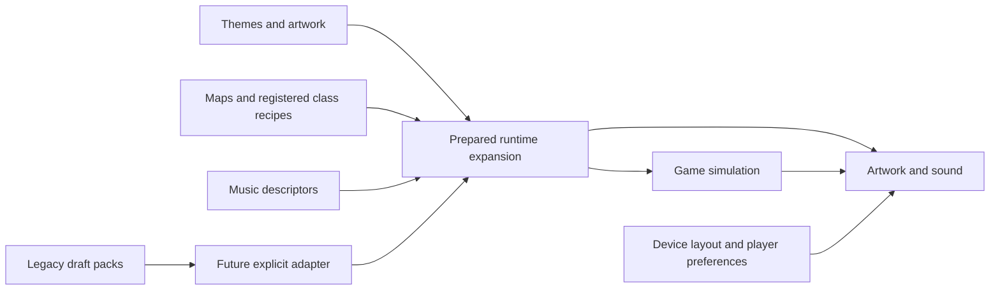

# Xonix content authoring kit

Guide for v0.20 source authoring · 12 September 2026

v0.20 includes [shared couch controller menus](../docs/couch-controller-navigation.md), following v0.19's verified current/saved attempt exports and v0.18's Pack/Level launch controls and gallery-clock repair. The menu increment changes no pack, asset, simulation or portable-session format. [Source gates](../docs/verification/round-29/v020-source-gates.md), [archive verification](../docs/verification/round-29/v020-integrity.md) and [public deployment](../docs/verification/round-29/v020-public.md) record their separate evidence; the [public-release guide](../docs/public-release.md) describes remaining platform limits.

A reusable foundation for **FPV FRONT**, **UKRAINE ATLAS**, **1994 FOREVER**, **NAVI NETWORK**, and future families. It contains **13 AI-agent skills** and **124 shared CLI prompt templates** (56 base, 16 asset variations, 16 animation variants, 16 character-collection templates and 20 ability/world templates), plus four draft content packs, a versioned schema and primitive catalog. The base catalog also contains 28 additional variation options. Reference Importer has [10 prose examples](skills/xonix-reference-importer/references/import-and-style.md), the [library/pack guide](../docs/library-and-packs.md) adds 10 expansion/save workflow prompts, [audio/rewards](../docs/audio-and-rewards.md) adds four prompts, and [controller journeys](prompts/round-15-controller-journeys.md) adds 10 authoring/QA prompts. The [saved-flight workflows](prompts/round-28-attempt-exports.md) add five export, rescue and release-verification prompts. These prose examples are separate from the shared CLI's 124 entries.

The [playable browser game](../game/README.md) includes 29 maps: 12 campaign maps and 17 maps in six installable expansions. It offers seven classes, four worlds, five original synthesized music styles, local scores/saves/gallery, dated challenges and a separate couch race. Homeward Skies and Equipment Workshop provide six authored reward pictures across those 29 maps; the other 23 use procedural scenes. Both preserve PNG sources and complete prompts, with separate [Homeward](library/homeward-skies/prompts.json) and [Workshop](library/equipment-workshop/prompts.json) provenance. The [authored-art workflow](../docs/authored-art.md) covers exact-byte embedding, read-only builder checks, deliberate pack writes and returning-gallery verification; it is separate from [player continuation and release copying](../docs/continuity-transfer.md). Its playground, candidate generator, static packaging and explicit offline preparation use the actual [runtime formats and image limits](../docs/assets-and-configuration.md). The earlier content packs remain drafts; they do not import into that game automatically. The [media library tool](media/README.md) preserves originals, registers derivatives and binds visual variants. Four media templates contain 108 planned assets and 124 bindings, separate from the four draft packs and the 124 prompt count. An [actual concept library](library/round-06-fpv/README.md) demonstrates source/derivative registration. Complete production asset coverage and a draft-pack compiler remain unfinished. Native wrappers have a [separate packaging workflow](../docs/native-distribution.md); device and store checks are recorded independently.

## Start here

For illustrated content, start with [Workshop's source recipe and preserved procedural baseline](library/equipment-workshop/README.md) and the [authored-art guide](../docs/authored-art.md). Original PNGs, full generation prompts and initial source-review notes remain pinned inputs; the later [source browser review](../docs/verification/round-27/source-browser.md) is recorded separately. Artwork changes do not add a mechanic or authorize changing old proof/checkpoint files.

The optional [First Flight course](../docs/first-flight.md)—**Close a line**, **Find the empty side**, **Bring the picture home**—still uses three separate, non-awarding lessons. Its [eight prose workflows](prompts/round-26-first-flight.md) do not change the CLI-template or campaign-map counts. The earlier frozen v0.17.1 passes [1,566 tests and all six gates](../docs/verification/round-27-1/source-gates.md); its [archive rebuild](../docs/verification/round-27-1/integrity-notes.md) and [normal offline browser check](../docs/verification/round-27-1/frozen-browser.md) identify the final bytes. The frozen run logged `Celebration dt must be finite and nonnegative` during gallery replay, leaving that version’s celebration acceptance incomplete. This repairs the separately preserved [v0.17.0 offline failure](../docs/verification/round-27/frozen-offline-investigation.md). Physical-device behavior and beginner comprehension remain separate evidence.

| Need                                                              | Open                                                                                                                                                                                                         |
| ----------------------------------------------------------------- | ------------------------------------------------------------------------------------------------------------------------------------------------------------------------------------------------------------ |
| Play or change the actual game                                    | [Game guide](../game/README.md) · [Runtime Maintainer](skills/xonix-runtime-maintainer/SKILL.md) · [Assets/configuration](../docs/assets-and-configuration.md)                                               |
| Inspect verified gameplay and ability timing                      | [Replay Theater](../docs/replay-theater.md) · [Fieldcraft evidence](../docs/fieldcraft-challenges.md)                                                                                                        |
| Author or verify a controller session                             | [Controller journeys](prompts/round-15-controller-journeys.md) · [Controller practice](../docs/controller-practice.md) · [Current navigation](../docs/controller-navigation.md)                              |
| Continue a collection or copy an earlier release                  | [Continuity and transfer](../docs/continuity-transfer.md) · [Runtime Maintainer](skills/xonix-runtime-maintainer/SKILL.md)                                                                                   |
| Build a chapter around original collectible pictures              | [Authored art workflow](../docs/authored-art.md) · [Background Stylist](skills/xonix-background-stylist/SKILL.md)                                                                                            |
| Package a desktop or iPhone app                                   | [Native Packager](skills/xonix-native-packager/SKILL.md) · [Native distribution](../docs/native-distribution.md)                                                                                             |
| Create an installable expansion or test saved progress            | [Expansion Author](skills/xonix-expansion-author/SKILL.md) · [Library and packs](../docs/library-and-packs.md) · [Full backup](../docs/full-backup.md) · [Runtime playground](../docs/playground-runtime.md) |
| Understand current delivery and historical design choices         | [Public-release guide](../docs/public-release.md) · [Historical Round 10 plan](../docs/round-10-implementation-plan.md) · [Round 09 classes and world](../docs/round-09-classes-and-world.md)                |
| Inspect a reference pack or preserve supplied originals           | [Reference Importer](skills/xonix-reference-importer/SKILL.md) · [10 import/style examples](skills/xonix-reference-importer/references/import-and-style.md)                                                  |
| Create or revise a theme                                          | [Theme Designer](skills/xonix-theme-designer/SKILL.md)                                                                                                                                                       |
| Generate/edit backgrounds, sprites, UI, effects or marketing art  | [Asset Creator](skills/xonix-asset-creator/SKILL.md)                                                                                                                                                         |
| Preserve/import supplied art or create optional styled variants   | [Background Stylist](skills/xonix-background-stylist/SKILL.md) · [Working media CLI](media/README.md)                                                                                                        |
| Design levels, difficulty and objectives                          | [Level Designer](skills/xonix-level-designer/SKILL.md)                                                                                                                                                       |
| Configure music, picture finales or plan new audio                | [Audio Director](skills/xonix-audio-director/SKILL.md) · [Implemented audio and rewards](../docs/audio-and-rewards.md)                                                                                       |
| Plan modular animation and inspect playback                       | [Animation Director](skills/xonix-animation-director/SKILL.md) · [Motion lab](motion-lab/README.md)                                                                                                          |
| Organize selectable/earned characters and apply cosmetic variants | [Character Collection](skills/xonix-character-collection/SKILL.md) · [Collection prompt guide](prompts/round-08-character-collections.md)                                                                    |
| Design classes, equipment and supported ability variations        | [Ability Designer](skills/xonix-ability-designer/SKILL.md) · [Ability/world prompt guide](prompts/round-09-abilities-and-world.md)                                                                           |
| Inspect packs and distinguish readiness from proposals            | [Pack Reviewer](skills/xonix-pack-reviewer/SKILL.md)                                                                                                                                                         |
| Select an exact reusable prompt                                   | [Prompt guide](prompts/README.md) · [JSON catalog](prompts/catalog.json)                                                                                                                                     |
| Understand accepted data and extension boundaries                 | [Playable core](../game/core/README.md) · [Runtime configuration](../docs/assets-and-configuration.md) · [Expansion format](../docs/library-and-packs.md) · [Legacy draft contract](CONTRACT.md)             |
| Review test evidence and limitations                              | [Round 09 authoring checks](evaluations/round-09-authoring-checks.md) · [Round 08 authoring checks](evaluations/round-08-authoring-checks.md) · [Skill forward test](evaluations/round-04-forward-test.md)   |

## Use the skills

The source skills live here so they can evolve with the relevant contracts. The installer links these 13 unique names into the user's Codex skill directory, without replacing any existing path. The default is `$CODEX_HOME/skills`, or `~/.codex/skills` when that variable is unset. This kit's installation was performed locally; a client may need to refresh its skill catalog before newly installed skills appear.

```sh
python3 authoring/install-skills.py
python3 authoring/install-skills.py --install
```

Examples to give an AI agent, with this project as the working directory:

> Use $xonix-expansion-author and $xonix-runtime-maintainer to revise a copy of Night Shift into a three-map arcade chapter. Keep both turning modes, choose registered classes, include an original metal music descriptor, and verify pack import/export plus real completion routes. Test the working map in the playground and install the resulting campaign in the main game; preserve the original pack and do not claim hardware tests that were not run.

> Use $xonix-runtime-maintainer and $xonix-background-stylist to replace the playable playground's background with my supplied image. Preserve its original bytes, compare contain/cover, export and re-import a xonix-playground.v1 scenario, and check the same level in both steering modes without changing its rules.

> Use $xonix-runtime-maintainer to verify the earlier-release Copy flow with injected stores: review a real saved collection, change its source preferences or image before Copy, require a fresh review, then apply through the destination's existing Undo path. Prove the source bytes remain unchanged after success, cancellation and a target-storage failure.

> Use $xonix-background-stylist and $xonix-expansion-author to make a separate illustrated chapter from my supplied scenes. Preserve each original and its effective prompt/provenance, bind one picture per map, compare contain/cover and inspect the full reveal plus gallery replay. Keep maps and actor behavior independent of the background.

> Use $xonix-reference-importer to inspect the authorized public Telegram reference pack and preserve the PNG/TGS originals I supply. Report unknown inventory and rights honestly. Keep reference intake separate from static game-image import; prepare an original-art brief only when requested.

> Use $xonix-theme-designer to make a Winter Signal chapter for FPV Front: six reveal pictures of fictional invading military vehicles in snowy Ukrainian rural and industrial scenes. Preserve the existing capture rules and drone identity.

> Use $xonix-asset-creator to create three FPV player silhouette concepts, then compare the chosen design against bright snow and dark fog. Keep the outputs labeled as concepts until actual sprite exports are inspected.

> Use $xonix-theme-designer to make a Carpathian Ukraine Atlas chapter with watercolor and sourced archival-photo backgrounds. Preserve the source ruleset and level geometry, and keep original photographs intact.

> Use $xonix-asset-creator to explore a warm 1990s computer-room chapter and a separate FM-synth space chapter. Give each its own palette while keeping the same player and threat roles.

> Use $xonix-level-designer to create a five-level Navi Network draft campaign about fictional cost leaks and savings, using only the current primitive catalog. Put unsupported mechanics in an extension brief.

> Use $xonix-audio-director to prepare three original music directions for Daybreak Front, with cues for leaving safety, closing a cut, danger and discovery. Distinguish composition briefs from actual audio output.

> Use $xonix-animation-director to plan a smaller FPV silhouette with separate body, rotors, trail and effects. Compare compact, detailed and hybrid terrain on the same geometry and motion trace. Specify interruption, pause and reduced-effects behavior, then report which actual previews were played and reviewed.

> Use $xonix-character-collection to review the four-family starter/earned roster. Apply a requested cosmetic using its stable character ID, test context selection and explicitly simulated unlock fixtures, and inspect the visible switch. Keep stats unchanged and record missing asset or playback evidence.

> Use $xonix-ability-designer to try a three-charge heavy carrier with a smaller fictional fiber budget in an isolated copy of the ability-lab data. Validate the actual registry, test pickup, spending, cooldown and both turn policies, and keep the body choice and collection rewards unchanged. Put unsupported mechanics in a separate proposal.

> Use $xonix-pack-reviewer to inspect the four legacy draft example packs. Report data validity, asset review, runtime evidence and remaining design hypotheses separately.

## Find and fill prompts

These commands run locally and do not call a model or generate media. `show` includes reference requirements and variations. `render` fills the template and rejects missing, duplicate or unknown variables.

```sh
python3 authoring/prompt.py list --family fpv-front
python3 authoring/prompt.py list --type style_conversion
python3 authoring/prompt.py show shared-04-style-painterly
python3 authoring/prompt.py show animation-02-state-contract
python3 authoring/prompt.py show collection-03-three-blade-recipe
python3 authoring/prompt.py show collection-14-gameplan-review
python3 authoring/prompt.py show ability-03-bomber-pickup-drop
python3 authoring/prompt.py show ability-15-four-theme-remap
python3 authoring/prompt.py render fpv-02-reveal-art --set 'SCENE=fictional invading military trucks at a snowy rail siding at dawn'
```

Adapt template defaults to the requested subject, medium, number of images and level count. First name the target: playable game, motion lab, media library or legacy draft pack. They have different schemas and registries. A prompt cannot override that target's accepted fields or create a new mechanic. Record the final effective prompt and actual references with the [run-record template](prompts/run-record.template.json). The reference, library/pack and audio prose examples are read directly from their linked guides; they are not IDs accepted by `prompt.py`.

## Validate the intended format

For the playable game use `npm run validate`, relevant `npm test` checks, and an actual browser preview; see [development](../docs/development.md), [core semantics](../game/core/README.md) and [replays](../docs/replays.md). The playground uses `validateScenario` and awaited image decoding for ordinary `xonix-playground.v1`, optional-goal `.v2` and encounter `.v3` scenarios; compatible `xonix-level.v1` / `.v2` imports can replace a map. Runtime `xonix-pack.v1` / `.v2` / `.v3` and `xonix-pack-library.v1` imports use `preparePack` / `importPackLibrary` before adoption. The [pack goal contract](../docs/pack-mastery-contract.md) and [Sentinel guide](../docs/sentinel-relay.md) define the exact supported combinations. [Control geometry](../docs/flight-controls.md) captures the actual solo preview's target rectangles and viewport data without changing its game state. The Node structural validator does not visually inspect or fully decode uploaded art. New primitives require core code; accepted parameters, signal zones, hangars and challenge limits are editable data.

Ordinary maps retain `xonix-core.v2` / `xonix-replay.v3`; encounter maps use `xonix-core.v3` / `xonix-replay.v4`. Recoverable attempts wrap either verified recording as `xonix-session.v1`. Class switching is recorded and checked against the installed roster. Save/load and pack tests must preserve prior data on invalid input. `node scripts/verify-campaign.mjs` checks 24 authored routes; `node scripts/verify-packs.mjs` checks 34 expansion map/policy outcomes; `node scripts/verify-specialty.mjs` checks Fieldcraft's 70 specialty/fallback/comparison attempts; `node scripts/verify-homeward.mjs` checks 52 Homeward attempts. These fixtures do not prove an arbitrary new map is enjoyable or works on physical hardware. Four reviewed Fieldcraft recordings can be inspected in [Replay Theater](../docs/replay-theater.md), including single-tick steps and cosmetic-theme comparisons. That viewer neither awards progress nor turns a recording into a resumable player save.

The following Python commands validate the **legacy draft content packs**. They do not compile or launch the game:

Run commands from the project root. Python 3.9 or newer is required. The authoring CLI needs only the standard library.

```sh
python3 authoring/scripts/validate_pack.py
python3 authoring/scripts/validate_pack.py authoring/examples/fpv-front.pack.json --mode draft --json
python3 authoring/scripts/validate_pack.py --self-test
```

The examples include 41 planned asset entries, five reveal-art descriptions, four rulesets, four levels and four campaigns. Atlas deliberately includes both illustration and photography. They demonstrate expressible data, not playable content.

`--mode ready` intentionally fails on the present drafts. Passing it later will establish the documented metadata/file gate, not successful rendering, legal clearance, hardware performance or enjoyment. The standalone validator supports the checked-in JSON Schema subset and semantic checks; its limits are explicit in the contract.

For new work, copy an example into a new authoring output directory and revise it. Do not run `scripts/build_contract.py` over edited examples: it is a maintainer regeneration utility that overwrites its generated files.

## Keep these choices independent



Theme changes do not redefine capture. Cropping a painting does not move an enemy. Portrait rotation does not change the arena. Input remaps stay with the player. Animation reads declared movement and events; swapping a body, rotor, trail or terrain appearance does not change a collider. Supported rule parameters are editable data; new algorithms require a bounded, versioned extension.

The actual game loads eight independently replaceable static image roles and seven class recipes using five primitives. Runtime expansions can provide per-map images, themes, classes, rules and music descriptors; player libraries retain campaign progress, completed-picture metadata and local scores. Static image import retains the existing rig anchors and does not create new animation frames automatically. Its renderer deliberately reuses the lab's character/animation modules and preset assets; this reuse does not import the lab's complete ability, collection or terrain contracts. Follow [Runtime Maintainer](skills/xonix-runtime-maintainer/SKILL.md) for applied changes and [assets/configuration](../docs/assets-and-configuration.md) for framing, limits and inherited rig anchors.

The [motion lab](motion-lab/README.md) is an authoring preview with its own documented capabilities. Consult its actual controls and limitations before using it as evidence. A preview, planned state contract or generated contact sheet does not establish game-runtime integration, complete animation assets, collision correctness or device performance.

The lab's [character collection](motion-lab/collection-presets.json) and [selection/reward evaluator](motion-lab/collection.mjs) are separate from the content-pack and media formats. Starter/earned status, context eligibility, requested selection and loaded visual are different facts. Supplied result fixtures are explicitly simulated in an isolated lab profile. Cosmetic bodies and rotor/wing/thruster/pulse recipes do not grant gameplay stats; three blades per propeller does not mean three rotor hubs.

The [ability definitions](motion-lab/ability-presets.json) and [ability evaluator](motion-lab/ability.mjs) have their own preview format: ten classes share five registered primitives, with radio/fiber equipment and fictional resources. An explicit class or equipment selection can change declared gameplay state; swapping its body or animation cannot. Preserve the selected turn policy when comparing cosmetic variants, and compare different classes as different gameplay experiments. Abstract lab targets do not award captured territory, real level results or collection progress. New primitives still require code and tests.

## Research and visuals

- Current implementation: [development](../docs/development.md), [library/packs](../docs/library-and-packs.md), [runtime playground](../docs/playground-runtime.md), [audio/rewards](../docs/audio-and-rewards.md), [public release](../docs/public-release.md), [offline play](../docs/offline-release.md), [versioning](../docs/versioning.md) and [replays](../docs/replays.md). Browser/native/network and physical-test boundaries are explicit in these guides.
- Historical [Round 10 implementation plan](../docs/round-10-implementation-plan.md), [reference/import research](../docs/research/round-10-reference-and-import.md) and [verification record](../docs/verification/round-10.md) preserve that iteration's evidence; they are not a current release certificate.
- [Round 09 classes and world](../docs/round-09-classes-and-world.md), [browsable reference atlas](../docs/concepts/round-09-reference-atlas.html), [drone research](../docs/research/round-09-drone-reference.md), [ground/support research](../docs/research/round-09-ground-and-support-reference.md), [20 ability/world templates](prompts/round-09-abilities-and-world.md), and [executed authoring checks](evaluations/round-09-authoring-checks.md). Reference catalogs are curated, not exhaustive or implemented actor rosters.
- [Round 08 character collection](../docs/round-08-character-collection.md), [gameplay plan before logic implementation](../docs/round-08-gameplay-plan.md), [16 collection/recipe prompts](prompts/round-08-character-collections.md), and [executed authoring checks](evaluations/round-08-authoring-checks.md).
- [Round 07 Reloaded UI and motion inspection](../docs/research/round-07-reloaded-ui-motion.md): source-frame evidence for gallery focus, separate active cuts, progress-preserving life loss and sequential picture/results rewards.
- [Round 07 motion and balance direction](../docs/round-07-motion-and-balance.md), [16 animation templates](prompts/round-07-animation-variants.md), [motion lab](motion-lab/README.md), and [executed authoring checks](evaluations/round-07-authoring-checks.md).
- [Round 06 deeper Reloaded audit](../docs/research/round-06-reloaded-observations.md): local video-frame analysis of capture, terrain appearance, erosion, contact pickups and pack gates.
- [Corrected FPV gameplay view](../docs/concepts/round-06-fpv-object-skins.png), [three-chapter asset variations](../docs/concepts/round-06-fpv-asset-variants.png), and [effective prompts/review](../docs/concepts/round-06-review.md).
- [16 new source/asset templates](prompts/round-06-asset-variations.md), [media verification](media/VERIFICATION.md), and [Round 06 combined checks](evaluations/round-06-verification.md).

- [Round 05 direct gameplay inspection](../docs/round-05-gameplay-direction.md): sampled footage from nine videos plus complete located Reloaded, Lightfish and AirXonix official screenshot sets; public SeXoniX stills.
- [Twelve challenge briefs and extension matrix](challenges/round-05-reference-adjustments.md), [shared AI reference lessons](REFERENCE-LESSONS.md), and [17 revised prompts](prompts/round-05-adjustments.md) within the 56-template catalog.
- [New FPV gameplay study](../docs/concepts/round-05-gameplay-study.png), [prompt and review](../docs/concepts/round-05-gameplay-prompt.md), and [Round 05 authoring checks](evaluations/round-05-verification.md).

- [Framework recommendations](../docs/research/round-04-framework-recommendations.md): Phaser 4, mixed texture filtering, masks, memory, editor choices, input and platform proof.
- [Asset workflow research](../docs/research/round-04-asset-workflow.md): Aseprite, cultural sources, semantic art roles, animation and production handoff.
- [Contract sources](../docs/research/round-04-contracts-sources.md): schema and validation rationale.
- [New mixed-media concept](../docs/concepts/round-04-theme-system.png) and [effective prompt/review notes](../docs/concepts/round-04-theme-system-prompt.md).
- [Earlier Xonix/XPOSED research](../docs/research/xonix-and-xposed.md), [engine comparison](../docs/research/engine-and-framework.md), [four-family direction](../docs/round-03-focused-direction.md).
