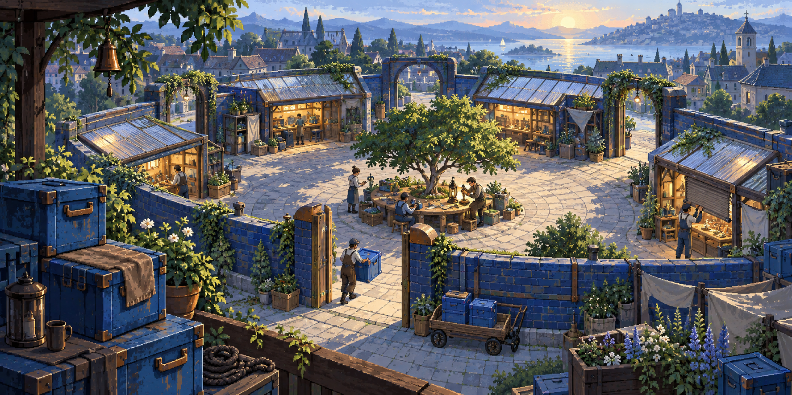
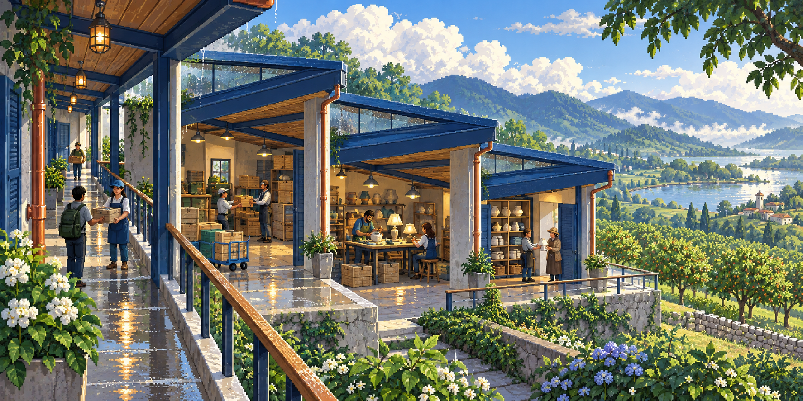
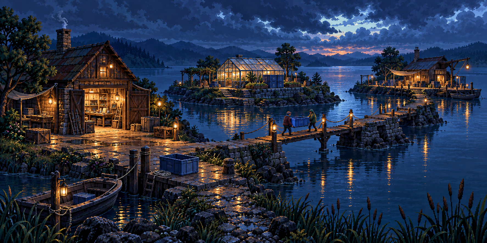

# Fracture Lines · Spend Network source art

Three original reward panoramas use fictional cooperation, repair and resource-sharing stories for the existing [Fracture Lines](../fracture-lines/README.md) roles. They add no geometry, runtime edition, descriptor, registry, saved/earned assignment or release content. All earlier FPV, Ukraine and retro originals remain unchanged.

The actual outputs are **1774 × 887 RGB PNGs (2:1)**, copied byte-for-byte from imagegen without crop, stretch, resize or re-encoding. Each is below the unchanged 4 MiB limit; their total is **8,706,823 bytes**. No derivative is needed.

| Existing mission | Reward scene                | Original bytes |
| ---------------- | --------------------------- | -------------: |
| Split Ring       | The Shared Repair Court     |      3,057,159 |
| Fault Fan        | Where Three Deliveries Meet |      2,950,816 |
| Frayed Causeway  | The Bridges We Rebuilt      |      2,698,848 |

## Preview and observed differences

A blue-walled repair court encloses a tree and shared worktable, with four scenic openings, reusable crates and a handcart. The people are larger than requested and the result is warmer and brighter than the cool-morning brief. Distant waterfront buildings and towers are invented scenery, not a named corporate campus or historical town.

Receiving, repair and return bays share a covered passage beside an orchard. Blue roof ribs, pale concrete and copper gutters make the theme physical. The people are larger than requested; the bays form a stepped linear arrangement rather than an exact branching spine. The sunny hills and distant water are fictional additions to the brief.

Three main islands hold a workshop, greenhouse and depot at blue hour. Two neighbors carry a reusable crate across a patched crossing. Their figures are larger than requested; no bridge to the middle greenhouse is clearly visible, so this is not proof of a fully connected network. Small causeway piers and painted routes are scenery, not collision geometry.

The authoring agent inspected all three actual PNGs; root visual acceptance is recorded separately. These detailed generated pixel-art illustrations do not certify a hand-pixel grid, partial-reveal readability, gameplay quality, device behavior or animation. They depict no actual Coupa interface, approved mascot, financial result, endorsement or AI performance claim.

## Provenance and verification

Three independent built-in imagegen calls used the full prompts in [prompts.json](prompts.json), with no reference-image uploads, retries or edits. The [earlier Spend Network batch](../spend-route-art/README.md) and [Sentinel theme conventions](../sentinel-theme-art/README.md) informed the blue/cyan/amber palette and shared-resource vocabulary. Earlier article references remain qualified in those guides; this batch derived no factual or financial assertions from them and copied no product imagery.

[provenance.json](provenance.json) records exact source-context and original pins, observations and limitations. [generation-results.json](generation-results.json) retains default tool paths and output hints. All default originals remain untouched; provenance is not exclusive-rights certification.

Run `node authoring/library/fracture-coupa-art/verify.mjs` from the repository root. The check uses the unchanged [bounded RGB/CRC decoder](../four-worlds-chapters/verify-images.mjs), verifies fixed PNG and complete-prompt hashes, exact ordinary-file inventory, context pins, actual dimensions and the 4 MiB cap. `--tool-originals` also compares the copies with local default tool files. Initial `--record --tool-originals` creates [verification.json](verification.json) exclusively; ordinary verification writes nothing.

## Future adoption or replacement

A later reviewed compiler must create an explicit Spend Network edition owner and per-mission assignments. Preserve level IDs, recipes, outcomes, saved/earned owners and prior original bytes; never silently redirect an old FPV, Ukraine or retro pin. Keep these original PNGs canonical. Any display derivative needs separate input/output hashes and justification, without aspect stretching. Replacement art belongs in a versioned sibling batch with full prompts, original copies, observations and fresh verification. Native reveal, installation, backup, replay and offline checks belong to later integration. These three stills change no production count.
