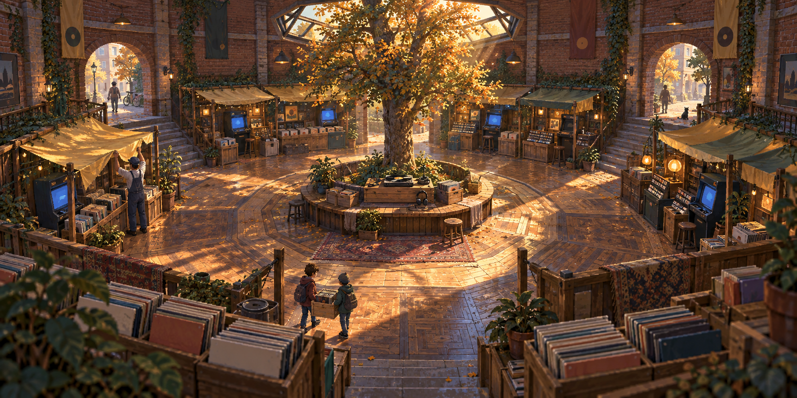
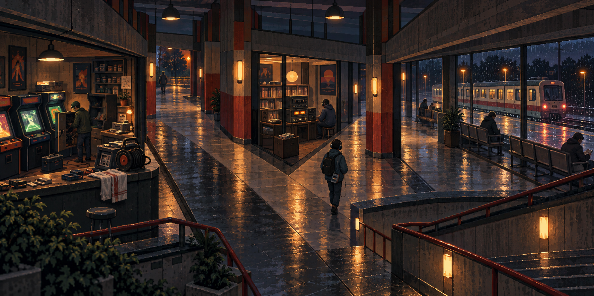
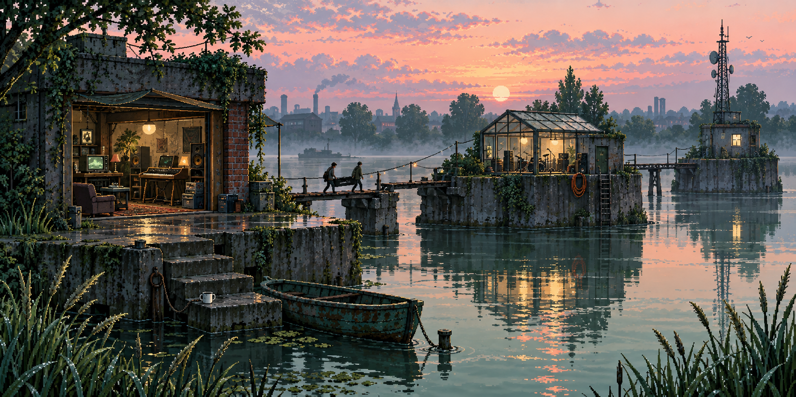

# Fracture Lines · 1994 Forever source art

Three original reward panoramas for the existing [Fracture Lines](../fracture-lines/README.md) mission roles. They add no geometry, runtime edition, descriptor, registry, saved/earned assignment or release content. The earlier FPV and Ukraine originals remain unchanged.

The three actual outputs are **1774 × 887 RGB PNGs (2:1)**, copied byte-for-byte from imagegen with no crop, stretch, resize or re-encoding. Each is below the existing 4 MiB limit; their total is **7,954,882 bytes**. No derivative is needed.

| Existing mission | Reward scene                            | Original bytes |
| ---------------- | --------------------------------------- | -------------: |
| Split Ring       | The Record Market before Opening        |      2,818,631 |
| Fault Fan        | The Last Train through the Console Hall |      2,405,219 |
| Frayed Causeway  | Three Studios at First Light            |      2,731,032 |

## Preview and observed differences

A brick rotunda encloses a record-and-arcade market around a tree and listening bench. Honey morning light, terracotta, jade shadows and plain record sleeves suggest anticipation before opening. The figures are larger than requested and some near detail is soft; scenic passages do not reproduce the four authored gates.

Branching concourse passages connect arcade repair, listening and waiting bays. Red-painted columns, sodium lamps, rain and a departing train make a different dusk setting. The central traveler is larger than requested. Screens and posters contain figurative and pseudo-letter marks despite the abstract/no-writing prompt; no readable route label, named game or usable product interface depends on them.

Three concrete islands carry a listening room, glass rehearsal room and antenna shed. Friends move a keyboard case over a repaired crossing at peach dawn. Celadon water and dark foliage separate the islands. The far shed is a utility space rather than a fully visible third rehearsal interior; stylized equipment and wall marks are not authenticated 1994 hardware or album designs.

All three actual PNGs were inspected by the authoring agent. Independent root visual acceptance is separate. These are detailed generated pixel-art illustrations, not a certified hand-pixel grid or literal level blueprints. They do not establish partial-reveal readability, gameplay quality, device behavior or animation.

## Provenance and verification

Three independent built-in imagegen calls used the full prompts in [prompts.json](prompts.json); there were no reference-image uploads, retries or edits. The [earlier retro batch](../retro-route-art/README.md) and [Sentinel theme conventions](../sentinel-theme-art/README.md) supplied project style context, not image inputs. These scenes are fictional nostalgia rather than historical reconstructions. [provenance.json](provenance.json) records exact context and original pins, scene observations and limits; [generation-results.json](generation-results.json) preserves default tool paths and output hints. Default originals remain untouched. No exclusive-rights certification is claimed.

Run `node authoring/library/fracture-retro-art/verify.mjs` from the repository root. The check uses the unchanged [bounded RGB/CRC decoder](../four-worlds-chapters/verify-images.mjs), verifies fixed PNG and complete-prompt hashes, exact ordinary-file inventory, context pins, dimensions and the 4 MiB cap. `--tool-originals` also compares the local copies with the default tool files. Initial `--record --tool-originals` creates [verification.json](verification.json) exclusively; ordinary verification writes nothing.

## Future adoption or replacement

A later reviewed compiler must create an explicit 1994 Forever edition owner and bind each original to its existing mission ID. Preserve all level recipes, outcomes, saved/earned owners and prior original bytes; never silently redirect an old FPV or Ukraine pin. Any display derivative needs separate input/output hashes and justification, without aspect stretching. Replacement art belongs in a versioned sibling batch with full prompts, original copies, observations and fresh verification. Native reveal, installation, backup, replay and offline qualification belong to that later integration. These three stills change no production count.
