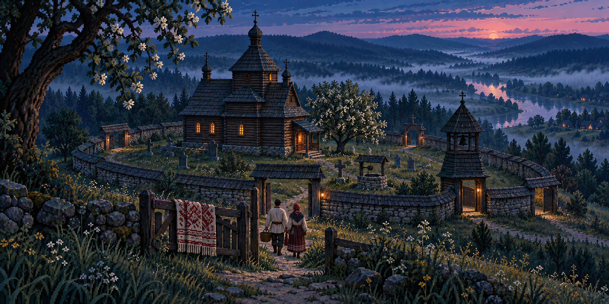
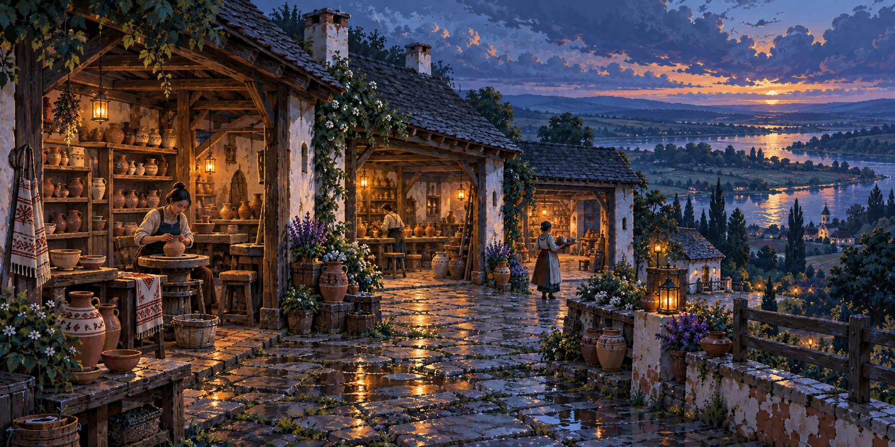
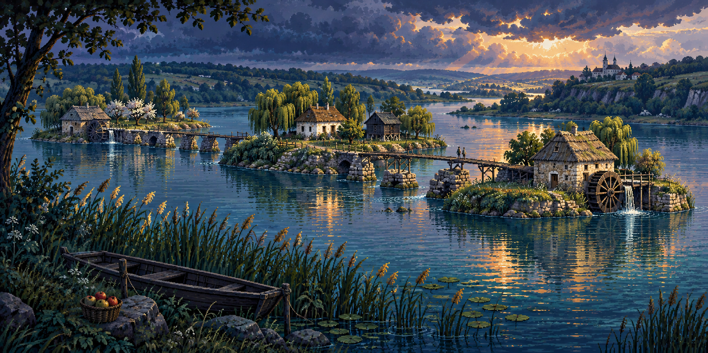

# Fracture Lines · Ukraine Atlas source art

Three original reward panoramas for the existing [Fracture Lines](../fracture-lines/README.md) mission roles. These are source candidates only: no new geometry, campaign, descriptor, registry, saved/earned assignment or release adoption. The existing FPV edition and all prior originals stay unchanged.

All three PNGs are the untouched imagegen outputs at **1774 × 887 (2:1)**. They were composed at that aspect ratio and copied byte-for-byte, without stretching, cropping, resizing or re-encoding. Each is below the existing 4 MiB limit; together they contain **8,721,992 bytes**. No derivative is needed for this batch.

| Existing mission | Reward scene                 | Original bytes |
| ---------------- | ---------------------------- | -------------: |
| Split Ring       | The Four Gates at Blue Hour  |      2,756,776 |
| Fault Fan        | Potters’ Terraces after Rain |      2,981,883 |
| Frayed Causeway  | The Mill-Island Causeway     |      2,983,333 |

## Preview and observed differences

The low enclosing wall and gateways surround a timber church above a misty valley. Pear trees, a well and warm windows make the center feel sheltered. The foreground people are larger than the requested tiny figures; incidental grave crosses and invented cloth ornament appear. The scenic ring is not a collision-map rendering.

Three sheltered pottery bays face an open river valley. Their shared passage recalls Fault Fan, although the result is more linear and stepped than a strong branching fan. The artisans are larger than requested. Small vessel and cloth marks are invented decoration, not readable labels or named traditional patterns.

Three separate islands hold two mills and a central home and granary. Broken stone piers and timber crossings make an emotional echo of Frayed Causeway. The mill mechanisms are stylized; the bridges do not reproduce playable routes. A distant hilltop church is incidental. A preliminary internal title saying “Three Mills” was corrected to the observed two-mill scene before source copying; the prompt and PNG stayed unchanged.

The authoring agent inspected all three actual images. The style is a detailed generated pixel-art illustration with luminous dark colors; no hand-pixel grid, partial-reveal readability or human-quality certification is claimed. Independent root visual acceptance is recorded separately before commit.

## Cultural sources and provenance

[UNESCO’s Carpathian tserkva listing](https://whc.unesco.org/en/list/1424) informed horizontal timber construction, shingled roofs and enclosed churchyard vocabulary. [Pyrohiv’s Lomachyntsi mill description](https://pyrohiv.com/exponat/vodyaniy-mlin-iz-sela-lomachintsi) informed stone, oak, reed-roof and waterwheel material cues. The [Opishne pottery museum](https://opishne-museum.gov.ua/) supplied the Ukrainian craft context. These are fictional compositions, not replicas of monuments, workshops, named ceramic designs or historical mechanisms.

Only text references informed the prompts; no external photograph or existing game image was supplied to imagegen. The museum-shop search excerpt and its failed direct-page open are qualified in [provenance.json](provenance.json). [prompts.json](prompts.json) retains each complete effective prompt; [generation-results.json](generation-results.json) retains the original tool paths and output hints. The default tool files remain untouched. Provenance does not certify exclusive rights or historical authenticity.

## Verification and future replacement

From the repository root, run `node authoring/library/fracture-ukraine-art/verify.mjs`. It checks fixed original and prompt hashes, exact file inventory, source-context pins, the 4 MiB cap, actual dimensions, all PNG chunk CRCs and full bounded RGB scanline decoding through the existing [decoder](../four-worlds-chapters/verify-images.mjs). `--tool-originals` additionally compares the workspace copies with the retained default tool outputs on the producing machine. Initial `--record --tool-originals` writes [verification.json](verification.json) exclusively; ordinary verification never overwrites it.

Future adoption needs its own reviewed Ukraine edition owner and explicit per-mission assignments. Preserve the three existing level IDs, recipes, outcomes and saved/earned identities. Do not replace the FPV edition’s bytes or silently redirect an old pin. Keep these PNGs as the canonical originals; any later display transform must be a separately justified derivative with recorded input/output hashes, never artificial aspect stretching.

For a replacement candidate, create a versioned sibling batch with its own full prompts, original tool copies, observations and verification. Review its actual pictures before changing a future compiler’s exact pins. Runtime reveal, installation, storage, replay, device and offline checks belong to that later integration; this batch changes no production count.
