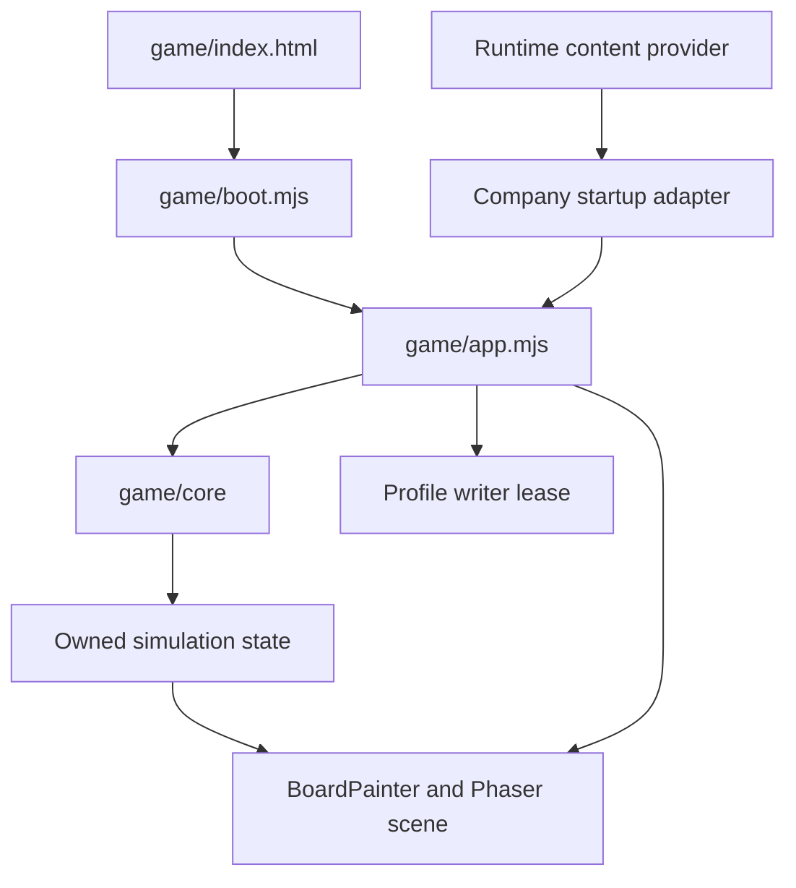

# Architecture

RevealLine's Solo path separates an HTML/bootstrap layer, a browser orchestration module, and a deterministic gameplay kernel. Content editions enter that host through a provider; replay identity is selected through explicit level/ruleset/version families. Static delivery, native staging, and the community backend are separate boundaries around the player runtime. [game/index.html:133](../../game/index.html#L133), [game/boot.mjs:231](../../game/boot.mjs#L231), [game/app.mjs:130](../../game/app.mjs#L130), [game/core/versions.mjs:3](../../game/core/versions.mjs#L3), [scripts/native-cli.mjs:188](../../scripts/native-cli.mjs#L188), [services/community/src/server.mjs:20](../../services/community/src/server.mjs#L20)

## Solo module map

**OBSERVED:** arrows show loading, calls, or data use, rather than a complete import graph. Boot dynamically imports the application; its startup adapter calls the content provider; the application imports the core, painter and writer lease, and owns the Phaser scene. [game/boot.mjs:244](../../game/boot.mjs#L244), [game/ui/company-startup.mjs:31](../../game/ui/company-startup.mjs#L31), [game/app.mjs:1](../../game/app.mjs#L1), [game/app.mjs:130](../../game/app.mjs#L130), [game/app.mjs:315](../../game/app.mjs#L315), [game/app.mjs:11205](../../game/app.mjs#L11205)

| Boundary         | Responsibility                                                                                                                                                                                                                                                                                                                   |
| ---------------- | -------------------------------------------------------------------------------------------------------------------------------------------------------------------------------------------------------------------------------------------------------------------------------------------------------------------------------- |
| `game/boot.mjs`  | Retains launch/failure UI, rejects `file:` startup, checks Phaser, prepares styles, then imports the app. [game/boot.mjs:1](../../game/boot.mjs#L1), [game/boot.mjs:222](../../game/boot.mjs#L222)                                                                                                                               |
| `game/app.mjs`   | Integrates content startup, core, rendering, and browser scheduling. Its Phaser configuration disables Phaser's input and audio adapters. [game/app.mjs:1](../../game/app.mjs#L1), [game/app.mjs:130](../../game/app.mjs#L130), [game/app.mjs:11215](../../game/app.mjs#L11215), [game/app.mjs:11277](../../game/app.mjs#L11277) |
| `game/core/`     | Owns mutable deterministic runs, with geometry, movement, capture, contact, abilities and variant implementations imported by the kernel. [game/core/index.mjs:1](../../game/core/index.mjs#L1), [game/core/index.mjs:57](../../game/core/index.mjs#L57)                                                                         |
| Content provider | Selects content/presentation for the existing Solo host, without owning its loop or controls. [game/runtime-content-provider.mjs:82](../../game/runtime-content-provider.mjs#L82)                                                                                                                                                |
| Profile writer   | Uses a lifetime Web Lock for one writing tab; denied tabs retain session-only behavior. [game/profile-writer.mjs:7](../../game/profile-writer.mjs#L7), [game/profile-writer.mjs:15](../../game/profile-writer.mjs#L15)                                                                                                           |

## Distinct execution paths

The legacy company entry document redirects to `index.html` while preserving query/hash and edition identity. This supports the shared-host interpretation; it should not be modeled as a second independent Solo engine. [game/company-entry.mjs:4](../../game/company-entry.mjs#L4)

Local competitive play creates two core runs through `game/multiplayer.mjs`. Relay Rescue imports its own cooperative API from `game/coop/core.mjs`. The Solo diagram therefore does not imply that every multiplayer mode executes the same host or state model. [game/multiplayer.mjs:1](../../game/multiplayer.mjs#L1), [game/multiplayer.mjs:21](../../game/multiplayer.mjs#L21), [game/couch/relay-rescue.mjs:43](../../game/couch/relay-rescue.mjs#L43)

The community executable constructs PostgreSQL, admission, auth, blob storage and tus adapters. Downloaded community packages cross back into local creator storage only after package-size/hash verification and creator-bundle import. This is a content distribution integration; its implementation is described separately from Solo profile persistence. [services/community/src/server.mjs:20](../../services/community/src/server.mjs#L20), [services/community/src/server.mjs:61](../../services/community/src/server.mjs#L61), [game/community/library.mjs:36](../../game/community/library.mjs#L36), [game/community/library.mjs:75](../../game/community/library.mjs#L75)

## Boundaries to preserve when changing code

The core's documented ownership forbids external gameplay-state mutation if replay guarantees are to hold. Its version registry pairs level, ruleset, replay format and checkpoint algorithm; current entries span multiple generations, so a single global “current replay format” would lose information. [game/core/index.mjs:57](../../game/core/index.mjs#L57), [game/core/versions.mjs:3](../../game/core/versions.mjs#L3), [game/core/versions.mjs:75](../../game/core/versions.mjs#L75)

Build output is assembled from admitted inputs and generated metadata. Native staging subsequently verifies the emitted manifest and bytes rather than pointing a host at arbitrary source files. [scripts/game-cli.mjs:229](../../scripts/game-cli.mjs#L229), [scripts/game-cli.mjs:1016](../../scripts/game-cli.mjs#L1016), [scripts/native-cli.mjs:188](../../scripts/native-cli.mjs#L188)

## Evidence

- [game/app.mjs:130](../../game/app.mjs#L130): core/painter integration.
- [game/ui/company-startup.mjs:31](../../game/ui/company-startup.mjs#L31): provider handoff.
- [game/core/versions.mjs:3](../../game/core/versions.mjs#L3): version family registry.
- [game/community/library.mjs:75](../../game/community/library.mjs#L75): community-to-local installation boundary.

## Coverage and limitations

Retrieval terms: `import`, `Phaser.Game`, `createRun`, `loadRuntimeContentProvider`, `claimProfileWriter`, `verifySite`. Fifteen evidence files were selectively read. The Solo path received the deepest trace; cooperative simulation, optional FPV simulation, all UI components, and the native bridge are explicitly outside this page's detailed control-flow coverage. No runtime execution or exhaustive dependency graph was produced.

## Related

[Overview](overview.md) · [Runtime data flow](runtime-data-flow.md) · [Content and authoring](content-and-authoring.md) · [Persistence and replays](persistence-and-replays.md) · [Community service](community-service.md) · [Operations and configuration](operations-and-configuration.md)
