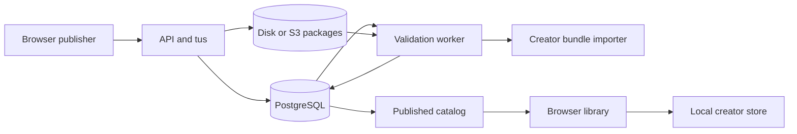

# Community service

The community backend is a Node service with a Fastify API, PostgreSQL repository, package storage, and a separate validation worker. Its executable server wires resumable tus uploads and account authentication; the worker independently consumes validation jobs. [services/community/src/server.mjs:20](../../services/community/src/server.mjs#L20), [services/community/src/app.mjs:50](../../services/community/src/app.mjs#L50), [services/community/src/worker-runner.mjs:9](../../services/community/src/worker-runner.mjs#L9)

### Upload to publication

The browser publisher imports and hashes a selected `.rlpack`, declares its metadata, uploads bytes, then submits it for validation. `POST /v1/submissions` authenticates the owner and applies submission admission before creating the row. [game/community/publisher.mjs:23](../../game/community/publisher.mjs#L23), [game/community/publisher.mjs:47](../../game/community/publisher.mjs#L47), [services/community/src/app.mjs:267](../../services/community/src/app.mjs#L267)

Tus creation reserves the declared byte cost and binds upload metadata to the owner's immutable submission. Subsequent requests check ownership; completion streams the package into `putVerified`, supplying its declared size and SHA-256 before marking it uploaded. The API also implements direct PUT uploads. [services/community/src/tus-server.mjs:94](../../services/community/src/tus-server.mjs#L94), [services/community/src/tus-server.mjs:150](../../services/community/src/tus-server.mjs#L150), [services/community/src/upload-transport.mjs:47](../../services/community/src/upload-transport.mjs#L47), [services/community/src/app.mjs:292](../../services/community/src/app.mjs#L292)

Validation enqueue is idempotent over submission, package hash, and validator version. Workers claim queued or expired jobs using `FOR UPDATE SKIP LOCKED`, with five-minute leases; completion checks worker identity and lease validity. An accepted result changes the submission directly to `published`; invalid content becomes `rejected`. [services/community/src/postgres-repository.mjs:227](../../services/community/src/postgres-repository.mjs#L227), [services/community/src/postgres-repository.mjs:278](../../services/community/src/postgres-repository.mjs#L278), [services/community/src/postgres-repository.mjs:310](../../services/community/src/postgres-repository.mjs#L310)

The validator checks exact bytes and invokes the shared creator-bundle importer, with PNG decoding and bounded `ffprobe` inspection. Missing `ffprobe` is an infrastructure error; worker errors requeue after a default 30 seconds. [services/community/src/validator.mjs:32](../../services/community/src/validator.mjs#L32), [services/community/src/validator.mjs:115](../../services/community/src/validator.mjs#L115), [services/community/src/worker.mjs:15](../../services/community/src/worker.mjs#L15)

**OBSERVED:** upload, repository, and browser integration calls above; storage selection is shared by API and worker. [services/community/src/blob-store-factory.mjs:5](../../services/community/src/blob-store-factory.mjs#L5), [game/community/library.mjs:75](../../game/community/library.mjs#L75)

### Identity, admission, and configuration

Better Auth sessions use the immutable user ID as owner; administrator roles derive from `COMMUNITY_ADMIN_SUBJECTS`. Development bearer tokens require explicit `COMMUNITY_ALLOW_DEV_AUTH=true`. Production configuration validates the auth secret, HTTPS account origin, mail webhook settings, and matching runtime/image release identity. [services/community/src/auth.mjs:42](../../services/community/src/auth.mjs#L42), [services/community/src/server.mjs:48](../../services/community/src/server.mjs#L48), [services/community/src/config.mjs:178](../../services/community/src/config.mjs#L178), [services/community/src/config.mjs:303](../../services/community/src/config.mjs#L303), [services/community/src/config.mjs:24](../../services/community/src/config.mjs#L24)

Admission hashes subjects and idempotency keys; PostgreSQL uses database time and atomic counters. Defaults are 30 auth attempts per five minutes, six reports/hour, twelve submissions/hour, and 2 GiB upload bytes/day. Auth/report limits use the request IP; submission/upload limits use the owner. Configure trusted proxy hops accurately. [services/community/src/admission.mjs:4](../../services/community/src/admission.mjs#L4), [services/community/src/admission.mjs:63](../../services/community/src/admission.mjs#L63), [services/community/src/postgres-repository.mjs:85](../../services/community/src/postgres-repository.mjs#L85), [services/community/src/app.mjs:57](../../services/community/src/app.mjs#L57), [services/community/src/app.mjs:183](../../services/community/src/app.mjs#L183), [services/community/src/config.mjs:256](../../services/community/src/config.mjs#L256)

`COMMUNITY_DATABASE_URL` is required. Defaults are `127.0.0.1:8787`, disk roots `./var/blobs` and `./var/tus`, and a 256 MiB package maximum. S3 requires bucket, region, and staging root, and excludes disk-root settings. From `services/community`, package commands include `npm start`, `npm run worker`, `npm run auth:migrate`, `npm run deployment:preflight`, and `npm test`. [services/community/src/server.mjs:21](../../services/community/src/server.mjs#L21), [services/community/src/config.mjs:138](../../services/community/src/config.mjs#L138), [services/community/src/config.mjs:199](../../services/community/src/config.mjs#L199), [services/community/package.json:10](../../services/community/package.json#L10)

### Boundary with local play

The store page selects API root `/`; its controller injects account and tus adapters. Installation independently checks package size/hash, reruns creator import, retains a recovery package, and installs into the creator store. Installed editions link to the local creator player and are marked offline playable. [game/community/store.html:2](../../game/community/store.html#L2), [game/community/page.mjs:23](../../game/community/page.mjs#L23), [game/community/library.mjs:36](../../game/community/library.mjs#L36), [game/community/library.mjs:51](../../game/community/library.mjs#L51), [game/community/library.mjs:75](../../game/community/library.mjs#L75)

### Evidence

- Publication and immutable download tests: [services/community/test/community.test.mjs:574](../../services/community/test/community.test.mjs#L574).
- Expired-worker ownership tests: [services/community/test/community.test.mjs:986](../../services/community/test/community.test.mjs#L986).
- Interrupted tus/owner isolation tests: [services/community/test/community.test.mjs:1146](../../services/community/test/community.test.mjs#L1146).

### Coverage and limitations

Retrieval expanded `submission`, `upload`, `admission`, `claimValidationJob`, `packageSha256`, and `installPreparedCreatorBundle`, following executable wiring into defining modules. Eighteen evidence files were sampled; recovery runners, full account flows, and storage-provider internals were not exhaustively audited. **UNVERIFIED:** tests were read, not run; deployment, mail delivery, PostgreSQL concurrency, and browser execution were not exercised.

### Related

[Architecture](architecture.md) · [Content and authoring](content-and-authoring.md) · [Persistence and replays](persistence-and-replays.md) · [Operations and configuration](operations-and-configuration.md) · [Testing](testing.md)
