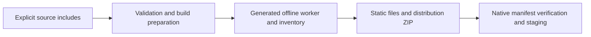

# Operations and configuration

The main delivery artifact is a static distribution assembled from an explicit include list, with generated manifests, offline metadata, and a ZIP. Native hosts consume verified web assets, while the community server is a separate deployment. Source version labels, rolling Pages deployments, and immutable release snapshots have different identities. [game/build-config.json:1](../../game/build-config.json#L1), [scripts/game-cli.mjs:1016](../../scripts/game-cli.mjs#L1016), [scripts/native-cli.mjs:188](../../scripts/native-cli.mjs#L188), [services/community/src/server.mjs:20](../../services/community/src/server.mjs#L20), [.github/workflows/deploy-main-pages.yml:47](../../.github/workflows/deploy-main-pages.yml#L47)

## Configuration map

| Configuration                           | Role                                                                                                                                                                                                                                                                                                  |
| --------------------------------------- | ----------------------------------------------------------------------------------------------------------------------------------------------------------------------------------------------------------------------------------------------------------------------------------------------------- |
| `game/build-config.json`                | Version, entry HTML, included paths, optional offline packs, and optional/external artwork, chapter, and soundtrack catalogs. [game/build-config.json:1](../../game/build-config.json#L1), [game/build-config.json:279](../../game/build-config.json#L279)                                            |
| `scripts/game-cli.mjs` security headers | Public CSP and related headers; packaged local previews add narrowly named soundtrack/media origins. The server applies preview headers when it recognizes the build marker. [scripts/game-cli.mjs:25](../../scripts/game-cli.mjs#L25), [scripts/game-cli.mjs:1068](../../scripts/game-cli.mjs#L1068) |
| Desktop environment                     | `REVEALLINE_SITE_DIR` and `REVEALLINE_USER_DATA_DIR` feed native directory selection. [platforms/desktop/main.mjs:20](../../platforms/desktop/main.mjs#L20)                                                                                                                                           |
| `platforms/ios/capacitor.config.json`   | Uses `www`, the `capacitor` scheme, and `/game/index.html` as its startup path. [platforms/ios/capacitor.config.json:1](../../platforms/ios/capacitor.config.json#L1)                                                                                                                                 |
| Community environment                   | Independently configures PostgreSQL, auth, upload, and blob storage; see the [service page](community-service.md).                                                                                                                                                                                    |

## Build and offline path

Build-file collection rejects symlinks/private paths and generated-file collisions, and omits source `game/test` and `game/offline` paths. Preparation validates resources and content, checks that optional chapter bodies do not enter automatic includes, and requires the catalogs in the core build. [scripts/game-cli.mjs:122](../../scripts/game-cli.mjs#L122), [scripts/game-cli.mjs:222](../../scripts/game-cli.mjs#L222), [scripts/game-cli.mjs:852](../../scripts/game-cli.mjs#L852)

The offline worker is generated from its source template. Its hashed core inventory is bounded to 2,000 files and 64 MiB, with optional content represented separately. The final build writes a staging directory, distribution ZIP and SHA-256 file, then replaces an owned prior output through rename/rollback handling. [scripts/game-cli.mjs:593](../../scripts/game-cli.mjs#L593), [scripts/game-cli.mjs:803](../../scripts/game-cli.mjs#L803), [scripts/game-cli.mjs:1032](../../scripts/game-cli.mjs#L1032)

**OBSERVED:** build preparation calls offline generation before writing output; native staging verifies a supplied site. [scripts/game-cli.mjs:962](../../scripts/game-cli.mjs#L962), [scripts/game-cli.mjs:1016](../../scripts/game-cli.mjs#L1016), [scripts/native-cli.mjs:251](../../scripts/native-cli.mjs#L251)

## Release and native boundaries

Protected-main Pages builds check out `github.sha`, derive a `main-<commit-prefix>` identity, and build with the `main-pages` publication profile. Fastline is a separate workflow accepting an exact version, source SHA, release PR, predecessor tag, and publication mode. This wiki has not queried either workflow's live results. [.github/workflows/deploy-main-pages.yml:33](../../.github/workflows/deploy-main-pages.yml#L33), [.github/workflows/deploy-main-pages.yml:75](../../.github/workflows/deploy-main-pages.yml#L75), [.github/workflows/fastline-release.yml:3](../../.github/workflows/fastline-release.yml#L3)

Local `release-snapshot` resolves a trusted Git ref, rejects reuse of an existing release label, and uses a snapshot lock. Manifest preservation additionally requires a clean exact-commit checkout. A dirty working tree described by this wiki is therefore not an immutable release identity. [scripts/game-cli.mjs:1257](../../scripts/game-cli.mjs#L1257)

Native verification checks manifest paths, lengths and hashes, with per-file and aggregate limits. Electron enables sandboxing, disables renderer Node integration, and restricts navigation/requests through policy. The README explicitly leaves native signing, device acceptance, and Steam integration unfinished; no native launch or distribution certification was established here. [scripts/native-cli.mjs:188](../../scripts/native-cli.mjs#L188), [platforms/desktop/policy.mjs:18](../../platforms/desktop/policy.mjs#L18), [platforms/desktop/main.mjs:57](../../platforms/desktop/main.mjs#L57), [platforms/desktop/main.mjs:104](../../platforms/desktop/main.mjs#L104), [README.md:59](../../README.md#L59)

## Evidence

- [game/build-config.json:279](../../game/build-config.json#L279): optional-content configuration.
- [scripts/game-cli.mjs:815](../../scripts/game-cli.mjs#L815): offline inventory limits.
- [scripts/native-cli.mjs:218](../../scripts/native-cli.mjs#L218): native byte/hash checks.

## Coverage and limitations

Retrieval terms: `readBuildConfig`, `buildProject`, `addOfflineEntries`, `releaseSnapshot`, `verifySite`, `source_sha`. Ten defining files were selectively read. Historical publication controllers, live deployments, signing, real offline installation, and the complete native bridge were not audited. See [Testing](testing.md) for the separate test-waiver caveat.

## Related

[Getting started](getting-started.md) · [Architecture](architecture.md) · [Content and authoring](content-and-authoring.md) · [Community service](community-service.md) · [Testing](testing.md)
