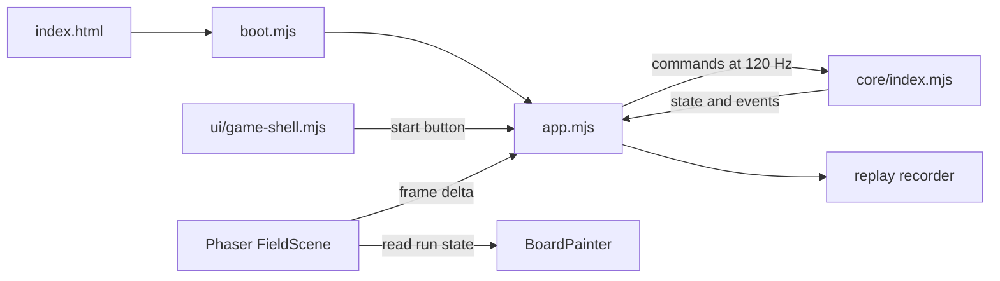

# Runtime data flow

The solo browser entry delegates startup to `boot.mjs`, then uses `app.mjs` to coordinate navigation, input, simulation, and presentation. The simulation owns mutable run state and explicitly excludes DOM, artwork, and clock reads; the browser host supplies commands and elapsed time. [game/index.html:133](../../game/index.html#L133) [game/boot.mjs:244](../../game/boot.mjs#L244) [game/core/index.mjs:57](../../game/core/index.mjs#L57)

## Startup and ownership

The boot guard is deliberately a classic script so static launch controls survive failed module loading. It checks Phaser availability, loads styles, imports the app, and requires the app to acknowledge startup with `RevealLineBoot.ready()`. The HTML separately includes the vendored Phaser script. [game/boot.mjs:1](../../game/boot.mjs#L1) [game/boot.mjs:231](../../game/boot.mjs#L231) [game/app.mjs:12825](../../game/app.mjs#L12825) [game/index.html:3576](../../game/index.html#L3576)

The host first loads company startup content; when its boot bundle is absent, it fetches campaign, themes, presets, classes, and pack catalogs. Mission preparation creates both a run and its recorder, then prepares the flight picture. Navigation is a separate presentation component: its Deploy action invokes the host's start button, whose handler calls `resume()`. [game/app.mjs:398](../../game/app.mjs#L398) [game/app.mjs:4450](../../game/app.mjs#L4450) [game/ui/game-shell.mjs:15](../../game/ui/game-shell.mjs#L15) [game/ui/game-shell.mjs:669](../../game/ui/game-shell.mjs#L669) [game/app.mjs:10649](../../game/app.mjs#L10649)

## Frame to simulation tick

Phaser provides a canvas scene and a nominal 60 FPS presentation loop; its own audio and input systems are disabled in this host. Each scene update converts milliseconds to seconds, calls the host update, and draws the run through `BoardPainter` with presentation options. [game/app.mjs:11215](../../game/app.mjs#L11215) [game/app.mjs:11241](../../game/app.mjs#L11241) [game/app.mjs:11277](../../game/app.mjs#L11277)

The host pauses after focus loss or a gameplay frame longer than 0.25 seconds. Gameplay advances only when started, unpaused, picture-ready, unobstructed by a dialog, and nonterminal. Its accumulator emits exact `FIXED_DT` commands, calls `stepRun`, records each command, and consumes the resulting events for feedback. Thus display frames and recorded simulation ticks have different ownership. [game/app.mjs:10012](../../game/app.mjs#L10012) [game/app.mjs:10152](../../game/app.mjs#L10152) [game/app.mjs:10205](../../game/app.mjs#L10205) [game/app.mjs:10255](../../game/app.mjs#L10255)

**OBSERVED:** Imports, startup, navigation callbacks, frame scheduling, and recording calls above establish these edges. [game/app.mjs:130](../../game/app.mjs#L130) [game/app.mjs:10205](../../game/app.mjs#L10205) [game/app.mjs:11215](../../game/app.mjs#L11215)

## Core and mode boundaries

The core uses 1/120-second steps. `createRun` validates options, builds the cell grid and actors, and selects version-specific state; `stepRun` normalizes input and drains its own accumulator without discarding supplied elapsed time. The host's long-frame pause policy therefore sits outside the core. Classic-family state dispatches to `stepClassic`, while the other path updates encounters, abilities, movement, and capture completion. [game/core/registry.mjs:2](../../game/core/registry.mjs#L2) [game/core/index.mjs:63](../../game/core/index.mjs#L63) [game/core/index.mjs:176](../../game/core/index.mjs#L176) [game/core/index.mjs:394](../../game/core/index.mjs#L394) [game/core/index.mjs:470](../../game/core/index.mjs#L470)

Version selection is an explicit level/ruleset/replay/checkpoint tuple, currently spanning level v1–v8 and core v2–v9; campaigns reject mixed simulation versions. Versus creates two solo runs and steps both before judging a result. Co-op has a separate `createCoop`/`stepCoop` engine whose API accepts exactly one 120 Hz tick per call. [game/core/versions.mjs:3](../../game/core/versions.mjs#L3) [game/core/versions.mjs:105](../../game/core/versions.mjs#L105) [game/multiplayer.mjs:14](../../game/multiplayer.mjs#L14) [game/multiplayer.mjs:68](../../game/multiplayer.mjs#L68) [game/coop/core.mjs:398](../../game/coop/core.mjs#L398) [game/coop/core.mjs:1004](../../game/coop/core.mjs#L1004)

## Evidence

- [game/boot.mjs:231](../../game/boot.mjs#L231): guarded startup/import.
- [game/app.mjs:10152](../../game/app.mjs#L10152): gameplay gating and fixed ticks.
- [game/core/index.mjs:470](../../game/core/index.mjs#L470): simulation stepping contract.
- [game/core/versions.mjs:75](../../game/core/versions.mjs#L75): supported version resolution.

## Coverage and limits

Queries: `boot`, `createRun`, `stepRun`, `FIXED_DT`, `Phaser`, `attachGameShell`. Reads prioritized the nine defining files above, following imports into core and navigation; sibling core, startup, and replay excerpts provided orientation. Detailed collision algorithms, every controller path, co-op internals, and optional practice runtimes were not audited. Browser execution and cross-engine determinism remain **UNVERIFIED** in this documentation pass.

## Related

[Architecture](architecture.md) · [Content and authoring](content-and-authoring.md) · [Persistence and replays](persistence-and-replays.md) · [Testing](testing.md)
