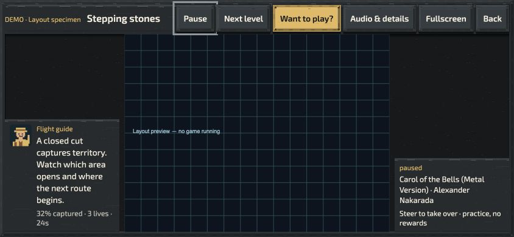
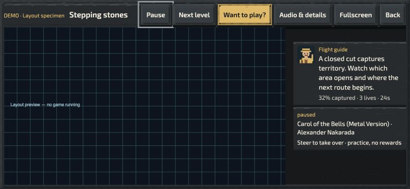
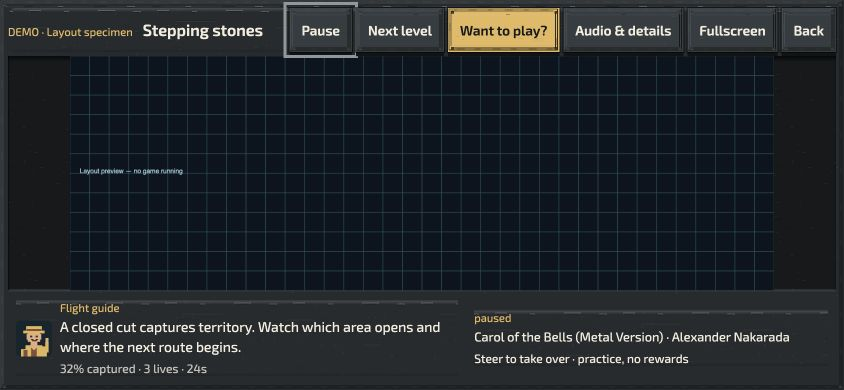
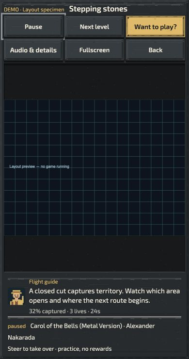

# Demo spectator layout revision

The icon-only change hid the reasons to watch and the invitation to play. This
revision restores those features in reserved space outside the board, using the
active theme for controls and surfaces. It supersedes the presentation section
of [the compact-controls report](../demo-complete-runs-2026-10-04.md); complete-run
playback remains unchanged.

## Implemented

- Labelled Pause/Resume, Next level, Fullscreen/Windowed and Back controls, with
  normal theme materials and at least 44-pixel touch targets. Full accessible
  names remain on the shortened controls.
- Persistent event-based teaching caption, capture/lives/time readout, prominent
  **Want to play?**, and an explanation that steering takes over as practice.
- Persistent song title, artist and actual muted/playback state. Existing audio
  transport, credits links, volume, styles and sound-content settings remain in
  Audio & details, with explicit close and restored keyboard focus.
- A horizontal action row with the play invitation and Audio & details beside
  Pause/Next/Fullscreen/Back. On phones it wraps into two labelled rows.
  Information uses a shallow bottom strip by default. When the actual map leaves
  sufficient unused space beside its image, captions/music occupy those margins
  without reducing the rendered game size; there is no fixed-width sidebar. Expanded settings and
  practice controls replace that information area; they do not cover the board.
  Long captions/large text can scroll inside the bounded information area.
- Reuse of the existing guide portrait alongside teaching captions. Its reaction
  pose follows capture, powerup and objective captions. Reduced effects uses the
  idle pose; disabling shared character reactions hides the portrait/name. The
  guide adds no voice, timer, audio intent, gameplay state or progress writes.
- English/Ukrainian copy and large-text scaling.

## Verification

The host/audio/fullscreen suite passes 27 tests, including automatic rotation,
keyboard/controller/touch takeover, progress isolation, music intent, visible
credits, and guide preference behavior. The first broad run recorded one rotation
wait timeout; the isolated rotation check and subsequent 27-test run passed. That
initial timeout is not treated as evidence of uninterrupted long-run reliability.
Focus/close and fullscreen checks were repeated after their final edits.

An isolated browser specimen loads production markup, styles, theme resolution,
and localization; it does **not** run a level or bypass the game access gate.
Browser checks covered 320×568 and 390×740 portrait and 667×375/844×390 landscape,
English/Ukrainian, Industrial Workshop and light Dnipro Porcelain, including large
text. Controls and information do not cover the rendered game image. In margin mode the
information container shares the board region, but its visible children stay in
unused margins. 844×390 normal-text information fits without scrolling. At 320×568
Ukrainian, all information fits in its reserved panel. Large text can require
scrolling the information region; buttons wrap whole rather than split words.
Physical Safari/iPhone, real gameplay appearance and physical controller review
remain outstanding. The screenshots are layout specimens, not gameplay evidence.

### Horizontal/adaptive follow-up

The initial all-horizontal trial reduced landscape game height too much. The final
layout measures the current canvas aspect ratio and the space below the header.
It uses two unused margins, one unused margin, or a horizontal bottom strip in
that order, only when each text column has at least 180 pixels (234 with large
text). Resizing, entering fullscreen, switching maps and opening details recompute
placement. Unsupported observers fall back to rows. Both observers disconnect on
host disposal. No extra frame loop is added.

Measured normal-text specimen sizes (CSS pixels):

| Viewport / map           | Layout                                   | Board region | Contained image |
| ------------------------ | ---------------------------------------- | ------------ | --------------- |
| 390×740 / 4:3            | horizontal information, wrapped controls | 374×431      | 374×281         |
| 320×568 / 4:3, Ukrainian | horizontal information, wrapped controls | 304×210      | 280×210         |
| 844×390 / 4:3            | two existing margins                     | 828×326      | 435×326         |
| 844×390 / 16:9           | one existing margin                      | 828×326      | 580×326         |
| 844×390 / 3:1            | horizontal information                   | 828×235      | 704×235         |

The previous revision had a 418-pixel portrait board region at 390×740 and a
324-pixel-high landscape board. The gain is modest: preserving a complete image's
aspect ratio limits its size. Wider surrounding space is not reported as larger
rendered gameplay. Readable information still costs height on maps with no spare
side space. Physical-device review remains required.

Follow-up verification: 4 focused layout/host tests pass (17 unrelated host tests
skipped); 6 offline dependency-closure tests pass; ESLint, Prettier and diff checks
pass. The first focused run hit a stale assertion that placed the play button in
the old footer; that assertion now requires the header location. No gameplay,
replay, reward or sound behavior was changed by this follow-up. The new module is
statically imported by the production demo host for normal dependency discovery;
no native package was built for this UI revision.

## Recommended next work, in priority order

1. **Qualify this layout on an actual iPhone.** Check Safari bars, rotation,
   fullscreen availability, audio disclosure and fresh touch takeover. The browser
   specimen proves layout geometry, not platform gestures or real device behavior.
2. **Give the guide occasional personality.** Add a few authored reactions to
   real close calls, recoveries and completions, selected through the existing
   reaction system with cooldowns and repetition limits. Keep mechanical tips
   available and respect dialogue/subtitle settings. Do not narrate every cut or
   add unrelated quips during danger. The current portrait/caption integration is
   deliberately silent; spoken lines require actual recordings and audio review.
3. **Invite participation at meaningful moments.** After a completed run, pair
   the actual result with an invitation such as trying a different route. Preserve
   the always-visible play choice. Avoid manufactured scores, countdown pressure
   or promises that practice grants rewards.
4. **Curate contrasting full performances.** Alternate calm teaching, ambitious
   routes, natural hazard losses and recoveries across supported levels. Prioritize
   opted-in human recordings with readable decisions. Keep full win/loss endpoints;
   do not reintroduce timed excerpts or artificial deaths to create variety.

These are product recommendations, not claims of measured engagement gains.
The layout follows [Xbox caption guidance](https://learn.microsoft.com/en-au/gaming/accessibility/xbox-accessibility-guidelines/104)
for speaker identification/readable caption backgrounds and
[Game Accessibility Guidelines](https://gameaccessibilityguidelines.com/avoid-placing-essential-temporary-information-outside-the-players-eye-line/)
for keeping time-sensitive information close to the action. Their application to
this demo is a design judgment to validate with viewers.
