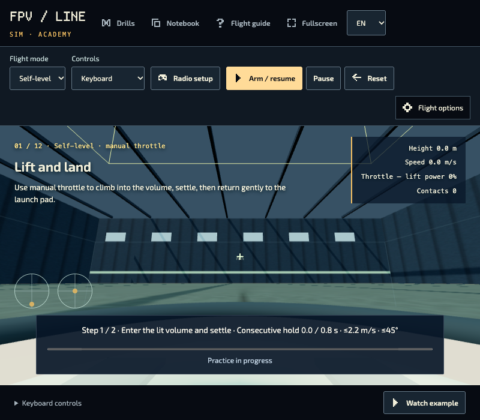

# Flight practice: player guide

[Українська](flight-practice-player.uk.md). The same task-based help is shipped as `guide.html` inside each package and linked from its launcher. It remains cached with the package.

## Choose and play

Open **Help & Extras → Flight practice**. Choose **Play** to open the app directly in a new tab, or **Details & guide** for requirements, support, offline preparation and help. There are no unlocks. Practice never grants campaign wins. The existing **FPV flight simulator** shortcut is unchanged.

| App                 | Start here                                                                                                                                        |
| ------------------- | ------------------------------------------------------------------------------------------------------------------------------------------------- |
| Civilian flight gym | Assisted movement/orientation. Select **Lift and return → Start / resume**. Keyboard, touch buttons or standard gamepad; a simple 2D view.        |
| FPV Flight Studio   | Focused lessons. Open **Flight guide**, choose **Lift and land**, then **Watch example**. Start with self-level; try Acro later. Requires WebGL2. |
| FPV World Studio    | Worlds, playlists and creation. Choose **Watch first flight**, then **Try first flight**. Requires WebGL2 and more memory.                        |

## Inputs and your first attempt

Use each app’s maintained Controls / Flight guide for exact bindings. FPV offers Keyboard, Touch · Mode 2 and calibrated USB radio; a standard gamepad is not automatically a radio. Set up/calibrate radio axes before arming. Keep sticks neutral, start or arm explicitly, and follow the on-screen target. Self-level assists leveling; Acro does not automatically return to level.

Use **Pause** before changing setup, **Reset / Retry** for a fresh attempt, and **Back to lobby** to change World Studio flights. A demonstration is an example, not a completion you earned. Practice is not a claim of real-world piloting proficiency.

## Offline versus home-screen installation

1. Open **Details & guide → Download for offline use**, or the app’s existing Prepare offline action.
2. Keep the tab open while **Downloading → Verifying** runs. Cancel stops that new attempt without removing a previous prepared version. An inactive download times out after 30 seconds; the overall maximum is five minutes.
3. Wait for **Ready offline** in the stable launcher. This checks the exact owning worker and cached dependencies, not just a saved pointer.
4. Close all site tabs, disable networking, and reopen the stable launcher on your device. Open the prepared version.
5. Separately, choose **Add to home screen** if offered. Otherwise use the browser’s Install app menu, or iPhone/iPad **Share → Add to Home Screen**. Support varies. Online play requires neither installation nor offline download.

## Updates, removal and backups

**Update available** does not reload a flight. Prepare the new version when ready; the previous prepared version stays linked. A waiting launcher update may require closing its tabs.

**Remove this offline copy (keep records)** removes only the selected version’s app-shell caches and worker. It does not delete flight records, controller calibration or imported worlds. Browser “clear site data” is broader and can delete all of those: export recordings/notebooks/playlists/worlds first with the app’s current export tools. There is no automatic backup guarantee.

Apps own separate caches but share this origin’s quota. Browsers can evict cached files. If **Needs repair** appears, reconnect, remove only the affected offline copy and download again. For denied/full storage, allow storage or leave private browsing, free space and retry. Keep backups independently.

## When something is missing

- **Empty catalogue:** no reviewed packages have been selected for the host. Use the existing FPV shortcut and guide in the main game.
- **Request failed:** retry. A dated cached catalogue is not a fresh availability check.
- **Unavailable version:** retry online or open a verified prepared version. A retired online version may no longer be hosted.
- **Blank 3D view:** check WebGL2/hardware acceleration or try Gym. Report browser/device, package version and error through **Support / report a problem**, without private recordings.

**`.rlpack` imports add content inside World Studio. They do not add executable apps to Flight practice.** Maintainers should follow the [package publishing guide](flight-practice-maintainer.md).
