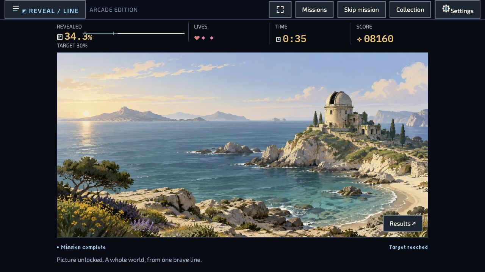
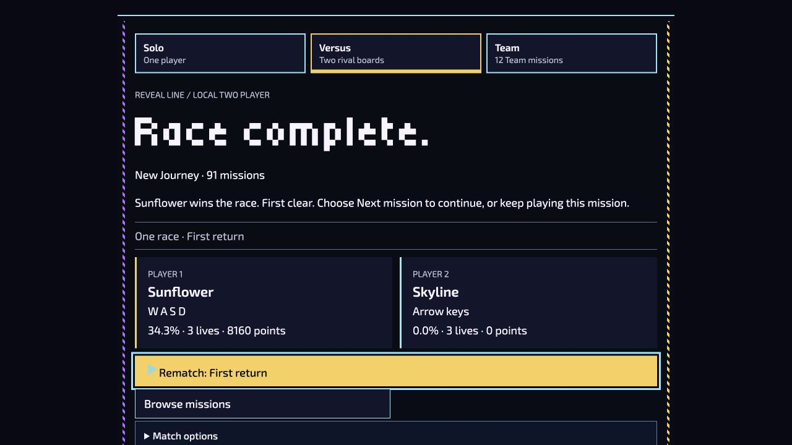
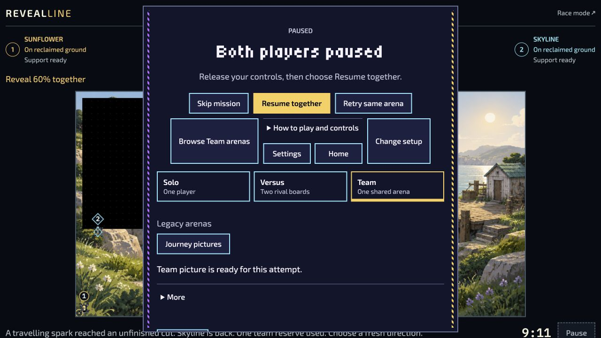
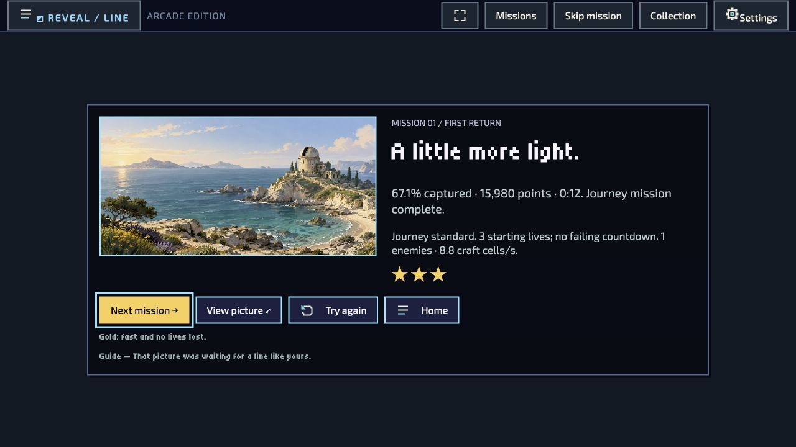
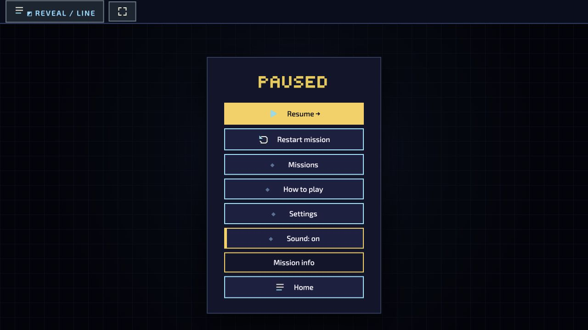
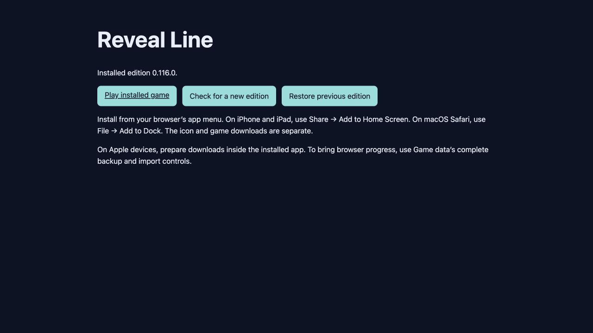

# Verification record — 2026-09-26

This is an implementation/qualification record, not a published platform-support claim.
The implementation was rebased onto `23e6129782e08ed826686f137a0989e5f154732a`,
fetched from `main` (0.131.0). The prepared release slot is v0.132.0.
No release or site was published during this work.

## Automated checks

| Check | Result |
| --- | --- |
| Unchanged baseline build | Passed; 1,145 files, 595,516,304 distribution bytes |
| Initial baseline offline/audio tests | 113 passed |
| Rebased downloader, official chapter/media, migration, worker, wake-lock, audio, backup and recipe-source tests | 276 passed |
| Publication, launcher, frozen snapshot and native-wrapper checks | 85 passed |
| Save/host lifecycle regression checks | New lifecycle failures fixed; existing Team fixture failures remain |
| Current-main comparison | Team picture fixture, Versus transport timeout and one presentation expectation reproduce on unchanged main |
| Content validation, presentation reproduction, ESLint and formatting | Passed on the final rebased source |
| Full repository suite | Test runner exited 1; captured 12,315 top-level results, including 1,297 failures. Final TAP totals are absent; not a green qualification gate. |

Reproduce the principal tests from the worktree root:

```sh
node --test --test-concurrency=4 \
  game/test/official-downloads.test.mjs game/test/official-chapters.test.mjs \
  game/test/installed-app.test.mjs game/test/game-wake-lock.test.mjs \
  game/test/offline.test.mjs game/test/offline-panel.test.mjs \
  game/test/soundtrack-source.test.mjs game/test/soundtrack-player.test.mjs \
  game/test/soundtrack-panel.test.mjs game/test/backup.test.mjs game/test/media-runtime-read.test.mjs \
  scripts/test-offline-publication.mjs
npm run validate
npm run lint
npm run format:check
npm run build
```

Tests cover connection loss while still nominally online, app/worker replacement,
pause, aborted and quota-failed writes, byte/hash corruption, partial HTTP responses,
duplicate/hash reuse, independent music failure, shared references and import
preservation. Worker tests cover scope-limited cleanup, unchanged runtime reuse,
range responses and interrupted installation checkpoints. Migration tests cover
changed sources, writer contention, interrupted journals, Undo invalidation and
explicit rollback without overwriting either profile. Official chapters are tested
alongside all twelve occupied user-import slots.

The full suite was started before several fixes and records those initial failures
as well as baseline failures. It exited with `Tests failed with exit 1`; the log
contains 11,018 passing and 1,297 failing top-level results, then ends without final
TAP totals. These are captured results, not a complete suite count. The two late
71-mission Versus tests ran for roughly forty minutes each; their final outcomes
and later buffered results were not emitted. A process sample showed nested array
traversal and string splitting, consistent with the synthetic DOM helpers; it does
not establish why final TAP output is missing. No timeout or termination was
requested. Separate tests reran the corrected behavior. Detached
baseline comparisons reproduced 1,058 failures across seven targeted batches
containing 2,109 tests. These include outdated Team artwork/checkpoint fixtures,
session-version and journey expectations, and the undefined `compileContentProject`
inspector fixture. This is not a claim that every full-suite failure was classified.
See [test-summary.json](evidence/test-summary.json) and its compressed TAP logs for
exact counts and retained failure evidence. Later baseline comparisons use unchanged files hard-linked into an isolated copy,
with every changed file restored from the baseline Git revision, to avoid another
1.6 GiB allocation on this nearly full disk.

The snapshot provenance test exposed an existing dirty-checkout bug, fixed in this
change. Publication fixture cleanup also retries transient `ENOTEMPTY` errors from
background Git metadata writes. One build attempt hit `ENOSPC`; removing the
completed temporary baseline worktree recovered space, while the previous valid
distribution remained intact.

Historical implementation and baseline logs are retained under
`docs/offline-pwa/evidence/`. Generated current inventories and the distribution
manifest are in the ignored local `dist/` directory.

Production reproduction (`produce-field-kit-theme.mjs --check`) passes at revision 86.
The uncommitted ledger's declaration check passes with 194 required reviewed slots;
this is not a committed-source release-readiness receipt. The three new source-ledger
regressions are fixed; its complete test file still has one failure also reproduced
on main. Ordinary transfer regression tests pass 11/11. Classic entry and Motion
Lab syntax checks pass. The final six-file host rerun passed 55/57; the remaining
new focus expectation was corrected and passed in an 18-test rerun (17 passed).
Its sole remaining Flight Records picture-initialization timeout also reproduces
on unchanged main (16/17), while that exact case passes in isolation on both trees.
The standard Cache API fixture was updated for the worker's new hash-index lookup.

The final rebased ordinary build contains 1,298 files; every manifest hash and byte count
was rechecked. ZIP SHA-256:
`9d3cfc44c1399b0d0db8488b8e82dc396451faedc0a65da18990d4c334715ba0`.
It is a local candidate build, not a frozen release. See
[evidence/build-identity.json](evidence/build-identity.json) and
[evidence/inventory-summary.json](evidence/inventory-summary.json).

Deduplicated gameplay is **597,252,702 bytes (569.6 MiB)**, versus **363,627,890
bytes (346.8 MiB)** of optional recordings. The required core is 46,660,811 bytes
across 1,121 files and contains no MP3. Runtime plus gameplay cache storage is
599,088,653 bytes. The conservative worst-case two-edition peak is 1,210,535,752
bytes before saves, imports and browser overhead. The first-download peak is
611,447,099 bytes. Storage estimates are advisory, and caches share the origin quota.

## Browser evidence

Test surface: Codex In-app Browser on macOS 26.6.2 (25G83). The browser tool does not expose
an exact engine/version or provide a physical installed mobile device. This does
not qualify Android, iOS/iPadOS or Safari Add to Dock.

The following browser evidence was captured on the earlier v0.116 implementation
build and remains behavioral evidence, not qualification of the current rebased
candidate. The packaged build was served on `127.0.0.1:8778`. The all-game download reached
**Game ready offline** while **Soundtracks: 0 downloaded of 70** remained unchanged.
The server process was then stopped, so requests actually failed; no fake
`navigator.onLine` override was used. The original tab was closed before opening
the game in a new tab. Solo, Versus and Team had not been visited before download.

- Solo cold launch, first mission, 34.3% clear, 8,160 points, original reward viewing.
- Versus mode navigation, first race, Sunflower win at 34.3%, 8,160 points.
- Team mode navigation, original arena readiness, two-player movement and shared
  cuts to 57.1%, life recovery, pause and navigation. A complete Team clear still
  needs to be included in device qualification.
- Returning to Solo checks retained progress independently of the unfinished Team attempt.





A second preview used the real publication layout on `127.0.0.1:8779`:
`/revealline/app/` and `/revealline/releases/v0.116.0/site/`. Its test-host CSP blocks
external `connect-src` and media requests. Preparing all gameplay made 1,224 local
requests and zero MP3 requests. After the server stopped and the tab was closed,
a new tab at the stable launcher opened the selected edition from local state.
Solo cleared at 67.1% / 15,980 points with sound enabled. An unvisited Night Shift
chapter prepared and started from official cache bytes, then saved paused at 2:18.
A failed explicit soundtrack download kept gameplay ready. The existing Classic
mission browser labels the first mount “Download” even when the bytes are already
local; it performs local preparation and then shows Play.

The real compiler produced a second test edition, 0.116.1, from the implementation.
To conserve disk space after two ENOSPC attempts, its site fixture hard-links 1,140
unchanged files and omits a second ZIP; the ordinary final build above includes its
ZIP. The two published-layout paths remain separate and immutable during the test.
The test edition uses the runtime before the final two-file transfer-link wording
change; download, migration and activation logic matches the final implementation.

- Explicit update check preserved the all-gameplay selection and zero soundtracks.
- Update preparation reused every chapter and artwork download: zero chapter,
  artwork or MP3 requests. Its first uncontrolled download-page load still fetched
  bootstrap modules; worker installation reused verified unchanged runtime hashes.
- Activation stayed pending until the earlier release was reviewed and copied.
- Classic's existing journaled transaction copied one official pack reference and
  one suspended flight, while keeping the earlier release and offering Undo.
- Edition B activated with zero recordings, and another blocked music download left
  gameplay ready. Closing the tab and stopping the server still allowed cold B launch.
- The migrated Midnight Channel flight restored offline, paused at exactly 2:18,
  with three lives and zero coverage. Journey Continue progress also remained visible.
- Explicit rollback verified the earlier edition offline and restored launcher
  selection to 0.116.0.

See [update-summary.json](evidence/update-summary.json) for request counts and scope.
Journey receipts remain in their existing content-edition stores; the complete
release-profile transfer is opened through Classic, rather than Journey's separate
backup controls. No real player's profile was used by these localhost tests.





## Remaining release gates

For each device, record OS version, browser version, install path, edition/build ID,
inventory, screenshots, failed requests and storage estimates. Use a fresh profile
and repeat with an existing player's backup.

| Platform | Required installed evidence | Status |
| --- | --- | --- |
| Physical Android / Chrome | Icon launch in airplane mode; full Solo/Versus/Team journeys; rotation, controller, wake lock, audio, background/resume | Not available in this session |
| Physical iPhone / Safari | Prepare inside Home Screen app; separate browser-progress import; cold launch, safe areas, audio and storage pressure | Not available in this session |
| Physical iPad / Safari | Same, including split view/rotation and controllers | Not available in this session |
| Desktop Chrome / Edge | Installed window launch, scope-preserving navigation, updates and multiple windows | Embedded-browser coverage only |
| macOS Safari Add to Dock | Installed storage isolation, launch, audio, update/recovery | Not available in this session |

Also qualify A → B on installed devices with production-sized profiles, an incompatible suspended
flight, interrupted transfer, rollback, and a partial album. Unit tests cover these
state transitions; installed-device tests must confirm browser lifecycle behavior.
Test zero/some/all recorded music, unavailable soundtrack host with the browser
still online, quota denial, eviction, missing/corrupt files, import preservation,
and physical-device closure during a download. Do not claim these device gates
passed based solely on the automated tests above.

Native Safari inspection was unavailable because Computer Use permissions were not granted. `xcrun xctrace` is unavailable on this host. No physical Android, iPhone or iPad was accessible. Those limitations are not passing device evidence.
