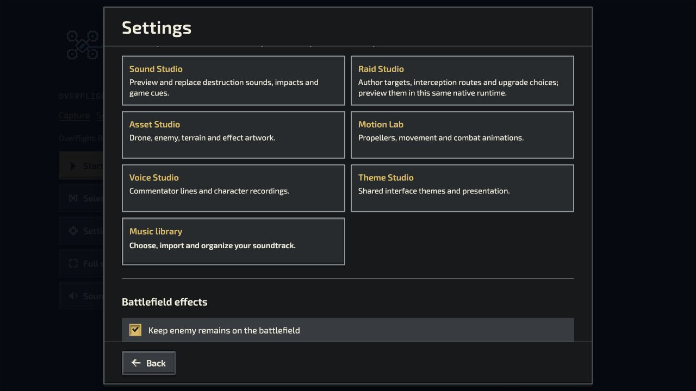
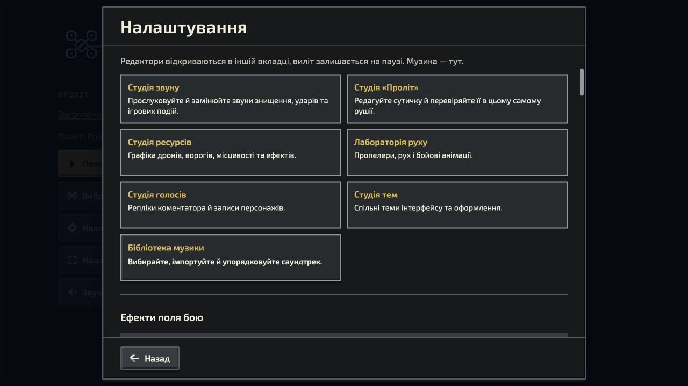

# Enemy destruction audio review — 2026-10-05

Implemented on `codex/destruction-audio`, stacked on the Raid candidate (`2de6e0e65`).

## Delivered

- Five shared sound categories: infantry, armored infantry, light machinery, heavy machinery and electronics; three distinct licensed recordings each.
- Native Survivor/Raid, Capture/Journey/Hunt, Snake and team defeat adapters retain enemy identity. Crowd deaths coalesce by category; Raid duplicate semantic events do not double-play.
- Optional FPV World/Academy uses the same categories through its existing bounded procedural engine. It does **not** load published Sound Studio recording replacements; those are supported by the native Soundscape modes.
- Shared master/effects volume, mute, pause, terminal destruction tails, warning priority and brutal preference remain honored. At most 16 native feedback voices; practice reserves two of its 12 effect voices for urgent cues.
- Imported destruction recordings are attenuated to the bank's peak and short-window RMS ceilings. No original sample is changed or amplified. Procedural fallbacks are numerically calibrated to avoid missing-pack volume jumps.
- Survivor and Raid Settings expose Sound, mode Creator, Asset, Motion, Voice, Theme and Music tools in EN/UK. Existing Studios retain their content ownership and playback services.
- Optional destruction slots can be admitted to existing Studio projects with an undoable action. Existing originals, bindings, saved revisions and export/import remain intact. Company board packaging includes authored destruction recordings.

## Listen and review

[Sequential audition](audition.wav) presents infantry → armored infantry → light machinery → heavy machinery → electronics, three variations each. [Timeline](audition.json) gives exact positions. The WAV contains the authored samples without music or extra gain.

[Production and source notes](../../../../authoring/audio/revealline-v1/DESTRUCTION.md) include source links, exact license/original checksums, recipes, measurements and reproducible build commands. Runtime addition: 582,420 bytes and approximately 1.11 MiB decoded.

## Evidence

- Final focused suite: **193/193 passed** (audio, category routing, source integrity, calibration, lifecycle, Studio admission/navigation, published playback and immutable presentation host).
- Additional adapter/core cohort: **137/137 passed**. Do not add this to the focused count; cohorts overlap.
- Company edition regression: **15/16 passed**; the remaining existing DroneAid test needs `authoring/library/droneaid-brand-kit-2026-09-29/background-original.png`, omitted by this checkout's sparse configuration (`git ls-files -v` reports `S`). Destruction packaging and all 13 Classic catch tests pass.
- Localization, game content/reference validation and presentation metadata checks pass. Generated Academy/reaction audio and the other optional runtime projections verify byte-identical after regeneration.
- Changed JavaScript passes ESLint; source formatting and `git diff --check` pass.
- Browser checks: Raid EN and Survivor UK Settings; mode-specific Creator paths; Sound admission and undo; Voice editor disclosure; existing Music Player; native infantry/heavy cue audition. No browser warnings/errors observed in those checks.
- Browser admission was an unsaved test draft, not a replacement of the user's saved workspace.

These checks establish routing, resource bounds and reproducibility. They are not a human listening panel, a recorded full-game audio mix or reference-laptop performance qualification. Review the audition and a real sortie on speakers/headphones before release; publication remains separate.
