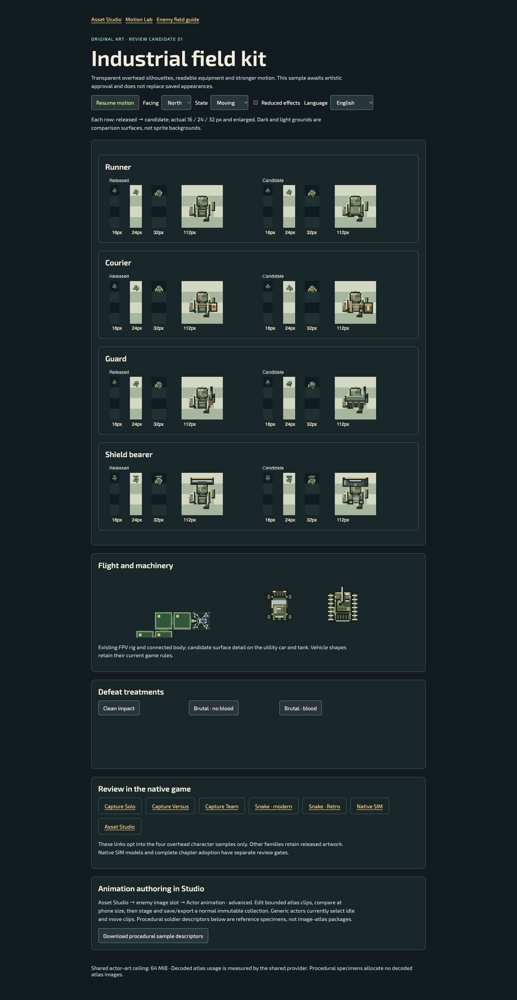
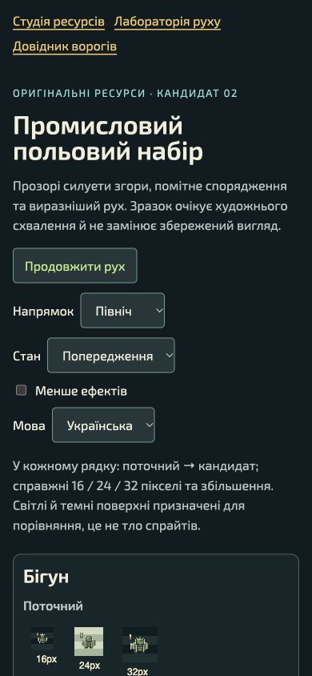
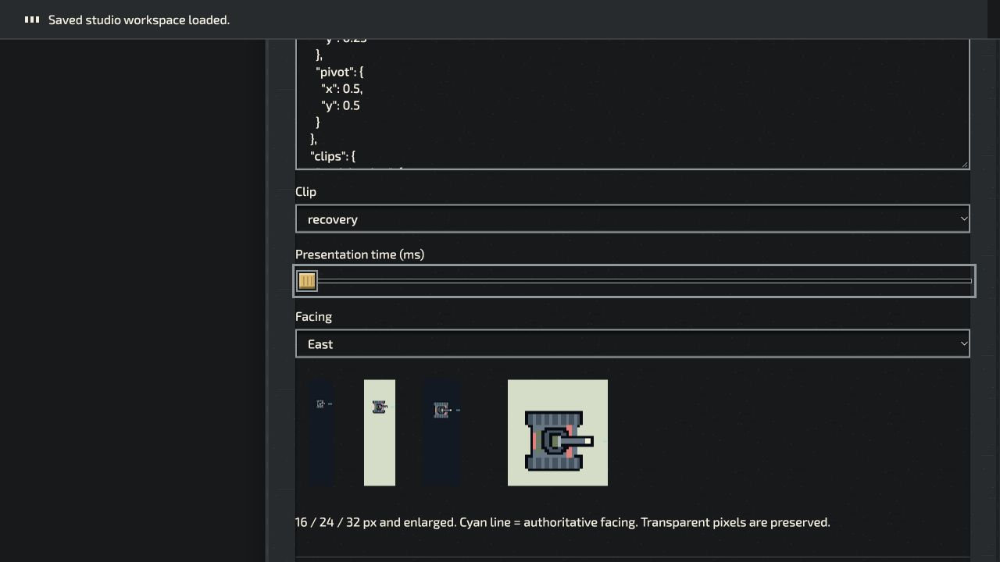
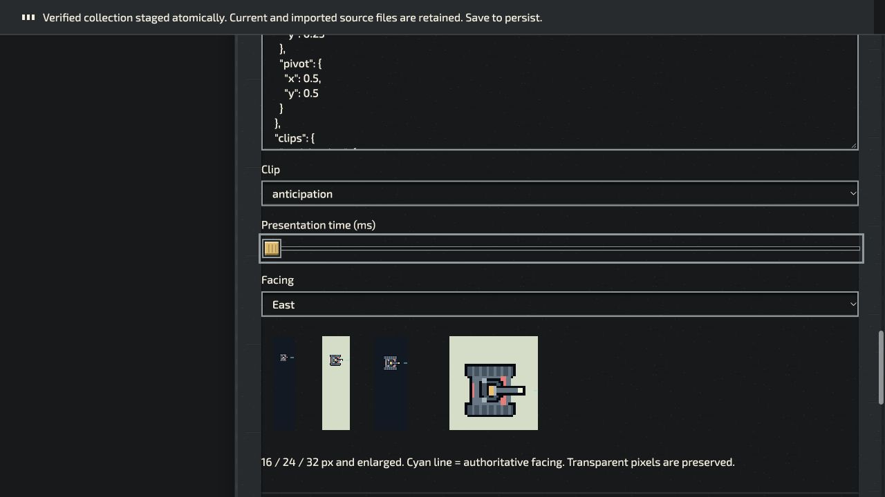
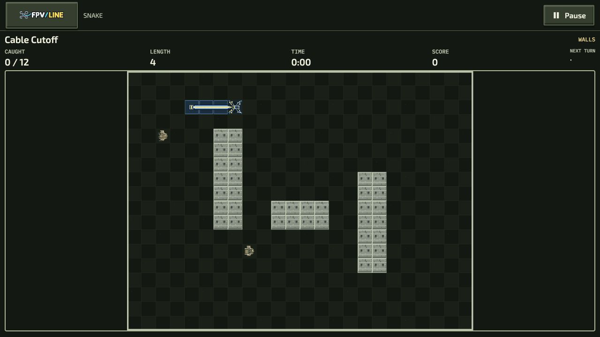
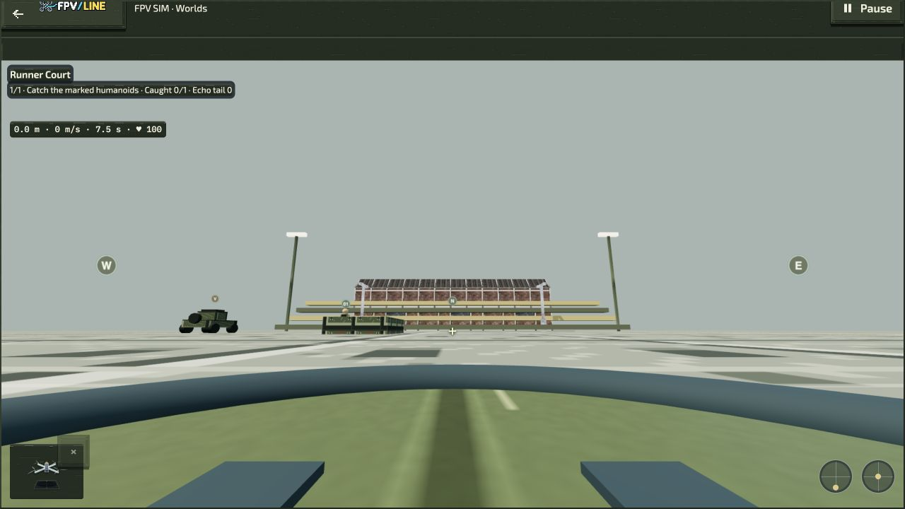

# Industrial art and unified play review

This is a review candidate, not production art approval or a public release.
The [implementation register](../../unified-industrial-plan.md) separates implemented source from required acceptance and optional expansion.

## Open the sample

Run the repository development server, then open `/authoring/industrial-art-review/`.
The current local review server uses <http://127.0.0.1:8790/authoring/industrial-art-review/>.
Use Pause, Facing, Appearance kit, State and Reduced effects to compare previous and corrected silhouettes at actual 16/24/32 px and enlarged sizes. EN/UK copy and native play links are provided. Each defeat preview is explicitly triggered by its labeled button.

Candidate 03 covers twelve families and three appearances using original procedural rigs; [the perspective audit](overhead-v2/README.md) records the changes, scope and limitations. Candidate 02 observations below remain historical evidence. They allocate no decoded atlas bitmap. The displayed 64/32 MiB ceiling is shared-provider capacity, not a measured process-memory number. Machine and material details are opt-in review specimens; default machinery bindings remain unchanged. Candidate 02 adds shared concrete/earth/metal samples, six deliberate audio samples and the downloadable twelve-frame Studio collection. The FPV drone, connected Retro body and destruction use existing shared renderers.

## Manual observations, 3 October 2026

- Desktop IAB: review page renders four transparent overhead candidates, real-size/enlarged comparison grounds and the native play links. Pausing freezes the comparison animation. Screenshot above records the visible specimen state.
- Native Snake: Cable Cutoff opened at briefing and explicit Start entered focused Retro play with native HUD; no console warning/error was observed. This is a startup check, not a clear or gameplay-quality qualification.
- Asset Studio on isolated localhost: selected `enemy.bouncer`, loaded the current image descriptor, checked preview, staged asset-v2, saved local revision atomically, reloaded document r105, and loaded the retained animation descriptor. Export prepared `revealline-fpv-r105.rltheme` including source files/revisions. The IAB download-event adapter timed out, so that first candidate did not establish an external file round trip. Candidate 02 below resolves this gap with a genuinely multi-frame sample. The first candidate reused its source frame across clips.
- Private Snake Versus: two local tabs joined the same recipe, both chose Ready, paired native boards started, and a terminal collision reached Results without console errors. Rematch reset readiness; both seats started again; Pause returned to the shared menu and Settings exposed the shared audio/display controls. This is a localhost lifecycle check, not network latency, reconnect, audio-listening or human play qualification.
- Attempted viewport override did not change the observed 1552×1484 CSS viewport. It was reset. Phone-size checks are **not** marked complete.

## Candidate 02 observations, 3 October 2026

- Review page: EN/UK headings, controls, material/audio descriptions and native links render. At the observed **390×844 CSS viewport**, page scroll width equals 390 and each actor canvas has 332 bitmap pixels for 332 CSS pixels. Released/candidate panels stack; 16/24/32 px specimens retain their actual size. Requests for other viewport dimensions did not change this observed width, so 320/360 px remain unqualified. Temporary viewport overrides were reset.
- Audio controls: muted Runner sample returns the muted explanation; deliberate unmute and Courier Play report a started sample; prior mute was restored. This verifies UI activation/routing, not speaker/headphone listening quality.
- Studio: the first real import exposed 54 unpublished picture slots in the generated baseline. The producer now pins the published 335-slot registry and calls native workspace adoption. The corrected 990,438-byte collection imported atomically; `enemy.bouncer` exposes 12 distinct frames, seven clips, its centered pivot and immutable parent. Anticipation/move/recovery, east facing and presentation-time scrubbing were inspected. A staged animation revision saved and reloaded successfully. The download-event adapter timed out, but the actual exported file was saved to Downloads. That 8,807,071-byte file was re-imported through the ordinary file chooser: native admission succeeded and the reloaded actor retained all twelve frames, seven clips and centered pivot. The [external-file receipt](studio-atlas-roundtrip.json) pins its SHA-256. Generator transport round-trip is separate byte-identical source evidence.
- Native Snake: Military Field Cable Cutoff entered focused play with the shared concrete walls and drone/body, reached a wall-failure result, then Retry and immediate Pause returned to the shared menu. No console warnings/errors were observed. This was not a successful mission clear.
- Native SIM: selected Runner Court through the ordinary mission menu, armed deliberately, observed the existing flight scene with the candidate material map, and paused through the shared menu. Native hull, target and control HUDs remained present; no console warnings/errors were observed. No flight completion, new model approval or catch-route qualification is claimed.
- Native Capture: the local preview requires its normal password. Access was requested from the user; no gate state was bypassed. Solo/Versus/Team browser evidence remains pending until unlocked.
- Direct Team enemy slots now admit validated asset-v2 full-sheet images with the same 32×32 per-frame contract. Detached equal geometry is re-admitted before rendering; static slots retain their original whole-image rules. Native adapter admission and authored regressions support this change; live Team observation still awaits Capture unlock.
- Independent source review caught and fixed a duplicate atlas idle pose and the native `field-tank` movement onset using the wheeled sound. No further issue was reported in atlas ownership/phase clocks or shared audio priority/restoration. Review does not replace waived automated suites.

## Reliability and phone-layout continuation, 4 October 2026

The [continuation report](continuation-2026-10-04/README.md) records corrected artwork ownership, recording provenance and room lifecycle handling, plus native Snake CSS measurements at 320/360/390 px. Earlier failed viewport attempts above remain historical; the new observations use measured viewport dimensions. They do not qualify physical phones or simultaneous touch.

## Evidence boundaries

`inventory.json` records immutable source hashes, byte sizes and mechanical Keep/Refine triage. It does not mean each of the 1,181 tracked visual/model files received artistic review. There are no third-party game-art copies.

`../../verification/native-pursuit-structural.json` records the native SIM route/Studio admission cases and source hashes. Zero simulation steps were used; this is deliberately not a completion route.

Automated regression sources cover bounded decoding, cancellation, sharing, atlas admission/pivot rules, stale Studio ownership, pursuit phases, recording validation and room ordering. They were authored **without running** the waived test suites.

## Pending before broad recommendation

- Complete native Capture Solo/Versus/Team scene captures after normal unlock, and review the implemented terrain/material/audio sample in all represented native contexts.
- Artist/user review of silhouettes, motion and all three destruction treatments.
- Offload/reinstall and interrupted-load evidence. The multi-frame sample now has native import, stage, save, reload, external export and external-file re-import observations.
- Broader 320/360/390 px host coverage, physical devices, landscape, enlarged text, two-player touch, controllers and audio listening. The continuation establishes only the listed Snake portrait CSS layouts.
- Measured low-end frame rate/peak memory and simultaneous two-board effects.
- Pause/Retry/restore/seeking across all represented modes, completed pinned-seed routes and human play review.

The all-family corrected overhead rig is a perspective review, not approval of full-roster/36-appearance production artwork. The plan still requires Phase C approval before mass production. Independent engine, recording and private-room correctness work can proceed.

## Source gates for candidate 02

Full ESLint, repository/native formatting, localization/content/pack validation, presentation metadata, all four generated flight projections, production-readiness declarations and the byte-identical sample producer passed locally. Regression files were authored without running automated suites. Exact committed-source identity and package/build receipts are recorded on PR #1005.

The additional full production regeneration check (`produce-field-kit-theme.mjs --check`) stops at the existing immutable Team migration guard: the current catalogue adds 54 picture slots beyond the published 335-slot Studio contract; that migration admits only its approved additive Team slots. The relevant catalogue, migration and compiled sources are unchanged from baseline `cfbbabac8`. This review does not relax the guard, regenerate approved artwork or relabel it reviewed. Resolving that separate production continuation remains a release gate. The review atlas uses the published slot subset and passes the normal importer.
