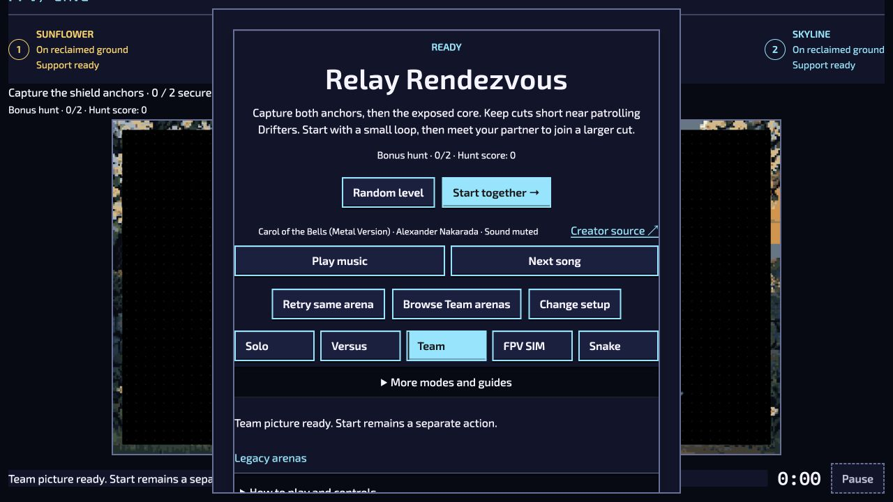
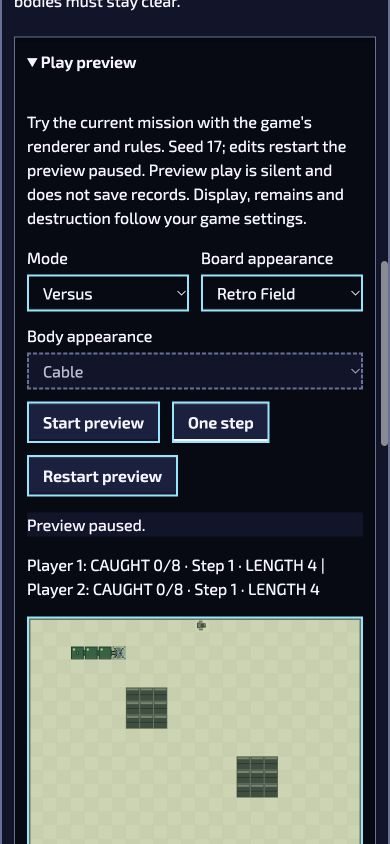
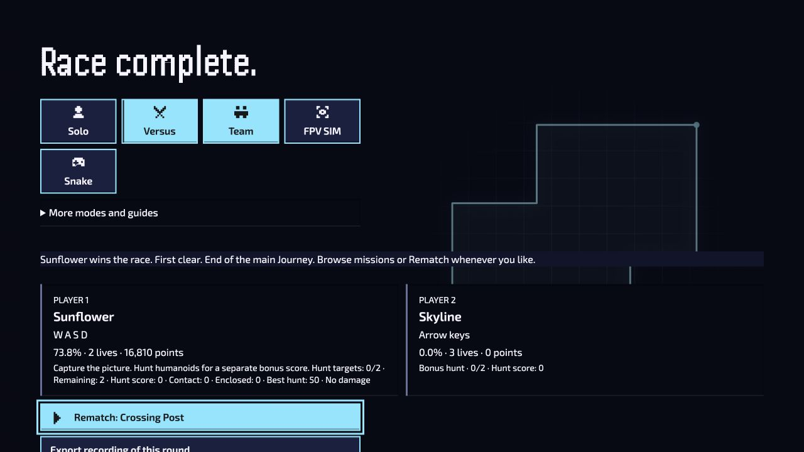

# Briefing, native Studio preview and recording v2 — 4 October 2026

This packet records normal browser actions against the evolving review worktree. It is agent-observed integration evidence, not human enjoyment, artistic approval or public-release qualification. The original historical v1 files remain unchanged.

## Mission selection and explicit Start

- **Solo / Crossing Post:** selecting the exact library row returned the native ready overlay, accepted objective and focused **Start mission**. The clock stayed at 0:00 during unrelated work. Explicit Start entered play; Pause and selecting the same mission prepared a new 0:00 briefing.
- **Versus / Crossing Post:** selecting its library row prepared paired boards and showed the exact mission/objective in the main shell. **Start race** was focused. Explicit Start entered the native paired race.
- **Team / Relay Rendezvous:** selecting its library row showed **READY**, the exact anchor/core objective, 0:00 and focused **Start together**. Only that action entered play; Pause showed the native shared pause overlay.

These observations cover native candidate mission selection. Installed content, saved Team attempts, controller-neutral boundaries, cancellation and stale preparation ownership have authored regressions but are not claimed as newly exercised browser cases.

## Snake Studio live board preview

Opened the existing Studio draft (Refuge Bays), then expanded **Play preview**. Solo began paused at step 0. One step advanced native play. Switching to Versus produced two matching initial boards; individual P1 turns changed only P1's route while both boards advanced. Team used one shared board and two lengths. Start ran the native timeline. Closing and reopening retired the previous preview and returned to paused step 0.

Retro Field retained its connected green body and FPV head; Game theme used the shared modern board. The preview is explicitly silent and writes no records. Existing full native Play links remain the audio/gameplay route. The separate specimen phase is now labeled to avoid implying it controls native actor state.

Actual CSS-width observations after correcting an intrinsic form-field overflow:

| Width  | EN Versus board width / height | Page overflow | Direction controls |
| ------ | ------------------------------ | ------------- | ------------------ |
| 320 px | 266 × 199.5 px, stacked        | None          | 48 × 48 px         |
| 360 px | 306 × 229.5 px, stacked        | None          | 48 × 48 px         |
| 390 px | 336 × 252 px, stacked          | None          | 48 × 48 px         |

Ukrainian Team at 360 px displayed shared catch/step/length feedback and two localized 48 px control groups, with no horizontal overflow. Studio intentionally scrolls. Browser viewport overrides were reset after measurement; this does not simulate physical phone performance or simultaneous touch.

## Fresh multiplayer v2 recording

A new native Crossing Post Versus attempt reached **73.8%**, **16,810 points**, two remaining lives and a first-clear victory. It used the authored untimed Standard recipe and seed 1. One trail interception cost a life; the second seat remained stationary. Both optional humanoids survived, demonstrating that zero-kill Bonus completion remains valid. This route does not qualify contact interception or competitive balance.

The ordinary result action downloaded `versus-crossing-post-v2.json`. The browser download-event adapter timed out, but the actual new file was found in Downloads and copied unchanged. Its SHA-256 is `0704a85104c69e18af8c918a441a592f485f0c76990e378042f8ef5ad5ae024e`.

| Verifier                                                   | Declared terminal observations | Exact complete native state |
| ---------------------------------------------------------- | ------------------------------ | --------------------------- |
| Originating Chrome browser, normal Playground paste/verify | Match                          | Match                       |
| Node 22, pinned native pilot verification command          | Match                          | Different                   |

The Node receipt is explicitly `pursuit-pilot-recording-receipt.v2` / `native-terminal-observation-completion`. It records the source checkout as dirty because this observation preceded the reviewed commit. The original browser export identifies its build as `dev`. These facts are preserved, not relabeled as committed-release evidence. The final PR source/build checks are separate.

The v2 contract binds the recipe, input journal and declared discrete terminal observations, with an explicit supported-engine list. It does not round numbers or claim identical continuous trajectories. V1 remains exact-only. This is one genuine browser-to-Node success; Team v2, other engine generations and historical devices remain to be reviewed.

## Verification boundary and next work

Full lint and repository/native formatting, localization/content/projection validation, committed source identity and package/build results are reported for the PR head. Focused host, recording and Studio regressions are authored but not run under the explicit suite waiver. Independent source reviews found no confirmed blockers.

Continue the six-pilot completion/interception matrix, Studio export/import and offline/recovery observations, then the Phase C art/sound decision. Production art expansion follows that decision. Device/hardware and real-network room review, HTTPS hosting and atomic published adoption retain their existing gates. Optional campaign and online expansion remains optional.
