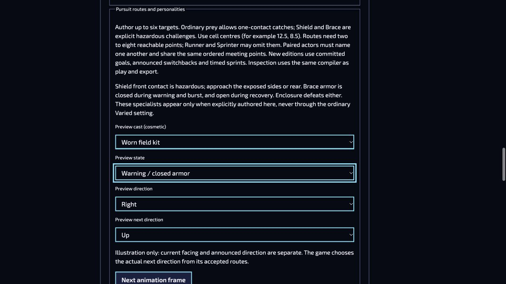

# Isolated production candidate and Studio guidance — 4 October 2026

This continuation reconciles published Field Kit revision 104's 335-slot contract with the 54 newer Retro picture slots without replacing published artwork or granting approval.

## Candidate migration

`scripts/picture-production-migration.json` pins the exact published history, definitions and owners, plus the exact 54 additions. Changed, incomplete or extra additions are rejected. Existing history stays immutable; successor revision 105 selects candidate content. All additions remain source-stage.

The producer also reopens changed-source reviews on 98 existing selected bindings: 93 reviewed → source and five reviewed → produced. These are conservative candidate downgrades, not modifications to published revision 104 or its historical evidence. Candidate coverage is 246 source, five produced, 138 reviewed and zero missing; `requiredReady` remains false.

The published runtime is separately retained as 1,264,907 exact bytes, SHA-256 `b1123620aa68398dd8131aafa23f29bd686224bb9e50bf86ceeeef94752a1ef3`, from commit `c5e22bc860e9021d42ce326761d0f4decba3fc40`. Historical aliases and dependency closure remain available.

Run from a clean committed checkout, using an existing parent and a new output directory:

```sh
node scripts/produce-field-kit-theme.mjs --candidate /absolute/existing-parent/new-review-directory
node scripts/produce-field-kit-theme.mjs --check-candidate /absolute/existing-parent/new-review-directory
```

Output contains `production.rltheme`, `compiled/` and `review.json`, staged and published as one directory. Existing destinations and aliases into production are rejected. Within the checkout, output is restricted to a new child of `.cache`. The receipt pins the source tree, actual consumed Git inputs, migration, output bytes and unapproved coverage. Verification reproduces the complete tree byte for byte; symlinks and unlisted files are rejected.

The published `--write` path remains guarded and was not used. Atomic adoption of approved content into the published ledger and runtime locations is separate remaining work.

## Structural measurements

Working-tree in-memory generation, compilation, output validation and portable export/import passed without simulation steps:

| Measurement                             |                  Result |
| --------------------------------------- | ----------------------: |
| Candidate slots                         |                     389 |
| Asset history records / theme revisions |             2,838 / 106 |
| Compiled files / bytes                  |        149 / 24,906,781 |
| Portable ledger bytes / payloads        |         8,975,679 / 132 |
| Studio metadata bytes / cap             |   4,966,326 / 5,242,880 |
| Runtime metadata bytes                  |               1,141,002 |
| Retained manifests                      |                      13 |
| Retained dependency closure bytes / cap | 17,063,408 / 33,554,432 |

These are structural measurements, not artistic approval, device memory measurements or completed play routes. Committed-source reproduction receipts belong to the PR and are reported separately.

## Studio corrections and observations

- Capture/Team Studio separates current facing from the next announced direction in applicable pursuit warnings and shield turns. Preview-only controls do not rewrite mission rules or infer goals.
- Normal Capture Studio UI was observed with Switchback, Warning, current Right and next Up. The specimen updated and the illustration-only explanation remained visible. No Apply, Save or export action was used.
- Native FPV World Studio reuses the runtime field guide, filtered to the selected actor and pinned pursuit generation. Historical v1 and successor v2 advice remain distinct.
- An unsaved copy of **Refuge Return · Committed routes** showed the native 0.8-second shelter warning and 1.6-second rest. Its Courier showed **Optional catch · no quota credit** and native delivery-waypoint guidance. No flight was armed and no draft saved.
- Native Brace advice does not mention Snake's Pulse. Optional actors are included even when absent from the required Hunt quota.



Relevant migration, retention, candidate-writer and Studio regressions were authored without running waived automated suites. Lint, formatting, native formatting, localization/content validation and projection checks passed. Physical-device review, completed native play, final artwork approval and published adoption remain open.

## Private-room preparation follow-up

Source review found that Capture artwork fetches and image preparation could retain the sole snapshot poll after suspension. Preparation now shares the poll's cancellation signal and has an eight-second deadline. Suspension or abandonment immediately retires the poll. Failure disposes all newly owned painters; late work cannot mount retired boards. Previously accepted presentation remains owned until replacement succeeds.

Five focused regressions cover suspended decode, bounded timeout and late construction, partial failure, native fetch cancellation, and immediate poll release. They are authored but unrun under the automated-suite waiver. Source review and static checks do not establish interrupted-network, hardware or human-play qualification. Native simulation, timing, records and recipe ownership are unchanged.
