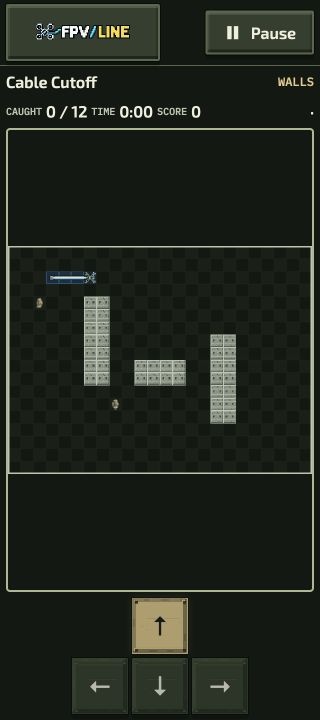
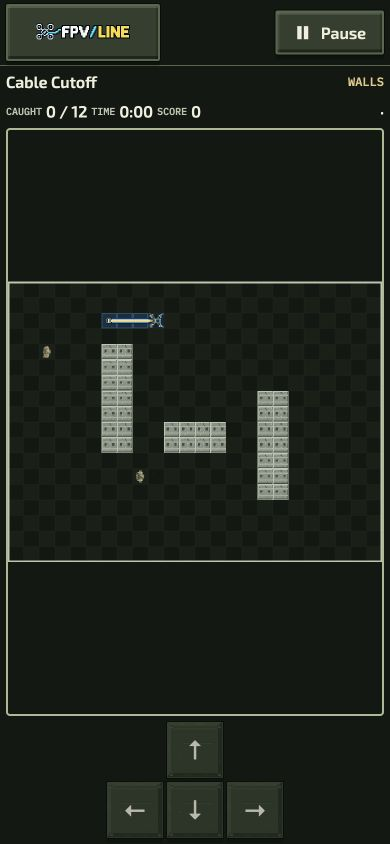
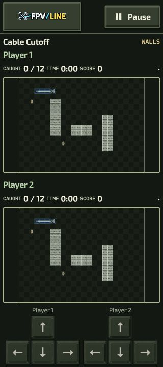
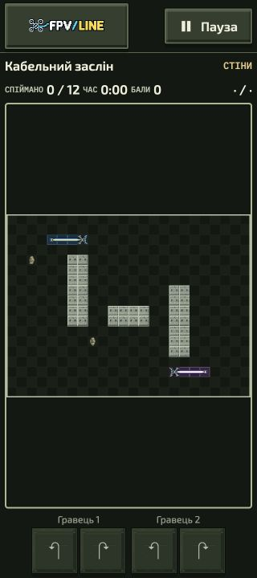

# Reliability and small-screen continuation — 4 October 2026

This continues the [implementation register](../../../unified-industrial-plan.md) after overhead candidate 03. Source changes and manual observations are separate from artistic approval, successful mission routes and public-release qualification.

## Corrections

- **Shared artwork lifecycle:** reacquiring an image while its canceled decoder finishes waits for retirement instead of failing or allocating duplicate pixels. DOM-isolated actor leases share the actual page pool. Temporary CSS export canvases stay charged until asynchronous encoding completes. Studio output canvases reserve their backing pixels and release on collapse/disposal/replacement; stale failures cannot replace current preview status.
- **Multiplayer recording ownership:** the v1 reader requires canonical source pins instead of discarding the validator's normalized result. Pilot verification checks the native source level, revision, identity and Team package identity as well as the runtime recipe. Complete historical v1 records and optional edition/package omission rules remain supported. Playground imports do not grant official progression.
- **Private-room controls:** keyboard and individual pointers own separate Team Support holds. Releasing one source cannot cancel another. Suspension clears holds and repeated Space cannot re-arm them. Delayed poll/Ready/Pause errors are ignored after their control epoch retires.
- **Room presentation:** transport pause/recovery projects a paused Team view without changing authoritative state. Restored topology and settled remains remain visible; the initial restored event tick is silent, avoiding old capture bursts. Fresh accepted events resume normally.

Focused regression sources were authored but not run under the repository waiver. Independent read-only reviews found no confirmed blocker. These statements describe implementation and review, not a successful live-network reconnection exercise.

## Manual native Snake observations

The local worktree served Cable Cutoff with `artReview=industrial-overhead-v2`. Ordinary mission selection, briefing, explicit Start, Pause and Settings were used. All observations below measured the actual DOM viewport after the viewport override. The browser used a desktop pointer; this was not a physical-phone or touch emulation session.

| Mode / locale / controls | Observed viewport | Board geometry                 | Smallest control | Observation                                              |
| ------------------------ | ----------------- | ------------------------------ | ---------------- | -------------------------------------------------------- |
| Solo EN / D-pad          | 320×720           | 304×228                        | 56×56            | Board and controls fit; scroll width 320                 |
| Solo EN / D-pad          | 360×740           | 344×258                        | 56×56            | Board and controls fit; scroll width 360                 |
| Solo EN / D-pad          | 390×844           | 374×280.5                      | 56×56            | Board and controls fit; scroll width 390                 |
| Versus EN / two D-pads   | 320×720           | Two stacked 246.4×184.8 boards | 45.3×45.3        | Both boards and all eight controls fit; scroll width 320 |
| Team EN / two D-pads     | 320×720           | Shared 304×228 board           | 45.3×45.3        | Board and all eight controls fit; scroll width 320       |
| Team UK / compact turns  | 320×720           | Shared board                   | 56×56            | All four localized turn controls fit; scroll width 320   |

The [geometry receipt](phone-geometry.json) contains measured rectangles, labels and viewport sizes. Temporary language and steering preferences were restored. No layout code was changed for these observations. No successful clear, catchability, animation-quality, simultaneous input or physical-device performance claim follows from them.

## Validation and remaining evidence

Mandatory lint, formatting, localization/content validation, generated projection checks, committed-source identity and reproducible optional-package builds are tracked with the exact PR head. The full core build runs in CI because this workstation lacks enough free disk for its output. The previous `a1ccee67` head completed the appearance preview, Community hosted acceptance and all Company gates successfully; it is baseline evidence, not a receipt for these changes.

Still required: interrupted-load/offload/reinstall browser evidence; native Capture observations after ordinary unlock; physical phones, landscape, enlarged text, overlapping touch/gamepad input, background recovery and real-network latency; completed pinned-seed routes; artistic review of motion and effects; low-end frame-rate and peak-memory measurements. The actor pool accounts supported decoded artwork and scratch backing stores, not all fixed fixture images or whole-page/GPU memory.

The existing production regeneration guard for 54 newer picture slots is unchanged. The reviewed sample continues to use the published Studio slot contract. Broader campaign promotion, public online play, media-bearing rooms and new combat/destructible-terrain mechanics remain optional as recorded in the plan.
