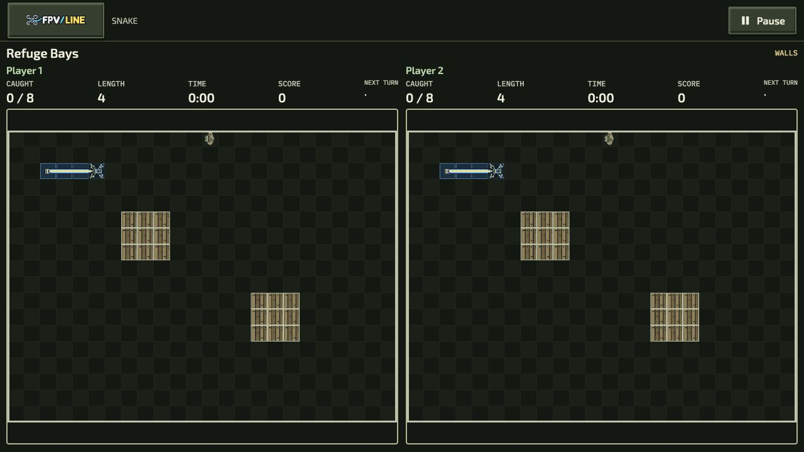
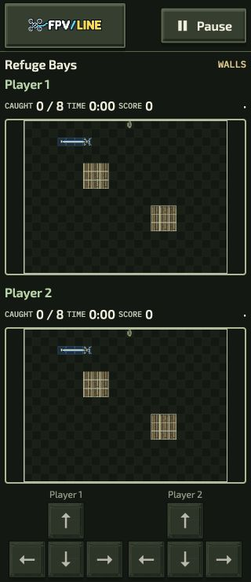
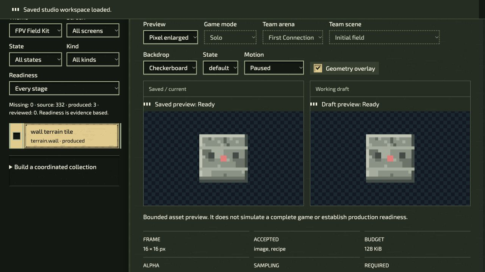

# Chapter environment browser evidence

These captures show the applied P2 source at `1717a5348111ae673209056b0eeef3e15e220f58`. They are review evidence from a desktop browser, not a public release or full device qualification. The screenshots are unchanged copies of the original captures.

## Snake Versus: Refuge Bays

The modern board uses the **Twin Intercepts** chapter kit, with timber wall tiles, the Military Field collection and `industrial-roster-v3` actors. Both boards show the same starting layout. These startup captures establish visible chapter-material binding and layout; they do not establish successful interception, mission completion or competitive balance.

| Emulated viewport | Scroll extent | Smallest directional button  | Measured direction buttons |
| ----------------- | ------------- | ---------------------------- | -------------------------- |
| 320 × 740         | 320 × 740     | 45.328125 × 45.328125 CSS px | 8                          |
| 360 × 740         | 360 × 740     | 52 × 52 CSS px               | 8                          |
| 390 × 740         | 390 × 740     | 56 × 56 CSS px               | 8                          |

All three captured layouts have no horizontal or vertical document overflow. The complete measurements, exact mission identity and source hash are in [versus-layouts.json](versus-layouts.json). Only the 320 px and desktop layouts have screenshots in this package; the other widths have recorded DOM measurements.

## Native Asset Studio: Guarded Crossings

The native UI imported the generated Guarded Crossings chapter package, saved generation 3 at revision 106, exported it, reimported that export at revision 107, saved generation 4 and reloaded revision 107. Both Saved and Draft previews returned **Ready**. The registry contains 335 slots: 332 retained source slots and three chapter terrain assets.

The actual export is 8,810,992 bytes with SHA-256 `558e9333894054f13708a123cf353815f7a5e4dd3249aceb502aa7ce51133dda`. Every retained file was verified, and the wall, slow and lethal terrain hashes match the committed chapter inventory. The full export contains the native workspace sources and is deliberately not duplicated in this small evidence package. [studio-roundtrip.json](studio-roundtrip.json) retains the export hash, terrain hashes and UI sequence without the personal download path.

This demonstrates one complete interactive chapter round trip. It does not claim fourteen separate UI round trips or qualify the appearance of every slot. The same-source generator check matched all 16 committed outputs, and both native Studio software-admission regressions passed; these are separate software checks.

## Source and limits

[source-identity.json](source-identity.json) records the exact clean source revision, Git tree and canonical source aggregate verified before and after the producer/admission checks. [manifest.json](manifest.json) binds the image and receipt bytes. Browser observation receipts identify the same frozen source; this package does not claim independent server attestation from an image alone.

The evidence does **not** establish physical-phone behavior, simultaneous touch ownership, controller input, audibility, muted/reduced-effect parity, frame pacing, memory disposal under load, landscape layout, enlarged text or human play acceptance. Those checks remain in the [qualification register](../../../industrial-environments-qualification.md). No replay or completed interception is asserted by these startup images. Captures of later commits must retain their own source identity rather than relabel this package.
