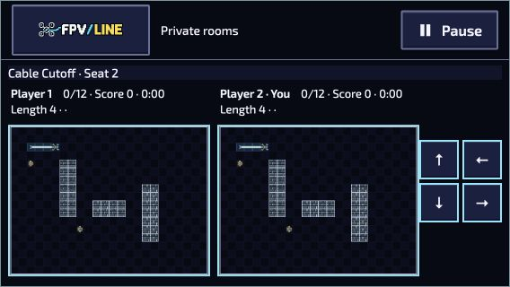
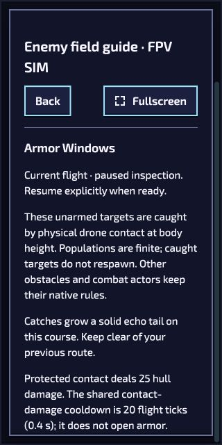

# Intent cues, room layouts and native flight guide — 4 October 2026

This continuation covers shared presentation and local UX on the industrial review branch. It does not approve the artwork or qualify a completed gameplay route. Automated suites remain waived; focused regressions are authored without execution.

## Changes

- Capture presentation retains the accepted next heading for ordinary Sprinter, Refuge and Switchback warnings. A hollow direction arrow stays visible with Reduced effects; cached north-facing artwork transforms it relative to the actor before world rotation. It does not infer a route from an inaccessible destination, change specialist facing or alter simulation.
- Private-room canvas wrappers now stretch within the allocated board area. Previously a 1280×720 play view had 627×0 wrappers and 4×4 canvases. Removing the obsolete narrow-screen height cap also preserves canvas aspect ratio in landscape. Equipment controls use a compact two-column arrangement.
- Crossing the side-control layout breakpoint releases held inputs and pauses an active room. Resuming still requires both seats to choose Ready. Menu/inactive/disposed input owners do not send a pause.
- Native FPV SIM gains a text-first Enemy field guide, available from Hunt course previews and paused flight/shared menus. Accepted native actors determine required, optional and remaining counts. Goal–Tell–Counter descriptions distinguish historical and successor pursuit rules; specialist damage, finite populations, ordered catches and echo tails follow native flight rules. Dismissal never resumes flight. Canonical code is bundled through the existing checked reaction projection.

## Manual observations

Normal localhost room controls created and joined a two-seat Snake Versus Cable Cutoff attempt at Slow pace. No internal simulation state was injected. Both boards were inspected at these actual CSS viewports:

| Viewport | Each canvas   | Controls observed | Document width |
| -------- | ------------- | ----------------- | -------------- |
| 320×640  | 266.66×199.91 | 44×56             | 320            |
| 360×640  | 266.66×199.91 | 44×56             | 360            |
| 390×844  | 380×285       | 44×56             | 390            |
| 568×320  | 225×168.75    | 44×44             | 568            |

Changing from 568×320 to 360×640 during play returned the room to its paused menu with both seats unready. One seat choosing Ready did not resume; the second seat's normal Continue action resumed both. Retry/rematch followed native controls after ordinary collisions. These observations establish layout and pause behavior, not a successful mission or simultaneous physical-touch qualification.

[320 px](room-versus-320.png) · [360 px](room-versus-360.png)

The native Armor Windows course prepared normally, disarmed. The guide showed Shield and Brace once each, required/remaining counts, 25 hull damage and a 20-tick/0.4-second contact cooldown. Opening from an active flight paused it; Back retained the paused flight and exposed explicit Continue/Arm. At 320×640 the guide occupied 294×614.40 px, with a separate title row and no document overflow. Sound remained muted. No target was caught and no course completion is claimed.

The [Ukrainian guide](sim-guide-320-uk.png) also fit at 320 px. Normal mission selection and keyboard activation of Preview targets opened Refuge Return r2 with one required Refuge and one optional Courier, while the existing Armor Windows flight remained paused at zero elapsed time. Catalogue pointer activation and physical controller traversal still need device review.

Asset Studio's existing Field context was inspected through its normal UI: Solo used BoardPainter with Orchard Crossing; Versus used two independent native painters; Team used the native First Connection fixture. No artwork was staged, saved or published. These isolated rendering previews do not bypass the main Capture access gate or replace whole-host gameplay evidence.

## Verification and boundaries

Independent source reviews covered actor rotation/cache ownership, room controls/layout and native guide pause/pack ownership. Relevant regression cases cover the corrected paths. Mandatory lint, formatting, localization/content and generated projection checks are recorded with the review commit; committed source and package receipts belong to its PR check runs.

Physical devices, touch ownership, gamepads, network stress, human pilot completion and artistic approval remain outstanding. The native guide is deliberately text-first; no new portrait/3D production approval or package-budget increase is implied. Production's existing picture-slot migration guard remains unchanged.
