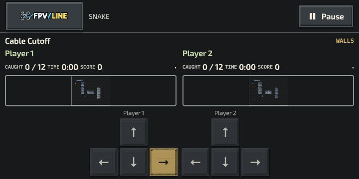
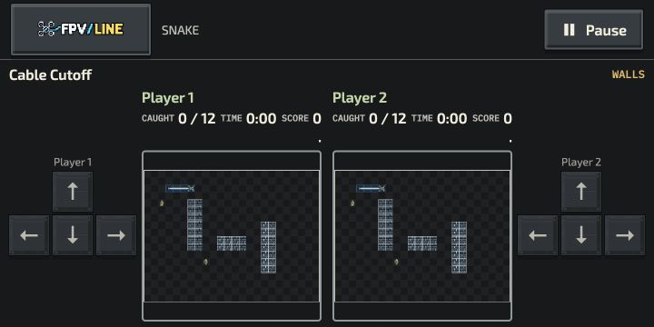
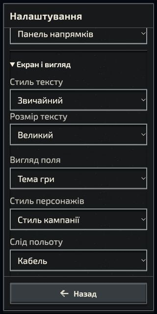
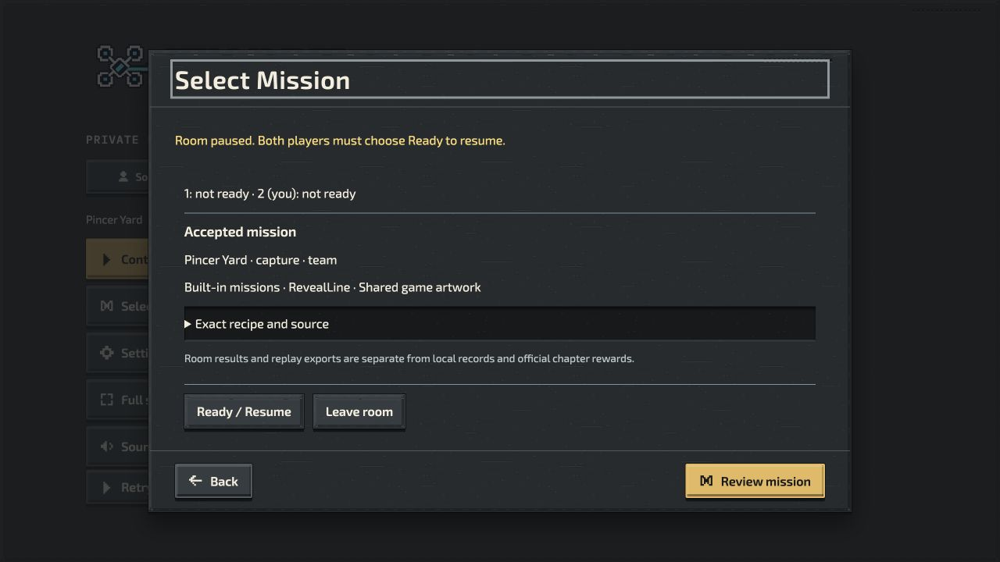

# Local recovery and landscape continuation — 4 October 2026

Source: mutable continuation of `b754c4bf9`, in PR #1005. These are bounded manual observations, not automated suites, physical-device qualification or proof of a completed mission.

## Snake landscape and reading controls

The prior 720×360 Versus layout put both pads below the boards and left each canvas only 77.75×58.31 CSS px. The revised layout puts each seat’s controls beside the field: each canvas is 194×145.5 CSS px, with 44×44 controls and no horizontal overflow. At 568×320, Versus canvases are 118×88.5; shared Team has a 242.41×181.81 canvas. Small boards still require human readability review.

Snake now exposes the existing shared Text style and Text size preferences under Settings → Display & appearance, using the same stored choices and EN/UK translations as Solo. Plain/Large was selected through the UI, language changed to Ukrainian, and Team observed at 568×320 and 320×640. At 320 px the canvas is 304×228 and both D-pads retain 45.33 px buttons without horizontal overflow. Preferences were restored afterward. No gameplay recipe changed.

The browser used a desktop pointer with a CSS viewport override. Simultaneous physical touch, hardware gamepads, phone browser chrome and native fullscreen are not covered. The existing profile’s two mission clears predate this review and are not qualification evidence.

## Private Team room recovery

A loopback room service and two normal browser seats launched Pincer Yard using the native Team host. At 0:03 the second seat paused, then reloaded. The paused board retained time, two lives, zero Hunt score and zero coverage. One seat choosing Ready left the room paused; after both seats chose Ready, native play resumed. Both tabs had no observed warning/error logs. Sound remained muted; this observation does not qualify audio quality or hardware input.

This observation used the baseline service before the controller/audio follow-up. It supports the existing reconnect/readiness flow, not proof of the new hardware handover fix. No invitations or credentials are included. Public HTTPS hosting, hostile latency, background suspension, native-device reconnect and a completed cooperative round remain pending.

## Source corrections and boundaries

- Private room menus and flight now use one shared controller router. Replacement/background/modal transitions require neutral then fresh input. Sound activation has epoch ownership, so a stale completion cannot pause a newer session.
- Optional installers serialize preparation/removal per scope, cancel verification and stop pending writes before reporting removal; later fetches cannot recreate an offloaded cache. Delayed registration is also joined before removal success. Real browser interruption/offload/reinstall review remains pending.
- Native SIM pursuit v2 retains Refuge goals and admits separated Rendezvous approaches/arrival positions. The original v1 rules and six r1 courses remain available. Two r2 courses use the correction. See the structural receipt and native pursuit specification; no flight steps or completion routes were executed.
- Relevant regressions are authored but not run under the explicit suite waiver. Lint, formatting, validation, projections, committed identity and package builds remain required. Exact-head receipts are reported on PR #1005.
