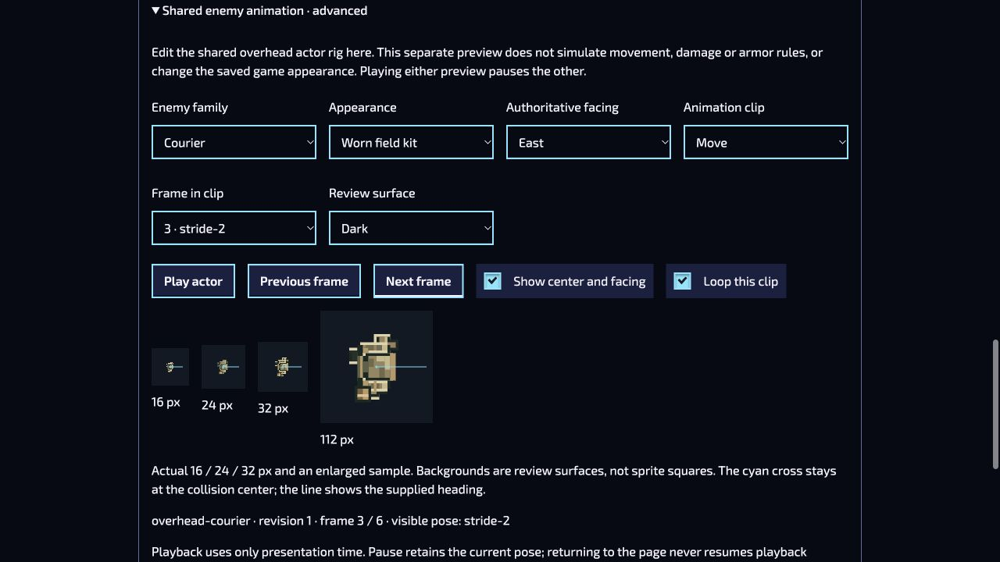

# Shared actor Motion Lab continuation — 4 October 2026

The plan review found that Asset Studio admitted shared actor animation descriptors, while Motion Lab still only edited its older player-component recipes. The new secondary **Shared enemy animation · advanced** panel closes that authoring gap without replacing the player sandbox or promoting candidate artwork.

It uses the existing admitted descriptor, sampler and overhead renderer for twelve families and three casts. Authors select clips, step frames, inspect authoritative heading/center overlays, and edit bounded stride, breathing, duration and Courier satchel motion. Exact JSON import/export hands off to the existing Asset Studio animation staging and Save/Export collection flow. Atlas descriptors require their real images and stay in Asset Studio. No AI, collision, armor, scoring, ownership or gameplay fields enter the descriptor.

Only one preview plays at a time. Four native/enlarged specimens reserve 121,088 bytes in the existing shared actor-art pool. Closing, suspension and teardown retire their owners; late acquisition is released. Shared/OS Reduced effects retains a static visible pose while frame inspection remains available. Drafts are local to this page lifetime and are not saved automatically.

## Executed evidence

- The four affected files passed **121/121 cases** on Node 22.22.2 and Node 20.19.5: shared actor editor, actual Motion Lab host, overhead renderer and Asset Studio animation. The new cases include exact round-trip/refusal, pooled ownership, playback exclusivity and lifecycle behavior.
- Scoped lint, formatting, localization build/check and whitespace checks passed. The source-bound creator phase now includes both Motion Lab files; its final combined receipt belongs to the completed stack head.
- Ordinary in-app browser UI at `http://127.0.0.1:8790/authoring/motion-lab/?lang=en` displayed the native specimens, changed heading to East, stepped frames and played the actor while pausing the older preview.
- Invalid descriptor JSON produced a visible refusal, and Export returned the exact previously accepted descriptor. No arbitrary AI or package type was admitted.
- Reduced motion kept the first visible pose while the selected inspection frame remained distinct. The Asset Studio link opened the real editor; ordinary Back returned to an explicitly paused actor preview. This observation does **not** establish a persisted browser-cache restore.
- At 320, 360 and 390 CSS-pixel widths, the page did not overflow horizontally. The first review found controls below 44 px; the corrected scoped rule was reloaded and measured at a **44 px minimum** at 320 px. Ukrainian enlarged-text layouts also retained no horizontal control overflow at 320 and 390 px. Viewport, language and text size were restored afterward; both previews were left paused.

These are software and desktop-browser observations. Physical touch targets, controllers, GPU/process memory, actual cached-page restoration, human readability and artistic approval remain separate qualification. The review treatment is not promoted to the game default.
