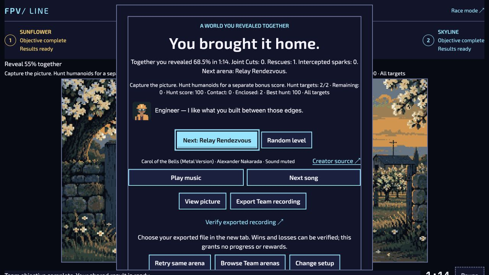
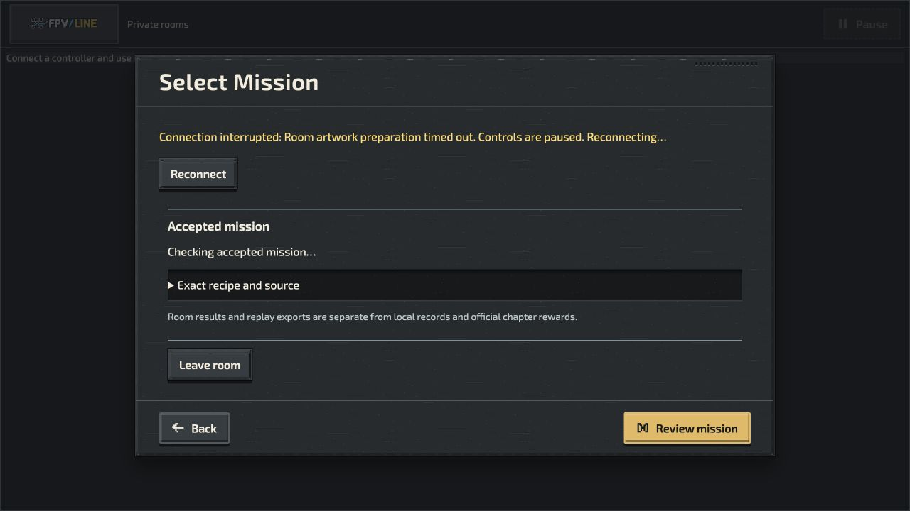

# Native Capture play and recording review — 4 October 2026

This is agent-controlled gameplay through normal browser controls after the user unlocked Capture. No simulation scripts generated the routes. It is evidence of specific playable attempts, not human enjoyment, physical-device qualification, artistic approval or public-release admission.

## Completed native attempts

| Mode / mission         | Observed result                                                                        | Scope                                                                                    |
| ---------------------- | -------------------------------------------------------------------------------------- | ---------------------------------------------------------------------------------------- |
| Solo / Crossing Post   | 62.3% revealed; 14,200 points; 1:26; three lives; both targets enclosed; Hunt 100      | Real native clear and normal Journey result; screenshot only                             |
| Versus / Crossing Post | Sunflower first clear; 56.2%; 12,810 points; three lives; one target enclosed; Hunt 50 | Paired native boards; second seat stayed stationary; genuine terminal export             |
| Team / Pincer Yard     | 68.5% revealed; 1:14; both targets enclosed; Hunt 100; one reserve remaining           | Both seats captured ground; one reserve used; normal results and genuine terminal export |

All used the authored pilot content and Standard settings. Solo/Versus used seed 1; Team used seed 17. The retained JSON exports pin the exact accepted recipes, native input segments and outcomes. Normal gameplay wrote its usual local progression; imported recordings wrote no progression. These routes do not qualify contact interception, joint cuts, competitive balance or all difficulties/seeds.

Solo closed a vertical connection through the left island, returned along the boundary, then divided the remaining field. Versus used the same initial connection, then two additional vertical cuts. Team connected both edge spawns to their islands, extended opposite vertical boundaries, and completed a final cut from the lower edge. The Team run includes an intercepted line and native recovery.

## Fixed Team launch blocker

Selecting Pincer Yard originally failed with “Team picture source does not match this arena.” The picture adapter was stripping an authenticated authored pursuit edition to its older inherited base. It now preserves authored editions and projects only supplemental overlays, with an exact level-version/ruleset mapping. Six pilot/difficulty preparations passed without simulation steps; see `team-picture-source-admission.json`. Subsequent normal play produced the Team clear above. Source and foreign-edition rejection remain authoritative.

## Recording UX and runtime boundary

Terminal Team/Versus results now offer a secondary **Verify exported recording** link to the same build's Playground panel in a new tab. Only locale is carried. The panel opens and focuses through the exact hash, does not import automatically, and explains that Replay Theater currently plays Solo. EN/UK guidance distinguishes verification of a loss from a completed mission.

Both actual exported files were pasted through the normal Playground verifier in a fresh native browser and reported **Replay matches its full recorded simulation state**. The browser download-event adapter timed out, but the real downloaded files were present and retained unchanged here.

The Node 22 command-line pilot verifier rejects both terminal digests. Detailed diagnosis of Versus found only 11 floating-point fields different from Chrome 154, by at most 1.9593e-12; summary, topology and every other state field agree. See `versus-runtime-diagnostic.json`. The diagnostic now reports an exact-state mismatch separately from a missing clear. Legacy v1 digest validation has not been rounded or relaxed. Neither recording is represented as a successful CLI qualification receipt.

Required follow-up: define a versioned portable recording/state contract or matching-runtime qualification path, with historical v1 interpretation preserved. Cross-runtime acceptance, old device recordings and broader multiplayer matrices remain open.

## Private-room delayed artwork

An isolated loopback wrapper delayed only the first two Motion Lab preset responses by 12 seconds. The ordinary room service, authentication, recipes and simulation were unchanged. The browser canceled the requests at 8,001 and 8,002 ms, showed the localized artwork-timeout/reconnecting notice, and kept play controls unavailable. Subsequent preparation recovered normally. A second invited seat joined; the first Ready alone left the room waiting, and the second Ready started it. Pause then froze both boards at 0:04. Both task-owned servers were stopped afterward.

This verifies local delayed-fetch cancellation and subsequent two-seat readiness. It does not establish real-network latency, all decode failures, hardware suspension or production hosting.

## Remaining UX gap and checks

The live review confirmed that shared legacy mission selection launches a selected mission immediately in both Solo and Versus; Team does likewise. This differs from the approved separate briefing and explicit Start sequence. A coordinated shared-host correction remains required; changing one mode alone would introduce another inconsistency.

Relevant regressions are authored but unrun under `publishing/test-policy.json`. Mandatory lint, formatting, content/localization validation, source identity and committed-source build receipts are reported with the exact PR head. Art Phase C approval remains required before mass production. Optional expansion remains optional.
