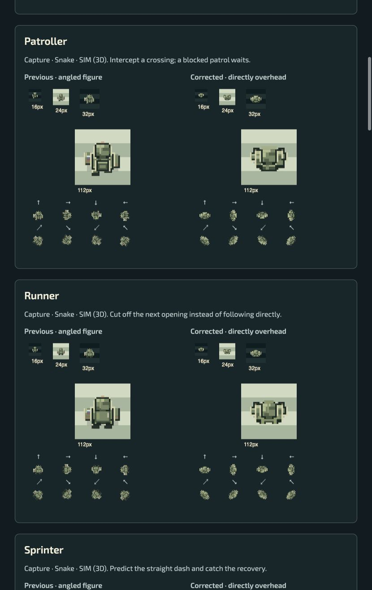
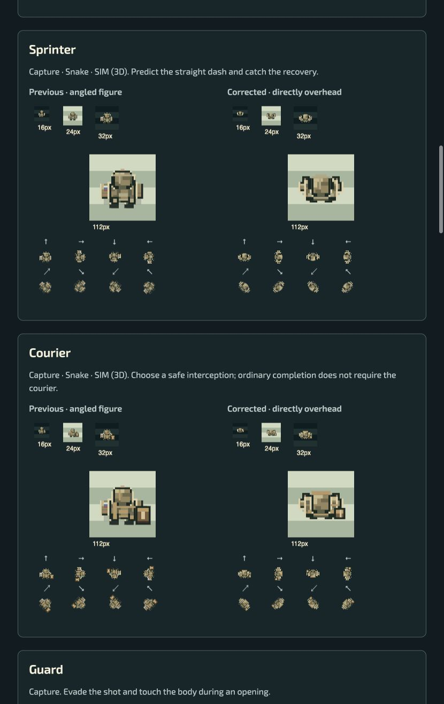
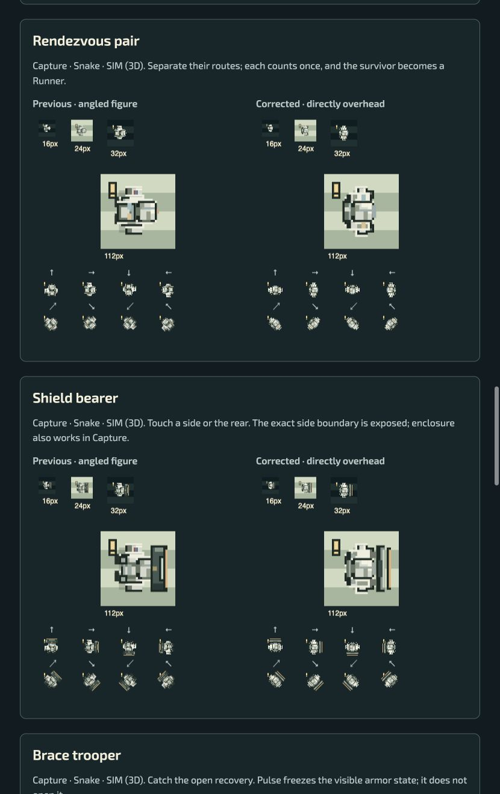
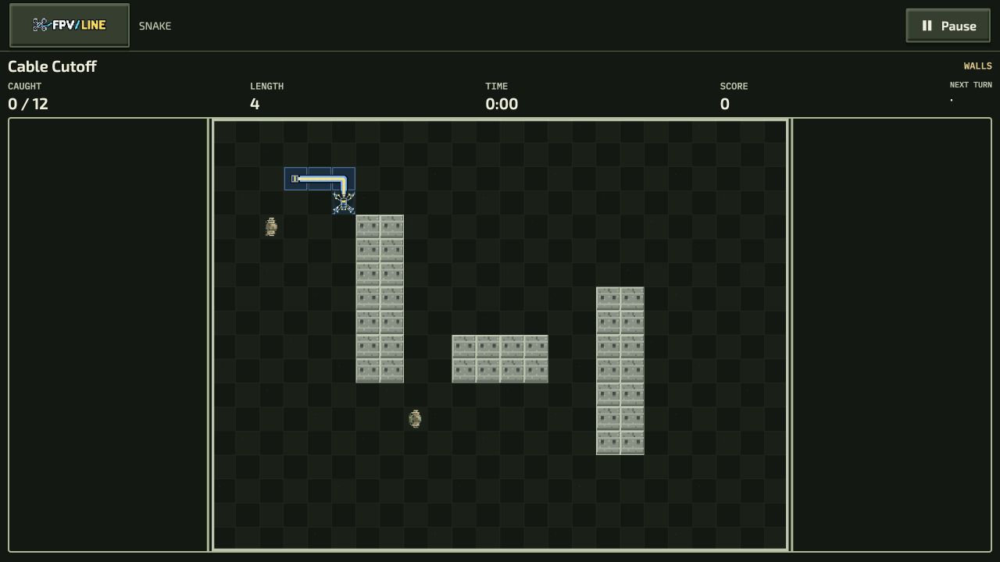

# Directly overhead character review — candidate 03

3 October 2026. This corrects the perspective reported in the industrial-art review. It is an opt-in presentation revision, not approval of finished production art.

Open `/authoring/industrial-art-review/`. Native board and Studio links select `artReview=industrial-overhead-v2`. The previous `industrial-pilot-v1` and default art remain available; this review selector does not overwrite saved appearance choices.

## Audit findings and corrections

The previous figure stacked a helmet above an upright chest and long legs. Rotation alone could not make that silhouette read as an overhead body. All twelve families and three appearance kits now share compact/detailed plan-view rigs: the helmet crown overlaps the shoulders, arms bend in the ground plane, short feet appear under the body, and packs/equipment show their top surfaces. Sprites have transparent surroundings. Comparison grounds are drawn separately.

The audit also found native presentation defects:

- Capture ordinary prey could receive its heading twice: once in the cached sprite and again in world rendering. Cached ordinary bodies now stay north-facing and rotate once at their world position.
- Ordinary prey used retained cardinal intent ahead of actual velocity. Moving prey now faces its actual movement; Shield and Brace keep their authoritative protected facing, and Guard aiming remains authoritative.
- Capture sampled six movement frames at a 300 ms idle cadence, repeatedly selecting neutral poses. Movement uses its six 100 ms phases. The new rig and explicit Studio clips also avoid gating descriptor strides through an unrelated legacy gait clock.
- Historical Snake targets have no recorded heading. A bounded presentation observer derives cardinal direction from observed positions, recognizes wrap seams and retains the last direction when stopped. Accepted successor headings always win. The observer resets on new attempts, changed recipe/seed and backwards seeking. A restored historical target starts with its available/default heading until movement is observed; no historical heading is invented.
- Asset Studio procedural previews now pass the exact selected clip. Anticipation, recovery, aim and fire no longer fall through to moving art. Pause/freeze/Reduced effects suppress cosmetic movement.

No AI, speed, hitbox, quota, score, projectile or replay format was changed. Drawing code does not consume simulation randomness. Native SIM uses real 3D meshes with world-space yaw; it keeps its separate geometry and requires its own art review.

## Family and capability coverage

These are catalogue capabilities, not a claim that every level uses every actor.

| Family          | Overhead identity                             | Native capability                       |
| --------------- | --------------------------------------------- | --------------------------------------- |
| Lookout         | Cap and forward binoculars                    | Snake, SIM                              |
| Patroller       | Cap, rear kit and side equipment              | Capture, Snake, SIM                     |
| Runner          | Light kit and short moving stride             | Capture, Snake, SIM                     |
| Sprinter        | Compact harness and braced warning            | Capture, Snake, SIM                     |
| Courier         | Offset satchel and parcel                     | Capture, Snake, SIM                     |
| Guard           | Broad shoulder armor; weapon only when armed  | Capture                                 |
| Refuge seeker   | Hood and broad rear pack                      | Capture, Snake, SIM                     |
| Switchback      | Trailing scarf/cloth marker                   | Capture, Snake, SIM                     |
| Rendezvous pair | Radio pack and paired shoulder marks          | Capture, Snake, SIM                     |
| Shield bearer   | Edge-on front shield; preserved side boundary | Explicit specialist Capture, Snake, SIM |
| Brace trooper   | Opening/closing arm plates                    | Explicit specialist Capture, Snake, SIM |
| Relay warden    | Heavy shoulders, relay equipment and aerials  | Native Capture objective                |

Field, worn and winter kits share identical mechanics. The review shows all twelve families, three kits, actual 16/24/32 px specimens, enlarged views and all eight headings. Capability/counter text comes from the existing actor catalogue. The rig is reused by Capture, Snake, field-guide portraits and procedural Studio previews. Native SIM guide portraits can use it; flight actors remain 3D.

## Browser observations

- Review page on an isolated no-store localhost origin loaded the corrected renderer. The old origin had cached an earlier module; it was not used as final evidence.
- Observed all twelve rows, three kit choices, movement/recovery/warning specimens, eight directions, shield front/side markings, EN/UK labels and Reduced effects. At the observed 830 px CSS width, page scroll width was also 830; the two comparison canvases were approximately 351 CSS px. This does not qualify phone widths.
- Native Snake Cable Cutoff entered briefing and explicit Start with the shared Military Field board. Refuge and Switchback actors rendered as overhead bodies. A natural wall collision reached Results; Retry, a direction input and Pause worked. No successful mission clear is claimed. The screenshot shows real native play, not a mocked canvas.
- No new console warning/error was observed on the final review origin. Old-origin cached-module errors remain in the historical tab log.
- Native Capture remains behind its normal local password gate. No access restriction was bypassed; live Solo/Versus/Team observations remain pending. Source audit covered the shared renderer and facing caller.
- Native SIM received a source review of mesh orientation; no new native 3D art or flight qualification is claimed.

## Verification and remaining gates

Relevant regression sources cover all 36 appearances, compact/detailed bounds and transparency, silhouette overlap, time/native-phase sampling, frozen presentation, specialist facing, historical draw compatibility, Capture rotation and historical Snake heading observations. They are authored without running the waived automated suites.

Mandatory lint, formatting, localization/content/projection validation and committed-source/package build outcomes are recorded in the PR receipts. No decoded actor bitmap is added by this procedural correction; existing 64/32 MiB shared-art limits are unchanged.

Artistic approval, physical-phone readability, real motion capture, successful native completion routes, Capture live evidence, touch/gamepad, audio listening and performance/peak-memory qualification remain open. Screenshots establish visible states, not full animation or play-quality acceptance. The older multi-frame atlas round-trip evidence remains valid for that unchanged machinery sample; it does not establish a new exported soldier atlas.
