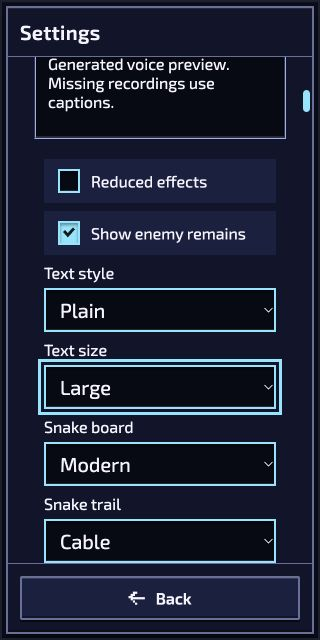

# Room and Studio continuation — 4 October 2026

Continuation of `177afe429` in PR #1005. This pass closes concrete presentation and authoring gaps; it does not approve the artwork or qualify a completed mission.

## Shared reading controls

Private rooms now expose **Text style: Theme font / Plain** alongside the existing Text size control, using the shared display-preference owner. Only explicit changes persist. History restoration and disposal follow the existing preference lifecycle.

The room's reading and motion controls now use the same in-page owner. A separate duplicate owner could otherwise save stale motion settings when changing font or size. A normal UI check enabled Reduced effects, then selected Plain: the checkbox remained checked and the body retained `effects=reduced`. Both choices were restored afterward.

In the normal room Settings menu, Plain/Large was selected at a 320×640 CSS viewport. Both selectors measured 232 px wide, starting at x=44; document width remained 320 px. Navigating to the Ukrainian room retained both selections, with translated labels and options. Theme font/Standard were restored through the UI afterward. The browser used a desktop pointer, not physical phone hardware.

## Animation timeline

Studio derives its scrubber bounds from the selected admitted clip instead of stopping at six seconds. Optional Aim/Fire choices are hidden and disabled when absent, and a removed selected clip returns to labelled Idle.

The saved Studio workspace loaded normally (`r104`, local save 1). Through **enemy.bouncer → Actor animation · advanced → Load current actor**, a temporary descriptor used 32 existing frame references with 2,000 ms durations. **Check and preview → move → End** reached 63,999 ms, with a 1 ms step. Choosing Idle clamped to that temporary clip's 3,999 ms maximum. The original descriptor text was restored; no Stage, Save or Export action was taken. The preview rendered its four actual-size canvases. A screenshot write failed because local disk space briefly reached zero; the image was inspected in the browser tool but is not retained as evidence.

## Recovery and review boundaries

The room title now applies its initial shared mute state after mounting the menu. A fresh page showed **Sound: off**, matching Studio and the review. Toggling room sound updated the already-open review's button/status in both directions without clicking that page. Sound was restored to muted; no listening or audio-quality claim is made. The review also derives status from actual sample completion and zero master volume instead of leaving stale labels.

Private-room recovery replaces native destruction ownership so previously frozen transient bursts cannot resume after Ready. Ordinary snapshots retain ownership, allowing new events to emit once. Regression cases cover settled-state restoration and later catches; they remain unrun under the repository's explicit automated-suite waiver. This pass does not claim a new real-network reconnect observation.

An independent recording audit found no additional confirmed defect in consumed commands, native pause/stop releases, Team Continue history, import ownership or pilot source binding. Normal unlocked Capture terminal export/import and genuine pilot completion remain required; no access gate was bypassed.

Required checks are lint, formatting, content/localization validation, exact source identity and committed-source builds. Exact-head results are reported in PR #1005; all checks for baseline `177afe429` passed. Artistic approval, physical controllers/touch, network stress, human completion and broader production artwork remain open.
