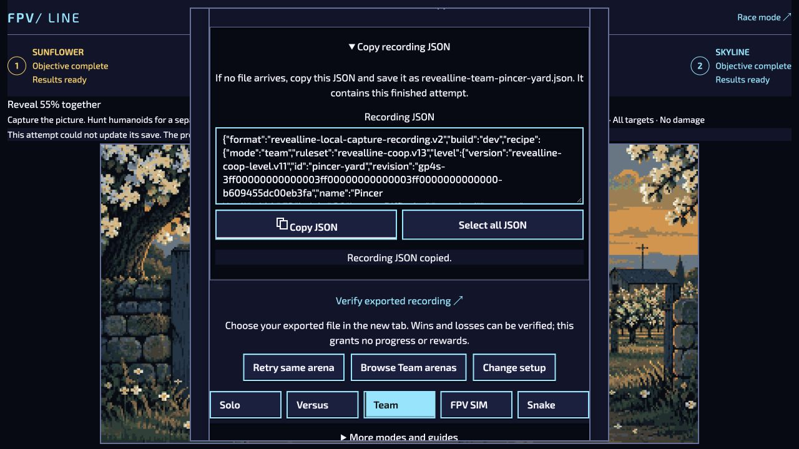

# Team export, creator handoff and adoption continuation — 4 October 2026

These observations use the ordinary localhost UI at port 8790, native keyboard controls and the previously user-unlocked Capture gate. No test suite, generated route, actor mutation or gate bypass was used. The browser served the developing worktree based on `5ac6d6743`; recordings honestly retain build `dev`. The archived Node receipt reports the dirty source state at collection. These are agent-controlled observations, not human enjoyment, device or release approval.

## Native Team routes and recording

- Pincer Yard, Standard, Full teamwork, seed 17: both players moved from opposite edges into their islands, then closed complementary vertical cuts. One native attempt cleared **88.8% in 0:34**, with two reserves intact, both optional humanoids enclosed, Hunt 100 and no damage. `team-pincer-yard-clear.jpg` records this first result. The old exporter requested a download but no new file appeared; this result is **not** the subsequently archived recording.
- After the copy fallback was implemented, a fresh attempt cleared **58.3% in 49.375 seconds**, native tick 5925. Both seats banked territory. Two reserves were spent; both optional targets survived. This demonstrates valid zero-kill Bonus completion. The displayed Best Hunt/mastery badges belong to earlier records, not this attempt.
- `team-pincer-yard-v2.json` contains the exact **9,045 UTF-8 bytes** exposed by the native read-only Recording JSON field after Export. It was saved directly without parsing/reformatting. SHA-256: `70267ce3b7fe79f4321c1518a5f087578bf1ddb1d5dfdb74386a39bcc88a1294`.
- The ordinary browser verifier accepted both declared terminal observations and the exact state digest. Node 22 accepted the declared observations and rejected the independent exact-state digest. See `team-browser-verification.json` and `team-node-verification.json`. This matches v2's documented portability boundary and does not prove identical continuous trajectories or restorable network state.
- The native source remains the pinned Pincer Yard `pursuit-2` edition, `pursuit-goals.v1`, core v13. This recording does not qualify the successor pursuit-v2 behaviors simply because the current branch also implements them.
- The existing unfinished Relay Rendezvous save was preserved. The visible save-conflict notice correctly reported that this different attempt could not overwrite it.
- A separate Relay Rendezvous attempt secured both anchors through complementary island returns and exposed the core. The core was not captured; completion remains pending. This partial route is not a clear.

## Export fallback and recovery

Team and Versus share a bounded-owner export panel. The exact terminal JSON is retained before requesting a platform download, with deliberate **Copy JSON** and **Select all JSON** controls. In the browser, Select all selected all 9,045 characters and Copy reported success. The panel is secondary to Results; it neither grants progression nor changes the attempt. Retry/replacement and disposal retire it. No actual file delivery is inferred from the browser's download-request status.

Source review also found a restored installed Hunt could create its running-only save recorder while still paused at the new briefing. Resume now changes the same core to running before attaching persistence, without advancing time. The preparatory pause and resume releases remain in the native journals. An installed Hunt regression covers the unchanged briefing clock, exact saved attempt identity, same-tick release, and replayable Hunt/installed mirrors; it is authored but unrun.

## Creator and production tooling

- Snake Studio pins the selected package and mission before asynchronous installation. Later edits, selection, competing Play, focus loss or departure cannot launch stale content. Cached browser navigation keeps the existing storage owners alive so Back can still Save/Restore/Play. In normal UI, Play team launched the exact Refuge Bays installed edition (`937612aa43e98e48`); Back returned to Studio, Save reported success and Restore retained the one-mission draft. `studio-after-back.jpg` records the restored page. This does not establish whether that navigation used the back-forward cache. Deferred-install and cached-page regressions are authored, unrun; browser fault-injection qualification remains pending.
- [Atomic Field Kit adoption](../../../field-kit-atomic-adoption.md) stages the ledger and compiled generation in one Git tree through a private index. Explicit adoption creates only a new review ref after complete reproduction and readiness checks. Recovery/rollback are guarded by exact ref ownership. No production adoption, approval changes, default appearance change or public publication was performed.

## Verification boundary

Independent source reviews found no confirmed blockers in the new exporter, restored Team resume or adoption mechanism. Mandatory lint, formatting, localization/content/projection validation, source identity and committed builds are reported on the associated PR. Automated suites remain waived.

Remaining acceptance includes other pilot completion/interception routes, real phone/controller/touch review, interrupted-load and historical recording matrices, audio listening and Phase C artistic approval. This batch does not authorize mass production or qualify public/private-network deployment.

