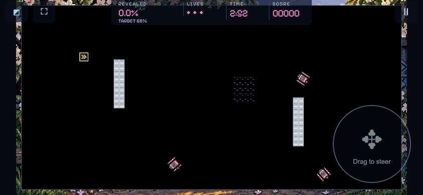
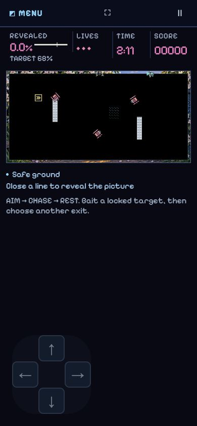

# Touch and controller controls — v0.42.0

Research and verification: 14 September 2026.

## Design decisions

The default is a floating, four-direction stick. A player can start a drag anywhere on the board or in the broad thumb area. It follows a drifting thumb and has a small dead zone and diagonal hysteresis. This suits fast, right-angle turns without repeatedly finding separate buttons. Lifting the finger retains this game's continuous-flight behavior; Pause remains explicit.

Players can instead choose swipe steering or a sliding D-pad. Swipe reanchors after each turn, so a short reverse gesture works without crossing the original contact point. The D-pad captures the gesture across its whole area, including gaps: a player can slide between directions without lifting. Its direction targets are 52 × 52 CSS pixels, or 64 × 64 with Large controls. All three modes offer left/right placement and adjustable opacity; the default is the right thumb. Separate fingers remain available for equipment actions in missions that provide them.

Landscape play fills the available viewport while preserving the complete board's aspect ratio. Compact telemetry, menu/pause and translucent steering overlay the board. Dynamic viewport units follow changing browser bars; safe-area insets protect notches and the home indicator. Fullscreen is offered when the browser supports it. A web page cannot guarantee removal of Safari's browser chrome. A differently shaped board necessarily leaves narrow margins instead of distorting or cropping gameplay.

Gyroscope steering was considered but not implemented: this game's precise cardinal turns benefit from a stable directional gesture, while tilting changes viewing position and requires calibration. This is a game-specific design judgment, not a claim that tilt is universally inferior. There is no single touch layout best for every player, so preferences persist in the profile and its backups.

## Research

- [Apple: Design great touch experiences for games](https://developer.apple.com/videos/play/wwdc2026/358/) describes thumb-friendly reach, broad interaction areas, floating sticks and contextual actions. These informed the broad steering surface and removable finger indicator.
- [Game Accessibility Guidelines: large interactive elements](https://gameaccessibilityguidelines.com/ensure-interactive-elements-virtual-controls-are-large-and-well-spaced-particularly-on-small-or-touch-screens/) and [configurable controls](https://gameaccessibilityguidelines.com/allow-controls-to-be-remapped-reconfigured/) support larger targets and player choice.
- [Apple layout guidance](https://developer.apple.com/design/human-interface-guidelines/layout) and [MDN viewport lengths](https://developer.mozilla.org/en-US/docs/Web/CSS/Reference/Values/length) informed safe-area handling and dynamic viewport sizing.
- The [W3C Gamepad specification](https://www.w3.org/TR/gamepad/) and [MDN Gamepad guide](https://developer.mozilla.org/en-US/docs/Web/API/Gamepad_API/Using_the_Gamepad_API) define standard physical button positions and axes. Device names select prompt labels; they do not change physical mappings.
- [Valve hardware recommendations](https://partner.steamgames.com/doc/steamhardware/recommendations) and [Steam Deck compatibility guidance](https://partner.steamgames.com/doc/steamhardware/compat?l=french&language=english) informed complete controller navigation and legible controller prompts. A browser launched through Steam needs a Gamepad Steam Input layout to expose standard controller input.

## Controller behavior

The first neutral standard controller connects automatically. The next confirm press works immediately. A controller discovered while held must first return to neutral. Both sticks and the D-pad work by default; customized mappings take precedence. Explicitly selecting a label family or changing dead zones retains the default dual-stick layout.

| Control position | Xbox / Steam Deck | PlayStation | Menus | Flight |
| --- | --- | --- | --- | --- |
| South face | A | Cross | Confirm | Ability when available; otherwise pause |
| East face | B | Circle | Back / cancel | Pause |
| West face | X | Square | Confirm | Supply when manual; otherwise field guide |
| North face | Y | Triangle | Back / cancel | Hangar when applicable; otherwise missions |
| Menu | Menu | Options | Resume paused flight | Pause |
| View | View | Share / Create | Back | Pause |
| Shoulders / triggers | LB/LT, RB/RT | L1/L2, R1/R2 | Previous / next | Existing right-shoulder boost when available |
| Either stick / D-pad | Same positions | Same positions | Navigate / edit selected fields | Cardinal steering |

Unused flight shoulder/trigger/stick-click positions remain available for remapping. System/Home is reserved for the device. Selects and sliders use confirm to edit/apply, and back to cancel. Navigation includes menus, settings, library, collection, mission picker, reading panels and pause/result flows. Disconnect pauses the game; held controls cannot activate the next screen accidentally. Xbox, Sony and Steam identifiers select recognizable prompt labels; generic devices get position labels.

## Verification evidence

**Final result: 500 tests passed, 0 failed** in the focused suite (147.8 seconds). The complete run used the isolated staged source; all changed executable files were compared byte-for-byte with the index.

Automated tests exercise the real input router, actual solo host, simulation, replay and preference persistence with modeled DOM events and standard Gamepad samples. They cover both sticks and every D-pad direction for Xbox, DualSense, DualShock, Steam Deck and generic identifiers; face actions; menu repeat; custom mappings; neutral/reconnect gating; pause/resume; field guide and mission navigation; all three touch modes; drifting thumbs; quick reversals; capture loss; extra fingers; keyboard handoff; and legacy saved profiles. These are simulated standard mappings, not physical-controller certification.

Browser checks used the Codex in-app Chromium browser and the game's isolated Controller Practice page. The practice page fed the actual embedded game: the first south-face press started a mission, Menu paused, analog input navigated the pause menu, and a shoulder moved main-menu focus. On the touch surface, real browser pointer drags changed flight direction in stick, swipe and sliding D-pad modes. Touch/pen event behavior and multiple fingers were exercised by automated tests, not mobile hardware emulation.

Measured production layout:

| Viewport | Board | Steering | Horizontal overflow |
| --- | --- | --- | --- |
| 844 × 390 landscape | 780 × 390; x=32, y=0 | Right stick, 156 × 156 | None |
| 390 × 844 portrait | 364 × 181; x=13, y=141 | Left D-pad, 156 × 156; 52-pixel buttons | None |





Real iPhone Safari, Bluetooth/USB controllers and a physical Steam Deck were not available. Device-specific browser bars, safe-area values, gamepad exposure, latency and comfort still need hands-on verification. No claim of physical-device testing is made.

## Reproducing the checks

The final focused run uses the staged source, independently of unrelated working-tree edits:

```sh
node --test \
  game/test/touch-steering.test.mjs game/test/device-controls-host.test.mjs \
  game/test/touchscreen-controller-host.test.mjs game/test/controller*.test.mjs \
  game/test/ui-input.test.mjs game/test/control-geometry.test.mjs \
  game/test/continuous-input.test.mjs game/test/terminal-navigation.test.mjs \
  game/test/nonmodal-header-navigation.test.mjs game/test/collection-context-host.test.mjs \
  game/test/settings-assists-host.test.mjs game/test/practice-brief-host.test.mjs \
  game/test/main-menu-collection-host.test.mjs game/test/enemy-guide-host.test.mjs \
  game/test/soundtrack-host.test.mjs game/test/storage-retention-host.test.mjs \
  game/test/compatibility-v0100.test.mjs game/test/campaign-difficulty-library.test.mjs \
  game/test/chapter-reward-integration.test.mjs
npm run lint
npm run format:check
npm run validate
npm run build
```

An exploratory repository-wide test run was stopped while lengthy optional-world tests were still running. Its discovered control/profile regressions were corrected and rechecked in the focused suite. A complete repository-wide pass is not claimed.

Final release build: **v0.42.0**, 333 files. Distribution SHA-256: `3dd43887fc16185df8bc0dbf77d1856a2b20cb511403fcddd8cda83cadbd8503`. Lint, formatting and build-reference validation passed. The final staged build booted with `boot-state=ready`, reported `v0.42.0`, and exposed all three touch modes.
