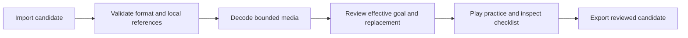

# Round 19 — authoring optional goals in packs

Research date: **12 September 2026**. This review read primary creator documentation and the project's [pack/mastery plan](../round-18-pack-mastery-plan.md), [equipment guide](../equipment-seals.md), and v0.8 definition/observer contracts. The external pages below were opened and read as text. No new gameplay video, screenshot, audio audition, creator-tool session or physical-device test was performed.

**Released baseline:** v0.8.0 implements Steady Signal, Supply Line and Safe Return as pinned sidecars. It does not import authored goals through pack v2 or scenario v2. Work on those explicit versions is underway separately; the recommendations and UI sketches here are design guidance, not proof that an importer or editor feature has shipped. Existing finite definition documents are already valid; their new containers and registration workflows need their own implementation evidence.

## Primary sources and useful observations

| Source, accessed 2026-09-12                                                                                                                                                                                      | Observed documentation                                                                                                                                                                                                                                    | Application to this increment — design inference                                                                                                                                                                                                    |
| ---------------------------------------------------------------------------------------------------------------------------------------------------------------------------------------------------------------- | --------------------------------------------------------------------------------------------------------------------------------------------------------------------------------------------------------------------------------------------------------- | --------------------------------------------------------------------------------------------------------------------------------------------------------------------------------------------------------------------------------------------------- |
| Microsoft/Mojang, [Minecraft pack manifest reference](https://learn.microsoft.com/en-us/minecraft/creator/reference/content/addonsreference/packmanifest?view=minecraft-bedrock-stable), page updated 2025-08-04 | Separates manifest syntax, pack identity/version, engine compatibility and dependencies. It documents replacing an installed pack with a higher version and matching dependencies to the required pack/version.                                           | Show format support, replacement and dependencies as distinct checks. Retain our reviewed explicit replacement/Undo policy; do not import Minecraft's automatic version-order policy.                                                               |
| Epic Games, [Tracker devices](https://dev.epicgames.com/documentation/en-us/fortnite/using-tracker-devices-in-fortnite-creative), undated current documentation                                                  | A tracker represents an objective. Completion behavior, progress/HUD presentation and a completion ceremony are configurable separately. Device names can explain purpose; contextual filtering reduces clutter but needs understandable documentation.   | Keep one optional goal per map, show its named requirement rows, and preserve ordinary picture completion. A future form should show only fields for the selected supported recipe, while still explaining every condition.                         |
| Pathoschild, [Content Patcher troubleshooting](https://github.com/Pathoschild/StardewMods/blob/develop/ContentPatcher/docs/author-guide/troubleshooting.md), current `develop` documentation                     | Schema validation catches some errors but does not replace in-game testing. `patch summary` distinguishes loaded patches, matched conditions and applied changes, with reasons. Other tools reload patches and export the resulting asset for inspection. | Separate structural validity, local reference resolution and observed gameplay qualification. Offer an inspectable preview of the effective declaration and test the real practice flow. A successful parse should never be labeled “goal proven.”  |
| Wube, [Factorio AchievementPrototype](https://lua-api.factorio.com/latest/prototypes/AchievementPrototype.html), API page labeled 2.1.17 when read                                                               | Achievement definitions include presentation and eligibility properties. `steam_stats_name` is unavailable to mods; another property can restrict eligibility under particular map settings.                                                              | State the boundary of our local seals clearly. A locally imported record is not a newly verified run or a platform achievement. Explain actual equipment/content requirements before the player starts; do not add hidden eligibility restrictions. |

These sources describe their own products. They do not establish better retention or prove that our proposed workflow is usable. Minecraft's preview manifest features, Fortnite scripting/persistence policies and Factorio platform APIs are not proposed additions to this game. The next increment remains bounded JSON using existing simulation and observer primitives.

## A small authoring flow that exposes the right information

Use the existing import/preparation path and practice view. The useful next step is a compact **goal preflight summary**, not another editor framework. Show the pack format/version, campaign and map, goal name and recipe, resolved local references, and whether this is an added, unchanged, changed or removed declaration. Put hashes and exact IDs in an expandable diagnostic section rather than requiring players to understand them.

Proposed author-facing preview, not an existing screenshot:

```text
Homeward goals — candidate pack v2
River Switchyard · Supply Line

References resolved: 2 pads, 2 signal regions, south hangar, Heavy carrier
Equipment available: supply-consuming field tool and a switchable roster
Goal change: unchanged declaration
Practice: not yet checked in this session

Preview in practice       Back to editing
```

If a goal changes on an unchanged board, use specific language: “This replaces the goal for River Switchyard. Existing records for the previous declaration remain archived. Ordinary picture progress is kept.” If the candidate conflicts with another installed pack, identify both packs and the affected map; leave the current installation unchanged. These are proposed messages, not new serialized states or acceptance rules.

Keep the sequence understandable:



Any failure returns an actionable message while retaining the prior playable candidate. Validation may find a missing actor or incapable roster; it cannot prove the required route is achievable. Existing positive and control traces provide stronger evidence, followed by actual UI checks. For a full-backup import, the existing transactional path still owns adoption and rollback; the diagram does not authorize bypassing it.

## Recipe choice should preserve the real rules

Use the three existing compositions exactly. A display name or themed body never substitutes for capability or event evidence.

| Existing recipe              | Fields to expose in an eventual form                                              | Important preview distinction                                                                                                                                     |
| ---------------------------- | --------------------------------------------------------------------------------- | ----------------------------------------------------------------------------------------------------------------------------------------------------------------- |
| Steady Signal, definition v1 | One local signal region and its distinct-cell threshold; existing clean finish    | Active interference, actual resistance, and one successful closed cut. Pending cells are not committed credit.                                                    |
| Supply Line, definition v2   | Named pads; named regions and individual thresholds; target hangar/class          | Successful refills, each region's threshold in one closed cut, an accepted switch, then a win. Different regions may use different cuts. No clean-life condition. |
| Safe Return, definition v2   | Supported local actor and minimum pre-use live trail cells; existing clean finish | The new impact pulse must affect that actor, then its own redeployment must return. Returning and returned are distinct phases.                                   |

The [eight prompt examples](../../authoring/prompts/round-19-pack-goals.md) include full, existing definition documents. Their thresholds are supported configuration, not evidence that every edited map can satisfy them. When choosing references, list only the appropriate local domains and show a readable label alongside the stable ID. Keep JSON validation authoritative if the UI selection becomes stale.

The current text/digest relationship matters: changing a definition's name or description changes its canonical hash. Changing map metadata or recipe labels may change campaign identity under the existing contracts. Presentation replacements in dedicated image/theme fields are different edits. The importer should explain the actual effect; it must not silently redefine old hashes to make an edit look compatible.

## Replacement and saved progress need one policy

Use the already reviewed plan's effective-registration rules everywhere:

1. A v1 pack supplies no authored definition field. Only an exact shipped content match can receive its built-in fallback.
2. A v2 pack explicitly lists its declarations. An omitted map or empty list means none; it must not unexpectedly regain the v1 fallback.
3. Same-ID replacement validates the prospective set after removing the old member. Competing effective declarations for an identical campaign key reject; identical declarations may share that board.
4. Removed or changed declarations leave historical records intact. A currently applicable seal label requires the actual map, roster and definition identity. Imported metadata never creates a new award.
5. Pending verification is cancelled before replacement/adoption. A saved flight contains no trusted goal counters; its recorded prefix is evaluated under the currently applicable definition, or restored as ordinary play when no definition applies.

A proposed replacement review should identify that last consequence directly: “The saved flight will be checked against this goal when loaded.” Do not claim that partial progress from the previous declaration is migrated. Reinstalling exact earlier content can make its old records current again; it does not award seals from ordinary past clears.

## Focused acceptance for the next playable increment

- Preserve v1 pack/scenario round trips, definition hashes, maps, campaign keys, records and old replay/session expectations. Test unsupported versions and missing required v2 fields explicitly.
- Resolve every referenced pad, region, hangar, class and actor within the actual owning map and filtered roster before the first image decoder. Unknown/wrong-domain references leave the current candidate untouched.
- Show each independent completion row truthfully after an ordinary win, even when equipment conditions remain incomplete. This retains the v0.8 checklist fix.
- Replay qualifying and ordinary/action-omission routes under both steering policies using prepared declarations. Compare final core summaries/checkpoints with the existing proofs; the container change must not alter physics.
- Suspend before and after closed-cut credit, impact use, the matching return, and a class switch. Restore the complete prefix, not serialized counters. A revised or removed goal must not inherit stale partial state.
- Keep the goal through presentation edits and Undo; explicitly remove it or revalidate after structural edits. Exporting an edited one-map scenario must expose any required campaign retargeting and changed definition identity.
- Exercise replacement, conflict rejection, failed decode, cancelled work, backup/Undo and restore through the real UI. A temporary practice result stays non-writing for the entire preview lifetime.

A new currency, grind counter, arbitrary expression language, remote code loader, cross-pack target reference, competing-goal selector, cloud award service or changed core/replay format is unnecessary for this increment. A useful result is an author who can understand what was accepted, try the exact goal, see why it did or did not qualify, and export it without losing prior content or player history.
