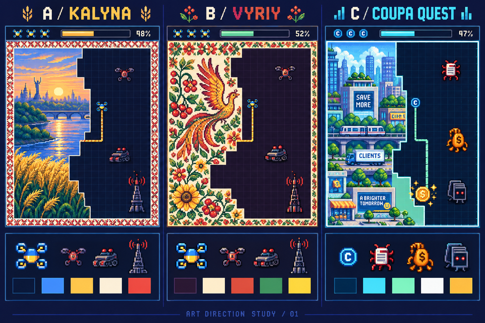
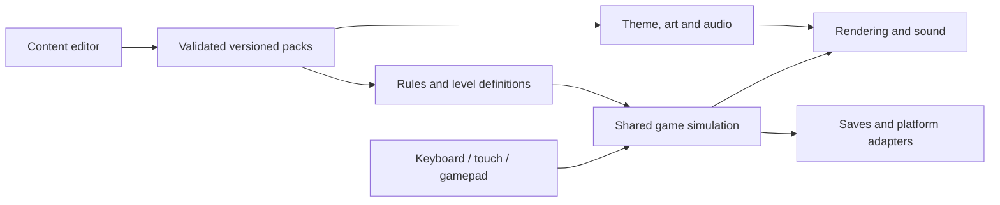

# Territory-reveal game — research and concept round 01

Date: 12 September 2026. Status: **brainstorming; proposed choices, not an approved design**. The user explicitly requested research and visual iteration before implementation. The workspace started empty. No game, editor, dependency setup or platform package has been built.

Later steering: the user selected all three motivations and narrowed the themes to four families, with Ukrainian FPV military as the main game. See [the current round 03 direction](round-03-focused-direction.md); the decisions below are retained as round 01 history.

## First recommendation

Build toward a beautiful Ukrainian FPV territory-capture arcade game: clear Xonix movement, daring cuts, satisfying reveals, optional mastery challenges, and rich original Ukrainian art and music. Use this as the first expression of a themeable game family. A Coupa savings adventure should demonstrate that the framework can change its identity through content and supported rulesets.

The first bet is **classic arcade mastery as the foundation, discovery and reclamation as the identity**. Short expeditions with upgrade choices are a possible later mode. This is a recommendation awaiting the user's response, not a settled decision.

## Research library

- [Xonix lineage and XPOSED RELOADED](research/xonix-and-xposed.md): exact edition boundaries; six official screenshots inspected; verified star goals and trophy mechanics; Qix, Xonix, Super Qix, Volfied, Gals Panic, SeXoniX, AirXonix, Fortix, Lightfish and Mokoko X; replay hypotheses and explicit unknowns.
- [Modern pixel art and Ukrainian cultural direction](research/pixel-art-and-cultural-direction.md): eleven influential references, original art/music proposals, cultural sources and visual readability requirements.
- [Engine and framework research](research/engine-and-framework.md): Phaser, Godot, GDevelop, Construct, Godogen, packaging tradeoffs, editable packs and validation proposals.
- [Original concept comparison](concepts/round-01-art-directions.png) and [generation prompt and visual review](concepts/round-01-image-prompt.md).

Research limits matter: no complete playthrough or hands-on XPOSED RELOADED session was performed. No empirical retention data was found. Screenshot observations, publisher claims, reviews and our proposals are distinguished in the research. Exact enemy algorithms, soundtrack credits, capture policy and full pack mapping remain unresolved. The modern game sample is curated, not an exhaustive popularity ranking.

## What we learned from the reference

Reloaded's strongest visible language is neon arcade clarity: near-black board, bright cyan paths, yellow accents, red obstacles, magenta stars and a compact HUD. The first-level results screenshot confirms separate rewards for completing the level, preserving lives and finishing within 60 seconds. That timing must not be generalized to every level. The official listing confirms image reveal and unlockable packs. [Publisher listing](https://store.playstation.com/en-us/concept/10002881/), [results screenshot](https://image.api.playstation.com/vulcan/ap/rnd/202111/0311/Yppqw545Pp2aocZZaDvKTy7i.jpg).

Our design interpretation is that curiosity starts the cut, vulnerability sustains attention, and completing the enclosure creates relief and a visible reward. Replay after the image is known requires skill, different objectives, interesting layouts or new combinations. Stars alone cannot fix a dull or confusing capture loop.

The related Switch game's reviews identify control precision and unexplained fill outcomes as potential frustrations. They are useful warnings, not proof that the PS4 release has identical behavior. [Control review](https://eshopperreviews.com/2024/02/26/xposed-switched-for-nintendo-switch-review/), [capture-rule review](https://gameslushpile.com/2023/05/09/xposed-switched-switch-review/).

## Gameplay approaches to compare

| Approach | The player comes back for | Advantages | Main cost |
| --- | --- | --- | --- |
| Classic arcade mastery — recommended foundation | A better cut, cleaner survival, faster clear and higher score | Closest to Xonix/Reloaded; low input complexity; easy to understand | Once art is familiar, authored hazards and skill goals must sustain replay |
| Living-picture reclamation — recommended identity | Restoring places, discovering scenic details, completing a collection | Distinctive emotional payoff; Ukrainian and Coupa themes both fit | More authored artwork and clear rules for interactive landmarks |
| Short tactical expeditions — possible later mode | Choosing modules, discovering combinations and beating a shared seed | High variation from reusable content | Balance work and added complexity can obscure the core arcade game |

Proposed first-play sequence: enter a safe perimeter, see one enemy's movement, make a small guided cut, close it and expose a striking detail, then choose a larger risk. A second board introduces a boundary threat; a third introduces a terrain obstacle. Exact timings, life counts and quotas remain tunable design decisions.

Candidate replay structure: short boards, immediate retries, saved artwork collections, optional survival/time/large-capture medals, alternate challenges on familiar pictures, and later a shared seeded challenge. Treat roughly one-to-two-minute boards as a hypothesis, not a promise. Basic campaign progress should not require perfect medals.

Two separate decisions deserve visual comparison before implementation: the fill policy (for example, which enemy-free regions become safe) and the effects of capturing objectives (for example, disabling a device in a region that fills). These can coexist. A moving enemy that preserves fog and a capturable device must have clearly different roles. We must choose explicit rules for multiple enclosed enemies, self-crossing, return to safety, and simultaneous hits. The editor and generator depend on these decisions.

## Original visual directions

Names below are working labels; no name-availability research has been performed.

| Board | Direction | Core assets and mood |
| --- | --- | --- |
| A — KALYNA | Ukrainian FPV arcade | Navy, blue, wheat gold, ivory and warning red; readable quadcopter; stylized Russian invading military machines; Ukrainian landscape reveals; restrained embroidered safe borders |
| B — VYRIY | Ukrainian folk-art interpretation | Plum, parchment, berry red, green and gold; Petrykivka-inspired flora and birds; warm reveal celebrations; the same readable drone and danger roles |
| C — COUPA QUEST | Savings adventure | Ink blue, cyan and mint; a proposed C token; invoice glitches, cost leaks and duplicate-document enemies; a client city that becomes lively as value is recovered |

Recommended synthesis: A's clear field and drone identity, with B's rich cultural image collections. C is a proposed reskin demonstration, not an approved Coupa/Navi brand treatment. Its C token is a placeholder; the official Navi source character sheet and brand tokens remain to verify.

The concept board shows colors, composition and silhouettes. It is not a real game screenshot, sprite atlas, final regional motif library or proof of capture geometry. The generated incidental signage and decorative density need refinement. Production art should have consistent pixels, transparent layers, animation and small-screen review.

### Original signature to explore

A drone's vulnerable signal line becomes a stitched safe edge when closed. The captured region reveals color; water, wheat or windows begin subtle ambient animation; the music resolves into a warmer phrase. This ties gesture, sound, Ukrainian identity and the reveal reward together. It is an invented game metaphor, not a historical meaning claimed for embroidery.

Petrykivka flora/birds, regional embroidery, pysanka and Crimean Tatar Örnek should retain distinct identities. The cultural research links authoritative sources. The final motif library should identify its references instead of blending all ornament into generic decoration.

### What the pictures reveal is still open

Three viable treatments are reconnaissance-style imagery with stylized invading units, beautiful Ukrainian scenery/culture, or a before/after pair that changes from interference/occupation to recovery. Round 01 visualizes scenery and cultural art as an assumption. The user's answer may shift both artwork and mechanics. Military threats in the Ukrainian theme represent invading forces, while the Coupa theme uses fictional waste and operational obstacles.

### Nostalgia and music

Favor 1990s Amiga/DOS/16-bit richness with 1980s arcade legibility. Combine a restrained tracker/FM-synth foundation with original bandura-like plucks and sopilka-like melodies. Use sound to distinguish leaving safety, danger, return and capture. Music references guide arrangement; existing recordings are not production assets. The full music and sound set remains future work.

Make CRT, bloom, flashes and shake independent settings. The base presentation must work without effects. Ensure Ukrainian text supports Ґ, Є, І, Ї and lowercase forms. Define separate silhouettes and contrast for safe ground, live trail, threats and decorative art.

## Framework proposal

**Provisional engine: Phaser 4 + TypeScript**, because the core game is 2D and maintainers are frontend engineers. Keep gameplay rules in an engine-independent simulation and use Phaser for rendering/input. A browser editor uses the same pack schema and runtime preview. Godot with GDScript is the strongest alternative when a built-in game editor and native delivery outweigh web-language familiarity. [Phaser overview](https://docs.phaser.io/phaser/getting-started/what-is-phaser), [Godot features](https://docs.godotengine.org/en/stable/about/list_of_features.html).

The linked Godogen repository is an AI generation workflow. Its Godot path currently generates C#; Godot 4 C# currently cannot export to browsers. Its existence does not remove the need to select and validate a runtime. [Godogen](https://github.com/htdt/godogen), [Godot web limits](https://docs.godotengine.org/en/stable/tutorials/export/exporting_for_web.html).

Browser delivery comes first in the proposal. Capacitor is the candidate iOS shell; Electron is the candidate desktop/Steam shell. Their memory, battery, startup and input behavior remain unmeasured. Electron adds a bundled browser runtime; Capacitor still renders through a web view. Native packaging, signing, store releases and Steam services are separate work. A low-spec requirement is a measured acceptance criterion, not something the engine name guarantees.

| Editable layer | What the author changes |
| --- | --- |
| Theme | Player/enemy sprites, animations, colors, typography, UI, effects, music and sound |
| Image collection | Artwork, thumbnails, focal points, ambient layers, discovery hotspots and attribution |
| Ruleset | Quota, lives, timer, speeds, scoring, capture policy and supported behavior combinations |
| Level | Board, safe cells, terrain, enemy placement, movement routes and objectives |
| Campaign/challenge | Order, unlocks, medals, difficulty progression and generation seeds |
| Marketing bundle | Logo/key art, menu backgrounds, storefront/social compositions and localization |

New content and combinations of existing mechanics should require no code. Entirely new mechanics require bounded extensions; the core simulation should stay stable. This is a realistic maintainability promise. Content packs should contain validated data/media, not arbitrary downloaded scripts.

Editor workflow to design: create pack → upload/crop images → assign visual roles → paint or generate board → place enemies/objectives → preview with any controls → inspect difficulty warnings → export/version pack. Undo, validation messages, migration and rollback are part of usability. Generation must obey the chosen capture rules and reject invalid layouts; fun still needs playtesting.

## Complete asset system: planned deliverables

After choosing an art direction, specify a manifest for every visual/audio role, required states and source files. Final counts depend on the approved game scope.

| Family | Required coverage |
| --- | --- |
| Player | Idle, movement/directions, draw, ability, hit, loss and success states; portrait and small UI icon |
| Enemies and obstacles | Distinct role silhouettes, warning/attack/move/disabled states, terrain tiles and collision markers |
| Board | Safe edges/corners, live trail, unknown/captured masks, objectives, pickups and overlays |
| Feedback | Capture, score, near miss, damage, life loss, level completion, unlock and high-score effects |
| Interface | Title, pack selection, level selection, gallery, HUD, pause, results, settings, controls, accessibility and editor states |
| Artwork | Reveal images, thumbnails, optional ambient layers, before/after pairs if selected, collection covers |
| Audio | Menu/campaign/mission themes, adaptive stems, transitions, UI cues and all gameplay events |
| Release material | Key art, app icons, Steam/storefront images, screenshots, trailer shots and promotional/ad compositions |
| Editable sources | Layered art, palettes, sprite timing, audio stems, localization, license/provenance records and versioned manifests |

The asset contract should permit an entire game identity to be changed by choosing packs. Confirm it with at least the Ukrainian and Coupa examples before expanding the library. A folder of generated images is insufficient without roles, sizes, states and runtime validation.

## Flexible work sequence

| Stage | Concrete output | Evidence needed to move on |
| --- | --- | --- |
| 1. Research and concept iteration — current | Source notes, visual options, replay priorities, open decisions | User chooses the desired experience and art direction |
| 2. Visual/gameplay specification | Desktop/phone screens, capture storyboard, enemy roles, rules, sound brief and initial asset manifest | User reviews a concrete coherent design |
| 3. Small playable/device proof | One polished board, a few enemy roles, one capture sequence and all three input methods | Fair readable play on agreed phone/laptop targets; no asset-scale expansion yet |
| 4. Theme and pack contract | Ukrainian and Coupa configurations sharing the same simulation | Full art/audio/UI swap without theme-specific core changes |
| 5. Authoring tools | Import, edit, preview, validate, generate and version content | A person can create and revise a level without editing source code |
| 6. Production packs | Complete approved assets, campaign, challenges, original music and promotional material | Art consistency, useful progression and voluntary replay in playtests |
| 7. Platform releases | Browser, iOS and desktop/Steam builds as prioritized | Device, save/resume, input, packaging and release checks pass |

Each stage should be split into small reviewable pieces with its own done criteria. No implementation stage is authorized merely by this draft.

## Validation plan

- **Comprehension and feel:** new players can explain which area will fill and why they failed; accidental turn/reverse inputs are distinguished from skill mistakes; restarting is immediate.
- **Capture correctness:** tricky geometry, multiple enemies, obstacles, corner cases, self-crossing, simultaneous hit/closure, pause/resume and reproducible seeds.
- **Content flexibility:** replace images and a complete theme without editing the simulation; import/export and version migration preserve intended behavior; invalid packs explain the problem.
- **Generation:** required paths, spawns and objectives are valid; fixed seeds reproduce the board; difficulty warnings are tested against real play.
- **Visual quality:** compare actual-size sprites and moving trails against every background; test menus in Ukrainian/English and on phone; assess flashing/motion settings and non-color cues.
- **Devices:** set an explicit older-iPhone and integrated-GPU laptop target; measure frame timing, input, memory, battery, loading and resume. A 60 FPS target is proposed, not achieved.
- **Replay:** observe whether people voluntarily retry, choose another board and return after knowing the picture; record where they stop and their stated reasons. No claim of addictiveness or retention is validated yet.

## Decision log

- Confirmed by user: Xonix/Reloaded core; modern nostalgic pixel art; Ukrainian FPV first theme; easy theme/rule/content changes; Coupa variation; browser/iPhone/desktop/Steam aspirations; keyboard, touch and joystick support; research and visual iteration before building.
- Proposed: classic mastery plus living-picture identity; A/B art synthesis; Phaser/TypeScript; optional expeditions later.
- First question already asked: prioritize tense arcade mastery, beautiful discovery, or tactical upgrade runs. Awaiting response.
- Later decisions, to address one at a time: what the reveal pictures show; preferred nostalgia era; game tone; capture rules; session length; phone orientation and first launch platform; art scope; monetization and commercial scope; target devices; official Coupa source art.

For every future design round: revisit relevant web evidence, show an updated visual, recommend an option with tradeoffs, and record accepted changes. Research should narrow as decisions become concrete rather than repeating this broad survey.
