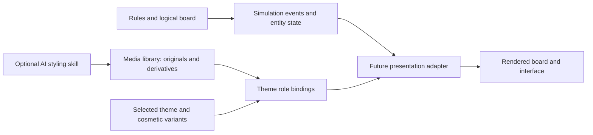

# Round 06 — interchangeable game art and deeper Reloaded evidence

Latest direction: [Round 07](round-07-motion-and-balance.md) retains compact tiles and detailed props with a hybrid default, adds a smaller FPV motion study, and expands animation guidance. This page records the earlier round.

12 September 2026. The intended game remains a Ukrainian FPV-led territory-reveal arcade, with Ukrainian culture, 80s–90s and Coupa families. This round adds real local asset-authoring tools, a sixth AI skill, sixteen prompt templates, revised FPV artwork and deeper video analysis. The playable engine and visual upload editor remain future implementation.

## Corrections carried into the assets

The Ukrainian player should look like a practical FPV quadcopter: exposed frame, separate propeller blades, compact battery, front camera and a small antenna. Use restrained blue/yellow accents and a readable outline rather than a large toy-like blue body. The [manufacturer's publicly shown drone](https://wildhornets.com/en/fpv-drone-with-10-inch-propellers-analog) informed the visible silhouette; the game art is original and does not claim an exact model reproduction or manufacturer endorsement. No operational capabilities are imported into the arcade rules.

The current FPV concepts use **no Z markings anywhere**. The revised image removes those markings, the generated real station name and the footer slogan. Ukrainian player, hostile military actors and neutral scenery have distinct identity in the briefs and media records. Hostile equipment in reveal artwork is unmarked; it is not silently relabeled as Ukrainian equipment.

The [corrected gameplay study](concepts/round-06-fpv-object-skins.png) replaces generic glyphs with concrete barriers, radio-interference props, danger equipment, infantry and patrol vehicles. The [variation sheet](concepts/round-06-fpv-asset-variants.png) compares Daybreak, Night Signal and Winter appearances. These are inspected concept boards, not production sprite exports. [Effective prompts and limitations](concepts/round-06-review.md)

## What the new video analysis changes

Read the [Round 06 motion audit](research/round-06-reloaded-observations.md) for exact source/timestamp and before/after evidence. Public video downloads were used for close local frame analysis where streaming controls were unreliable or unavailable to the research worker. Raw video stays outside the project. This does not mean every public video was watched, or that all browser playback failed.

- **A line alone can be the valid result.** In Pack 6 Level 7, a long closed route leaves a thin exposed corridor while field enemies occupy both large sides. A subsequent cut fills an empty pocket. This supports our explainable enemy-seeded starting rule in those cases, while leaving exact reference anchor eligibility unresolved.
- **Terrain artwork can disappear after enclosure.** The same pocket no longer shows its former wall/slow/lethal tiles. This is direct visual evidence, not yet proof of every collision rule after capture. Permanent blocked rectangles in our current contract must not be presented as an exact Reloaded match.
- **Erosion is visible in motion.** A large diamond at the frontier creates new black notches in previously exposed ground. We need ownership changes and contour rebuilding, with scoring rules that prevent repeated recapture farming.
- **Contact pickups are distinct from enclosed objectives.** A speed pickup remains after the picture beneath it is revealed, then disappears as the player reaches it and the trail changes appearance. The pickup needs its own position, collection event and timed status.
- **Quota and mastery time vary.** This later stage uses a 70% target and a 180-second mastery condition; earlier inspected stages show 80/90% and other time thresholds. Treat them as separate authored values.
- **Pack gates are explicit.** The menu shows successive star thresholds of 36, 72, 108, 144 and 180, alongside a purchase option. That establishes displayed gates, not a universal entitlement rule. Our recommended ordinary completion progression with optional mastery remains a deliberate product choice.

We should adopt the reference's expressive routes, readable terrain, changing frontier and capture payoff. We should explain the fill result and preserve approachable progression, rather than assume every source convention is necessary for replayability.

## How everything stays replaceable

The stable relationship is **behavior → visual role → chosen asset variant**. A role is the job an image performs, such as player, moving field threat or slow terrain. It is not a filename, a particular symbol or a national identity.

The media library and binding authoring exist now. Simulation, compilation into runtime assets, and the presentation adapter are still planned.

| Replaceable item | What an author changes | What remains independent |
|---|---|---|
| Player | Drone, bird, arcade craft or approved Navi image; skin and animation source | Position, collider, steering and damage rules |
| Enemy | Infantry, scout vehicle, drone, storm mote or expense sprite | Movement domain, fill-anchor rule and threat timing |
| Wall / slow / danger | Concrete, interference equipment, wire, craft material, circuit or paperwork artwork | Actor-specific collision/effect and the full affected cell region |
| Background collection | New source pictures, optional styled derivatives, captions and gallery ordering | Board geometry, capture result and objective positions |
| Trail / boundary / reveal cover | Palette, material, texture and supported effect recipe | Which cells are open, claimed or part of an unfinished cut |
| Menus / HUD / gallery / marketing | Layout assets, icon families, typography tokens and copy | Input meanings, actual result values and save identity |
| Audio / feedback | Original sounds, music, stems and supported event bindings | Simulation timing and essential warning meaning |
| Goals and challenges | Parameters and combinations of registered behaviors | Unregistered algorithms still require a bounded code extension |

The raster media tool currently covers image roles, sampling, fit and optional visual transforms. The existing content contract separately describes some animation/audio/crop metadata. They are not yet one automatically interchangeable runtime bundle. A compiler must reconcile them, reject missing capabilities, and produce a resolved, versioned asset set before a level begins.

Do not name a behavior `red-cross` or derive danger from red pixels. `terrain.danger` may have a military object skin today and an embroidered thorn skin later. The full zone outline or texture must remain visible even when the prop occupies only one corner. A decorative antenna is not an additional collider. Similarly, an infantry skin must still clearly show its movement domain; an appearance change does not secretly add pursuit or shooting.

## Background import and optional AI styling

The intended editor flow is: choose images → preview originals → choose keep-original or a requested style → review any derivative → assign to a collection → preview with the existing board. Local file selection and preview can use the browser File API; selection and upload are separate operations. [MDN File API guidance](https://developer.mozilla.org/en-US/docs/Web/API/File_API/Using_files_from_web_applications)

The working [local media CLI](../authoring/media/README.md) performs the import/registration portion now. It preserves original bytes, computes file identities, stores separately produced derivatives, and changes role bindings without replacing source files. An [executed concept-library example](../authoring/library/round-06-fpv/README.md) registers the previous image, corrected derivative and variation sheet with real hashes and dimensions. Its custom concept roles avoid treating composite pictures as game sprites. AI conversion is not an import side effect. The future editor will wrap this workflow in a visual interface; no drag-and-drop screen is claimed today.

Supported authoring choices include keeping a photograph as photography, adding a separate pixel overlay, or requesting a pixel/painted/other style derivative. All four draft theme packs now allow pixel art, illustration, photographs and scanned artwork. Original source, styled result and chosen display version remain distinct. Cropping or styling does not move a target or create an enemy.

The new [Background Stylist skill](../authoring/skills/xonix-background-stylist/SKILL.md) inspects the source, uses requested styling only, records the effective prompt and parent, and reviews identity and focal preservation. It does not claim generated text, transparency, equal sprite frames or animation correctness without inspecting them. The shared prompt CLI now exposes **72 templates**, including the [16 new asset/style prompts](../authoring/prompts/round-06-asset-variations.md).

## Engine recommendation and integration boundaries

Retain **Phaser 4 + TypeScript** provisionally. Its texture manager supports loading images and atlas data, and the versioned texture API separates sampling from game logic. Pin the tested release when the runtime proof begins; the checked official release page documents 4.2.1 dated 9 July 2026. [Texture manager](https://docs.phaser.io/api-documentation/4.0.0/class/textures-texturemanager), [Texture API](https://docs.phaser.io/api-documentation/4.0.0/class/textures-texture), [release](https://phaser.io/download/release/v4.2.1)

Use separate textures for nearest-filtered pixel sprites and smoothly sampled photographs. Use a semantic binding resolver rather than filenames in enemy code. Bind sprite anchors and rendered footprints independently of colliders. Keep image originals at authoring resolution and compile platform-sized derivatives for distribution. Aseprite can supply deliberate sprite/atlas exports after a design is selected; generated contact sheets remain concepts until frames and transparency are actually finished. [Aseprite export documentation](https://www.aseprite.org/docs/cli/)

A future skin change should load and validate the next presentation set before switching, then release unused textures. It must not reset simulation state. Rules/topology changes create a new challenge identity; cosmetic selection does not. A run pins its resolved rules and content version so a newly uploaded picture cannot change a saved replay halfway through.

Browser, iPhone and desktop/Steam packaging still need device testing. Portrait and landscape keep the same full arena. The new concept images preserve the earlier illustrative proportions and do not certify the contract's 4:3 runtime layout.

## Next implementation proof

Before producing every sprite and chapter, prove one board under all four themes and at least two background media. Swapping player/terrain/background art must leave identical input replays, captured cells and results. Test local import and source recovery, missing variants, nearest versus linear sampling, small-screen threat readability and switching assets without memory growth. Then add a reference-inspired mixed-terrain board, contact pickup and eroder using explicit rules.

The [verification record](../authoring/evaluations/round-06-verification.md) separates working authoring functions from concept art and future runtime tests. This keeps the next design discussion grounded in reusable assets without implying the complete engine already exists.
