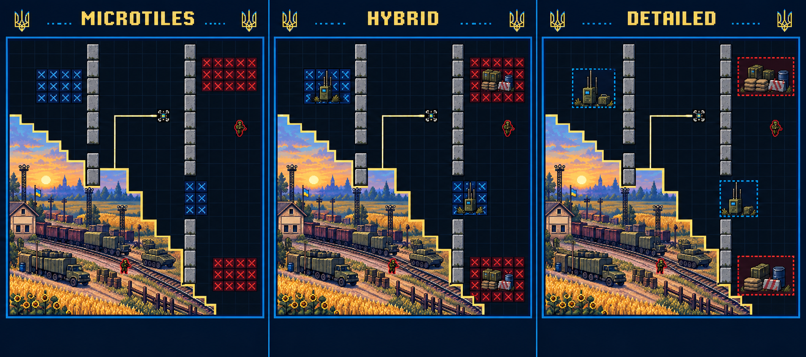

# Round 07 — compact scale, layered motion and three terrain treatments

12 September 2026. Keep both approved visual approaches and make **hybrid the default**: compact repeated pixels communicate routes and danger; a smaller number of detailed objects supplies identity. XPOSED RELOADED remains the principal interaction reference. This round adds an isolated [motion lab](../authoring/motion-lab/README.md), a new FPV body concept, a terrain comparison, animation authoring guidance and further direct video evidence. It does not implement the territory game or finish every theme's production animation.

## One board, three appearances

| Treatment | What we keep | Where it helps |
|---|---|---|
| **Microtile** | Multiple small squares, glyphs, connected edges and deliberate low-resolution clusters | Dense routes and narrow gaps; a strong early arcade rhythm |
| **Detailed props** | Larger coherent zones carrying recognizable barriers, equipment, landscape and architecture | Distinctive chapters, attractive discoveries and scene storytelling |
| **Hybrid — default** | Quiet repeated material inside the zone, strong shared boundaries and selected larger props | The clearest balance of the earlier and current directions |

These are independent presentation choices. X, chevron and square symbols remain valid optional skins; replacing one with an antenna or vehicle does not add a mechanic. An object occupies the existing logical footprint, with a zone edge showing the full affected area. Larger decorative roofs, shadows or foliage must not hide a real gap or imply a false one. Player, live cut and imminent threats render above ornament.

This generated sheet compares visual direction. Its panel interiors drifted to portrait proportions and are not an exact geometry fixture. Use the lab's actual 48×36, 4:3 board to compare the same coordinates under all three treatments. [Prompt and inspection record](concepts/round-07-review.md)

## A smaller FPV that reads through motion

The body should communicate a practical FPV quadcopter through an exposed carbon X-frame, four separated motor hubs, narrow strapped battery, forward camera and small antenna. A small blue/yellow accent identifies the Ukrainian player. Current FPV concepts use no Z markings anywhere. Hostile military, Ukrainian and neutral roles remain explicit metadata, independent of color or filenames.

The starting lab target is a **1.25-cell square body canvas** on a 48-cell-wide board, adjustable for comparison. That canvas is about 2.6% of arena width; the occupied silhouette is smaller because of alpha padding. A bright center and restrained rotor envelope keep it locatable. Source dimensions are not display size: the generated 1254×1254 PNG is a concept source, not a finished 32×32 sprite export. Test the occupied pixels, center and collider together in the future game before fixing final scale.

Movement should respond immediately to directional input. The body can turn or bank visually, but animation cannot decide travel direction, add inertia or reduce speed during a turn. Slow and boost cues read the actual movement state. At rest, retain the last meaningful facing. Rotor rate, propulsion and the short wake follow speed; the active cut remains a separate, authoritative route. A visual wake is not proof of territory capture.

## Animate independent components

Use the same presentation interface across themes, with different component recipes. Separately replace body, moving attachments, shadow, wake, active cut, frontier, capture effect, damage/respawn effect, terrain material, UI transition and sound cue. Some components are images or frame sequences; others are small parameterized drawing/effect recipes. They need stable roles, anchors, draw order and explicit state dependencies.

| Component | FPV FRONT | UKRAINE ATLAS | 1994 FOREVER | NAVI NETWORK |
|---|---|---|---|---|
| Player identity | Compact quadcopter | Swallow, embroidered shuttle or another chosen cultural character | Small arcade craft or cursor-like ship | Approved Navi character or Coupa mark |
| Motion response | Motor spin, restrained banking, short dust or signal wake | Wing cycle or shuttle tilt, thread or petal wake | Thruster flicker, directional pose, pixel exhaust | Directional pose, restrained expression and data ribbon |
| Moving threats | Unmarked fictional invading military actors with distinct movement silhouettes | Storm, thorn or folklore roles appropriate to the chapter | Sparks, sentries and circuit creatures | Fictional cost leaks, duplicate invoices and risk actors |
| Terrain life | Small warning lights, interference rhythm, restrained environmental movement | Reeds, woven highlights, water or wind | Machinery lights, plasma cycle, static | Queue indicators, ledger pulses, alert signs |
| Capture reward | Clean signal/frontier pulse and recovered image | Stitched border and revealed artwork | Crisp arcade flash and picture reveal | Savings/visibility cue tied to actual game values |

These are animation directions, not four completed character sets. The lab uses the generated FPV body and configurable palettes/materials; other character slots remain labeled placeholders until real art is supplied. Infantry gait, vehicle tracks, bird wings, facial animation and production UI sequences need their own frames or proven component recipes. A palette change alone does not complete a theme.

For each component define idle, move, turn, slow, boost, hit, respawn, capture and victory where relevant. Define priority and cancellation per component: hit replaces stale boost cosmetics, respawn replaces stale hit feedback, and capture can coexist with locomotion. World animation pauses with the world clock; UI has its own clock only when intentionally continuing. One-shot sound and visual effects consume unique events once. Rapid captures must not accumulate a queue that hides current play.

Reduced motion keeps a steady heading/state cue and readable warnings while removing decorative banking, rotor flicker, large zooms and particles. Read the device preference on first use and allow a visible setting. The browser exposes this preference through [`prefers-reduced-motion`](https://developer.mozilla.org/en-US/docs/Web/CSS/Reference/At-rules/@media/prefers-reduced-motion). Low-effects settings may simplify ornament but must not remove threat information.

## What the deeper Reloaded inspection changes

The [Round 07 audit](research/round-07-reloaded-ui-motion.md) records 27 curated frames with source links, timestamps, observations and uncertainties. It extends the prior sampled recordings; it is not a claim to have inspected every available source or heard their audio.

- **Small player, expressive cut.** The sampled 1280×720 footage has a roughly 12–18-pixel player core, a bright leading point and a warmer active head above a cooler completed route. This supports reducing our character while improving its readable center and motion cues. The reference arena is much wider than our proposed 4:3 board; these are visual proportions, not matching collider measurements.
- **Failure preserves the run's earned progress.** In the [Foreseen recording](https://www.youtube.com/watch?v=HEM9_sQGRJQ&t=148), lives change from five to four, the unfinished cut disappears, and 29/80 plus score 1,248 remain. The player reappears about 1.2 seconds after the loss sample. Our default should preserve captured progress on a life loss and clearly distinguish the hit and respawn locations. Exact control-return and invulnerability timing remain unverified.
- **The speed medal can expire without ending play.** The same recording continues at TIME 00:00 and later gains coverage. Label the countdown as a medal opportunity; author a separate, explicit hard deadline only for a challenge that needs one. This is a correction to any assumption that every zero timer means defeat.
- **Collection is part of the reward.** [Pack 6 footage](https://www.youtube.com/watch?v=-qG4k6dkd-c) shows gallery selection, hold-to-preview and return to the same image. Preserve gallery focus/scroll on return; use a preview toggle on touch and a hold shortcut where comfortable.
- **Victory has several beats.** The same recording takes roughly 12 seconds from quota completion to final visible actions: dissolve the cover, appreciate the picture, award medals, explain bonuses, offer replay/next. Skipability is unknown. Preserve that ordering, but let our repeat players finish the animation early with one deliberate input; do not let that input also start the next run.

For our first-clear flow, test a 0.25–0.5-second capture emphasis, a 1.5–2.5-second picture moment, short medal arrivals and a readable score tally. These are proposed values, not copied measurements or proven retention improvements. The repeat flow should offer its next action earlier. Avoid obscuring small text with scanlines, glow or simulated display faults.

## Fit the display without changing the challenge

Keep one full 4:3 arena across devices. On desktop and large tablets, the authoring lab can place controls beside it. Portrait places controls and HUD below/above it; landscape phones need controls beside the arena or in reserved safe areas. Never crop playable edges or change cell geometry merely to fill the screen. A narrower gameplay topology, if later selected, becomes a separate challenge identity.

Compare a 320–390 CSS-pixel-wide phone view, an 844×390 landscape viewport, tablet and desktop using the [live viewport comparison](concepts/round-07-device-preview.html). At 320 pixels of actual arena width a 1.25-cell source box is about 8.3 CSS pixels, so the optical body may become too small: test a configurable thin outline/center cue, then a modest visual scale floor that does not imply a larger collider. All major threats need the same scrutiny. A CSS preview is layout evidence only; iPhone touch, controller comfort, device frame time and sustained performance still require hardware tests.

## Authoring and engine boundaries

The reusable chain is **logical state/events → semantic role → selected component/clip recipe → renderer**. Existing image import, original/derivative history and role bindings remain separate from level geometry. The lab's `presets.json` proves a small subset of independently editable presentation parameters; it is an experimental lab format, not an expansion of the existing game-pack or raster-media schema.

Retain Phaser + TypeScript for the planned game proof. Phaser supports frame sequences, local/global animations, repeat rules, per-frame timing and importing Aseprite tags. Check the exact pinned version when integrating; no Phaser runtime is added by this standalone lab. [Official animation documentation](https://docs.phaser.io/phaser/concepts/animations)

Aseprite tags can group directional/state clips with forward, reverse or ping-pong playback, while its CLI exports textures and JSON and can separate layers. Keep editable sources and component identities through export. Neither an AI contact sheet nor an exported atlas proves a good loop; play it at actual size and inspect pivots, alpha, direction changes and interrupted states. [Tags](https://www.aseprite.org/docs/tags/), [export CLI](https://www.aseprite.org/docs/cli/)

Use the new [Animation Director skill](../authoring/skills/xonix-animation-director/SKILL.md) and [16 additional prompts](../authoring/prompts/round-07-animation-variants.md) for component changes, small-FPV variants, theme-specific motion, UI feedback and playback review. The shared library now has 88 templates and seven authoring skills. Supported artwork, anchors, rates, palettes and recipes are data; a genuinely new renderer, behavior or state dependency still needs a bounded extension. “Everything replaceable” does not mean an arbitrary new algorithm can be invented by uploading a picture.

## Readiness for the next discussion

Use the live lab to settle character size, body/rotor visibility, immediate turning and the three terrain treatments. The [visual review](concepts/round-07-review.md) records generated-image limits; the [authoring checks](../authoring/evaluations/round-07-authoring-checks.md) record executed validation. Browser observations belong in the separate [motion-lab review](../authoring/evaluations/round-07-motion-lab-review.md).

The next game proof still needs actual capture, a moving threat, terrain interactions, life loss, gallery/reward flow and recorded-input equivalence across skins. Production sprite atlases, all-theme animation, audio, background upload UI, packaging and real-device testing remain subsequent work. This round makes motion reviewable before those implementation choices are locked.
