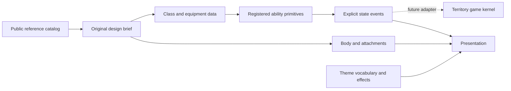

# Round 09 — classes, equipment and an expandable world

The game direction now includes **meaningful player abilities** as well as cosmetic variety. The [ability study](http://localhost:8767/authoring/motion-lab/) exercises ten class presets through a small shared registry on abstract markers. The [reference atlas](http://localhost:8767/docs/concepts/round-09-reference-atlas.html) organizes 67 sourced records for the larger world. The toy abilities can now be tested; territory gameplay and the researched world actors have a separate integration plan below.

## The structure we should keep

Compose a loadout from independent choices:

| Choice | Owns | Does not implicitly change |
|---|---|---|
| Airframe/body | Shape, rotor arrangement, wings, camera and animation anchors | Abilities, team, speed or capture rules |
| Cosmetic | Paint, trim, propeller style, portrait, sound/effect treatment | Class ownership or balance |
| Class | Primary ability, capacity, cooldown, eligible targets and explicit state changes | Equipped body or collection progress |
| Equipment | Declared compatibility and link/resource behavior | Nationality, real-world effectiveness or steering policy |
| Mission role | Friendly/enemy/support/neutral identity, behavior and objective binding | Manufacturer origin or appearance |
| Ruleset and input | Immediate/grid-center policy, future capture and contact semantics | Reference facts and art provenance |

Class and equipment changes are explicit study resets. Cosmetic changes stay cosmetic. The lab uses an explicit **Apply class appearance** action rather than changing art when a class is selected. All study classes allow both link presets as a fictional comparison; this is not a real-aircraft compatibility claim.

The simple default is one primary action and one contextual pickup action. The optional control-complexity question remains open for later loadout expansion. A second active slot should be a deliberate input/schema extension, not an extra unlabelled key.

## Classes to compare now

These are fictional arcade mechanics with values in cells and seconds. The actual [ability presets](../authoring/motion-lab/ability-presets.json), evaluator and [lab README](../authoring/motion-lab/README.md) are authoritative for current controls and limits.

| Class | Current study action | Proposed Xonix decision |
|---|---|---|
| Scout / camera quad | A pulse reveals nearby note markers temporarily | Spend attention on finding an optional objective before choosing a cut |
| Light bomber | Pick up one charge at a supply pad; drop a ground-clearing pulse | Carry one resource through an exposed route and choose a useful drop point |
| Heavy carrier | Same drop infrastructure, two-charge capacity | Plan two delivery/clear opportunities before returning to supply |
| Fiber courier | Scout preset with an explicit recommended fiber link | Compare a limited travel budget with a named signal-information effect |
| Fixed-wing courier | Pick up and deliver a parcel to a delivery marker | Complete a delivery detour while maintaining territory progress |
| Strike / one-way FPV | Charge dash; a successful ground tag returns to the study start | Commit a limited resource to opening a blocked opportunity, with explicit recovery cost |
| Interceptor | Dash that disables eligible airborne toy markers | Time a crossing against a clearly telegraphed moving hazard |
| Pulse emitter / gun-role analogue | A limited-charge arcade projectile affects an eligible marker | Trade supply and timing for a temporary route opportunity |
| Net catcher | Place a short-lived slowing/capture field for airborne toys | Predict a marked crossing and create a brief safe window |
| Relay helper | Pulse restores a nearby relay marker | Enclose or approach a support objective before taking the next risk |

The five registered primitives are **pulse, drop, dash, projectile and net**. Scan/restore and clear/deliver are supported outcomes, not new unregistered code strings. Fiber is an equipment behavior. A six-motor carrier is one body example; a different rotor count can serve the same class.

Use **E / Action** and **R / Pick up**, or their visible buttons. Start near a supply pad, disable autoplay for manual practice and lower cruise speed to compare timing. Reset ability test restores a reproducible toy stage. Pause freezes the study and rejects ability actions. Both immediate and grid-center steering remain configurable.

Radio haze currently changes the labelled signal display; it does not reverse controls or simulate real EW. Fiber uses a fictional spool budget and can block actions when empty while still allowing movement back to supply. Its line is an equipment cue, not a live Xonix cut. A fixed-wing body currently follows the same selected cardinal policy; continuous gliding, aerodynamic turn radii and VTOL transitions are not implemented.

## Research findings that matter to the design

The [drone study](research/round-09-drone-reference.md) records 33 entries: 32 named platform/model references and one linked modification. The [ground/support study](research/round-09-ground-and-support-reference.md) adds 34 entries across armour, support, EW/sensors, artillery/rockets, robots and personnel. Every entry carries its evidence and caveats; the inventory is curated and expandable, not a claim to cover every known system.

- Heavy multirotors have different layouts: the maker distinguishes four-motor Kazhan 620 and six-motor 630. [Reactive Drone](https://kazhan.ua/uk/)
- One platform can fill several roles: Queen Hornet is described as a carrier, bomber and relay; PD-2 supports fixed-wing and VTOL configurations. [Wild Hornets](https://wildhornets.com/en/frequently-asked-questions), [UkrSpecSystems](https://ukrspecsystems.com/drones/pd-2-uas)
- Fiber is a link property; FPV can describe a fixed-wing aircraft too. Source claims about links are not blanket immunity rules. [Ukraine MoD](https://mod.gov.ua/news/stijki-do-vorozhogo-reb-ukrayinski-droni-na-optovolokni-hizhak-reboff), [Ukraine DIU](https://gur.gov.ua/en/content/war-sanctions-zavdiaky-chomu-litaiut-rosiiski-fpv-kryla-molnyia-ta-analoh-orlanu-fenyks.html)
- Commercial origin and operator identity are separate. A camera quad silhouette alone does not identify allegiance. Named products, export variants, approval announcements, demonstrations and field-use reports remain distinct evidence classes.
- Gun and net configurations need version/status caveats. A documented modification or manufacturer demonstration does not establish that it is common across a fleet. The catalog includes those records with explicit qualifications.

Real sources inform broad purpose and original silhouettes. They do not supply the game's performance values, target weaknesses or operating procedures. Ukrainian, hostile-military, friendly-support and neutral roles belong in mission data, independently of a body model. Current concept art uses no Z markings.

## How the wider world enters Xonix

Start with a small number of readable **game roles**, then apply many visual references to them. This supports extensive variety without requiring a unique AI algorithm for every model.

| Future game role | Possible visual families | Challenge contribution |
|---|---|---|
| Field patrol | Tank, wheeled armour, infantry patrol, ground robot | Occupies an unclaimed region and pressures live cuts; model art does not select fill rules |
| Observer | Camera quad, reconnaissance wing, radar/spotter | A clearly timed information or warning cue; sensor and interference roles stay distinct |
| Lane threat | Winged drone, artillery/rocket abstraction | A marked lane or region becomes dangerous after a visible warning; no real ballistic simulation |
| Signal node | Relay, EW truck, communications post | A named information penalty or support objective with explicit coverage and lifecycle |
| Supply/support | Truck, engineer, medic, carrier, cargo robot | Resupply, delivery, rescue or restoration objectives with explicit friendly status |
| Mobile objective | Convoy, ground robot, uncrewed boat | A moving destination or enclosure objective introduced after static delivery works |

These actors are **planned**. The current toy targets do not implement military AI, terrain collision, vulnerable trails, capture, lives or completed levels. Medics and logistics need not be enemies; military personnel roles are not inferred from nationality or civilian appearance.

Suggested first chapters are a broad open **First Signal**, a supply-focused **Relay Orchard**, and a **Night Corridor** with one moving airborne marker and clearly separated safe nodes. A Ukrainian cultural version can restore heritage fragments; a retro version can recover cartridges and repair circuits; a business version can deliver fictional parcels and resolve labelled anomalies.

## Six teaching stages before a large campaign

1. **Find the note:** one scan and one optional objective, with generous movement room.
2. **One delivery:** a supply pad, a visible destination and one charge.
3. **Two opportunities:** demonstrate the carrier's capacity choice with separated goals.
4. **A crossing window:** introduce one moving air-domain target and a clear intercept/net cue.
5. **Choose a link:** compare the same authored route with the two equipment presets; make the budget and information effect explicit.
6. **Combine with capture:** after the real cut/fill kernel exists, combine one taught ability with one simple territory challenge.

Do not add all equipment types to an introductory level. Keep route choice and picture reveal central. A useful replay question is whether the player chooses a different class to solve the same map, not whether a stronger cosmetic makes an old map trivial.

## Progression and production integration

The demo exposes all classes for comparison. Real class unlocks and loadout persistence are future work, separate from current cosmetic test rewards. In production, select a loadout before a run or at an explicitly designed safe transition; changing class cannot become an unlimited refill/reset exploit. Cosmetic ownership remains stable across body replacements.

Keep `classId`, equipment IDs, ruleset revision, content revision, turn policy and seed with future replay/results identity. Compare scores within compatible setups. Define whether optional class challenges share campaign clears or have separate mastery records before adapting the collection evaluator.

Extend the [territory gameplay plan](round-08-gameplay-plan.md) in this order: implement the simple cut/fill loop; integrate one ability event path; prove three teaching levels; add remaining primitives; then add a small actor roster and progressively more reference skins. For integration, danger/contact must resolve before same-instant closure rewards. Decide how dash, drop, net and scan interact with live trails, claimed ground, enemies, walls and terminal results. None of those decisions can be left to a renderer callback.

Existing parameters and asset bindings can change through their validated JSON formats. A new effect, targeting domain, behavior or migration requires a registered implementation and tests. Reference catalogs, presentation manifests, ability presets, collection profiles and game packs retain separate versions and purposes.

## Art and AI workflow

Four additional original bodies are applied: camera quad, heavy six-rotor carrier, fixed-wing courier and delta interceptor. Their accepted source files, alpha checks and effective generation prompts are recorded in [asset provenance](concepts/round-09-generated-prompts.json). They are concept art with inspected attachment anchors, not exact replicas or finished low-resolution atlases. The atlas shows the concepts alongside the sourced catalog.

The new [Ability Designer skill](../authoring/skills/xonix-ability-designer/SKILL.md) joins the existing eight workflows. [Twenty new prompts](../authoring/prompts/round-09-abilities-and-world.md) cover research, abilities, equipment, bodies, personnel, world roles, teaching levels and cross-theme review. Prompt rendering produces instructions; actual image generation and binding are separately recorded. Current template total: 124.

Use the [authoring checks](../authoring/evaluations/round-09-authoring-checks.md) and [preview review](../authoring/evaluations/round-09-preview-checks.md) to distinguish valid data, generated concepts, applied art, exercised toy behavior and future production work.
