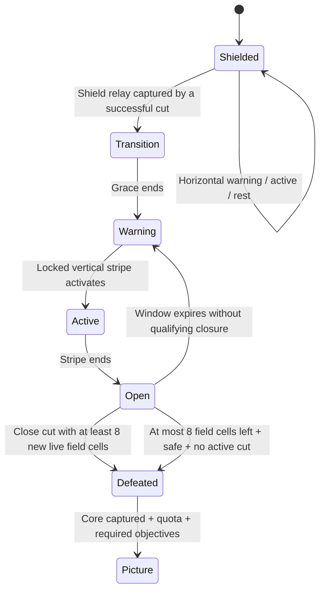

# Round 21 — Sentinel Relay, a playable two-stage reveal encounter

Prepared 12 September 2026 against the source following the Round 20 chapter-reward work. **Accepted implementation plan.** The new versioned core, pack, portable consumers and editor are implemented in the working source; browser and release checks remain in progress. The preserved v0.10.0 release passed 1,128 source tests. New verification is recorded separately and does not overwrite its evidence.

This increment adds one independently selectable **Sentinel Relay** encounter. Capture a shield relay, then finish a sufficiently long cut during a repeating core opening. That successful cut releases the last field seed and reveals the remaining picture. If earlier captures leave too little field for that route, isolating the core provides an explicit alternate finish. Keep seven classes, both steering policies and the existing movement controls. The encounter is fictional equipment; Ukrainian FPV is its first presentation, with identical mechanics available to the other themes.

## What changes from the older proposal

The [Round 15 plan](round-15-mastery-plan.md#b-one-genuinely-two-stage-boss) remains useful design history, but its packaging and progression assumptions are obsolete:

| Pre-implementation baseline fact                                                                                                                                                                       | Consequence for this increment                                                                                                                                                       |
| ------------------------------------------------------------------------------------------------------------------------------------------------------------------------------------------------------ | ------------------------------------------------------------------------------------------------------------------------------------------------------------------------------------ |
| [`lane-boss`](../game/core/README.md) has `idle`, `warning` and `active`, samples a player-aligned lane and remains a stationary field seed. It has no defeat, shield relay or second stage.           | Add a registered staged encounter; changing its label or animation would not implement the requested boss.                                                                           |
| [`commitCapture`](../game/core/capture.mjs) secures live trail cells and fills four-connected regions that have no non-patrol enemy center. Victory currently checks coverage and required objectives. | The staged sentinel needs an explicit, authoritative decision about whether it retains its region for a particular closure, followed by transition/defeat processing before victory. |
| [`contacts.mjs`](../game/core/contacts.mjs) tests swept enemy contact against entire live raster cells, as well as player bodies. Contact wins a closure tie.                                          | Retain those rules. A narrow immediate-mode route through the sentinel's cell must not evade its contact simply by missing the decorative sprite or circular center.                 |
| Before this increment, [`replay.mjs`](../game/replay.mjs) accepted only core v2/replay v3, with an explicit enemy-field checkpoint projection.                                                         | New stage fields would be unchecked if merely appended to an enemy object. A complete new version branch is necessary.                                                               |
| Pack v2 and playground scenario v2 already express finite optional mastery definitions; library v2 already stores mastery records.                                                                     | Do not repurpose those versions or repeat the completed library migration. Use new content versions for the new simulation.                                                          |
| Current chapter cosmetics derive from existing distinct clear records.                                                                                                                                 | Reuse ordinary completion rewards. A one-map chapter earns its current one-map milestones; do not invent a boss currency or new cosmetic entitlement.                                |

Do not append a map to Homeward or Workshop, or replace an existing `lane-boss` descriptor. Their campaign keys, completed-chapter meaning, picture records and recorded routes must stay exact.

## Primary references and the design inferences

These public text pages were reopened on 12 September 2026. No new video was watched, screenshot inspected, soundtrack auditioned or physical controller tested for this plan. The game creators' accounts below are design examples, not evidence of increased retention.

| Primary source and observed statement                                                                                                                                                                                                                                                                        | Specific proposed application                                                                                                                                                                                                                                  |
| ------------------------------------------------------------------------------------------------------------------------------------------------------------------------------------------------------------------------------------------------------------------------------------------------------------ | -------------------------------------------------------------------------------------------------------------------------------------------------------------------------------------------------------------------------------------------------------------- |
| [Emeric Thoa, The Game Bakers — Furi, PlayStation Blog, 9 March 2016](https://blog.playstation.com/2016/03/09/furi-on-ps4-a-gauntlet-of-brutal-boss-battles/): the creative director describes a small move set, immediate response, warnings followed by reaction opportunities, and exploiting an opening. | Change the capture decision between stages while retaining our cardinal controls. A complete warning precedes the first opening. Do not borrow Furi's demanding reflex expectations or artwork.                                                                |
| [Riot Scruffy — Champion Counterplay, 14 May 2021](https://www.leagueoflegends.com/en-au/news/dev/quick-gameplay-thoughts-may-14/): clear responses and broadly available tactical counters are important for high-impact threats; a special ability should not be the only answer.                          | Demonstrate an ordinary unboosted route with every class. Returning to safe ground before the stripe activates and making a cut during the opening are universal counters.                                                                                     |
| [Microsoft XAG 103 — Additional channels for visual and audio cues](https://learn.microsoft.com/en-us/xbox/accessibility/xbox-accessibility-guidelines/103), updated 4 March 2026: important cues need complementary channels, and color alone is insufficient.                                              | Combine a bounded stripe, distinct warning/active patterns, open/closed core shapes, concise text and optional original sound cues. Muting music or removing decorative effects cannot hide the opening. This does not establish nonvisual play accessibility. |
| [Microsoft XAG 108 — Game difficulty options](https://learn.microsoft.com/en-us/xbox/accessibility/xbox-accessibility-guidelines/108), updated 4 March 2026: difficulty depends on players' abilities; configurable barriers and pausable play help people reach the content.                                | Start with generous warning/open times and no mission deadline. Keep timings data-driven for an explicit later gentler preset. A practice-only variant without rewards is not equivalent to an accessible rewarded difficulty mode.                            |
| [Microsoft XAG 117 — Visual distractions and motion settings](https://learn.microsoft.com/en-us/xbox/accessibility/xbox-accessibility-guidelines/117), updated 4 March 2026: moving UI and background effects can interfere with reading; offer ways to pause or remove them.                                | Use a static camera, a stable phase label and a skippable finale. Reduced effects keep the lane boundary and phase information but omit bursts and zooms.                                                                                                      |

For the picture reward, reuse the previously inspected [Reloaded motion audit](research/round-07-reloaded-ui-motion.md#victory-is-a-sequence-of-distinct-rewards). Its Pack 6 samples show the last capture around 2:33, the unobstructed picture around 2:35–2:38, then stars and score. That earlier observation supports giving the image a clear moment. It does **not** establish a staged boss mechanic in Reloaded, mandatory unskippable results, input latency or an ideal duration for our game.

## The encounter the player receives

Working campaign/pack ID: `sentinel-relay`; map ID: `sentinel-relay-01`; first content revision `1`. These are proposed identifiers, to be checked for collisions when authoring. Use one fresh 48 × 36 board, one stationary sentinel, one visible shield relay and one visible core objective. The core shares the sentinel's cell. Both objectives are required.

Initial layout proposal: spawn `(0.5,18.5)`, shield relay `(8.5,8.5)`, sentinel/core `(34.5,18.5)`, home supply and hangar at spawn. Leave the first authored board free of permanent walls, other field enemies, patrols and signal zones. Players create the useful geometry by claiming the west side first. These candidate coordinates now have twenty verified legal-input routes, covering all seven classes in both steering modes and missed-opening, recovery and isolation alternatives. This is automated route evidence, not human playtesting. Add scenery through the theme, not invisible collision obstacles.

Use three lives, the existing eight-cell/second base speed and optional existing boost. No mission, cable-length or cut-duration failure deadline. Proposed coverage quota is 75%; the core remains required, so reaching the quota early cannot win. Speed medals remain optional. Set their thresholds only after ordinary route measurements rather than attaching an arbitrary deadline to the tutorial encounter.

Ready text should fit two instructions:

> Capture the shield relay. While open, close an 8-cell cut—or isolate the core.

The implemented HUD shows `1 / 2` or `2 / 2`, the named phase and its remaining seconds. During exposed phases it shows the actual `Live line n / 8 new cells` and explains closure during CORE OPEN. At eight or fewer remaining field cells, it switches to the isolation instruction. The earlier proposed pre-isolation countdown (for example, `12 cells left / 8`) is not implemented. Coverage remains separate; no health bar, damage number, ammunition requirement or personnel target is implied. Couch boards derive their own phase and cut text, including paused and round-ended context.



### Exact stage and capture rules

1. **Shielded:** the sentinel always retains its field component. At each warning start it locks a horizontal lane to the player's current row, clamped using the existing interior-center convention. The lane does not track afterward. Capturing the named shield relay in a successful closure transitions exactly once. A stage-1 closure cannot also defeat the core.
2. **Transition:** cancel the old scheduled stripe immediately, retain the sentinel seed and let the player move. Use a short labeled shield-opening effect. This is simulation grace, not a blocking cinematic. The first stage-2 warning occurs only after the full transition delay.
3. **Stage-2 warning/active:** lock a vertical lane at warning start; warn, then activate it. The core remains shielded throughout both phases. The whole first warning and active interval must elapse before the first opening, even if a stun field suppresses stripe contact.
4. **Open:** the lane is inactive. For each normal successful closure, count the distinct cells in the **current live trail** that are `FIELD` immediately before capture. At least eight are required. Do not count preexisting safe cells, automatic area-fill cells, earlier successful cuts, a failed/discarded trail, a timed dwell or a safe-ground loop.
5. **Qualifying closure:** only if stage 2 is open and that count meets the configured minimum, omit the sentinel's seed for this capture transaction. Perform the normal flood fill, capture the core objective, mark the sentinel defeated and remove its further contact/anchor contributions. Emit defeat once, then apply normal quota/required-objective victory checks. A visual effect cannot set these flags.
6. **Other closure:** short cuts or a long cut outside the opening still secure their ordinary trail and any normally unseeded regions. The sentinel continues retaining its region; there is no cut-release credit toward a later eight-cell cut or extra penalty. Reset the current-cut counter on closure. Those real captures may eventually satisfy the separate isolation condition below. After a miss, the warning/active/open loop repeats indefinitely until success or normal loss.
7. **Isolation finish:** after the relay is captured, if at most eight `FIELD` cells remain on the board, the core is isolated. On any open-phase tick where the run remains running after normal contact/timeout processing, the player occupies a `SAFE` cell and no cut is active, release the sentinel seed and reveal/capture the remainder. This can occur at the end of the tick containing a short closure; it is an isolation win, not a qualifying-cut win. Never trigger during transition, warning, active stripe or respawn. Missing an opening simply waits for the next one. Do not synthesize `cut.closed` or count the automatic reveal as an eight-cell live trail.
8. **Failure/recovery:** self/enemy/active-lane contact still resolves before closure at the same instant. The unfinished cut is discarded; its counter resets. Previously captured relay/territory and the current stage remain. The phase clock continues through respawn, as existing lane clocks do; pause/suspend freezes it. Restart creates a fresh stage-1 run. No extra life is lost for merely missing a window.

**The sole-seed release is intentional.** With no other field seed, a qualifying closure fills all remaining claimable territory, even if its trail is far from the core. Explain both the timed-cut and isolation routes; neither requires cutting through the core. The eight-cell condition prevents an almost empty border poke from immediately releasing a large remaining field, while avoiding new shooting or precision-targeting controls. An early attempt to cut through the occupied core tile must still lose to the existing raster-trail contact rules.

The isolation rule resolves a concrete independent-review finding: ordinary captures can permanently shrink the remaining region below the minimum cut length. Merely using `min(8, remainingField)` does not help when only the occupied core is left. The alternate route preserves earned territory, requires the relay and first full stage-2 attack, and avoids regenerating hidden terrain. A branched remnant with more than eight cells but no eight-cell path must remain reducible through ordinary shorter cuts until it meets isolation; test this explicitly on the bundled open board. Do not claim the schema alone proves every arbitrary authored wall layout is winnable.

### Authored timings and event ordering

All values below are fictional game tuning, not real equipment specifications or measured reference-game timings. Store them as positive bounded integer ticks at 120 Hz:

| Schedule                | Delay / warning | Active     | Rest / open                                    |
| ----------------------- | --------------- | ---------- | ---------------------------------------------- |
| Initial stage-1 lead-in | 240 ticks / 2 s | —          | —                                              |
| Stage 1, horizontal     | 240 / 2 s       | 84 / 0.7 s | 396 / 3.3 s; shield stays closed               |
| One transition          | 180 / 1.5 s     | —          | —                                              |
| Stage 2, vertical       | 240 / 2 s       | 84 / 0.7 s | 480 / 4 s; qualifying closure may release core |

No independent `period` field: derive each cycle from the three durations so contradictory schedules cannot be authored. At warning start, sample the lane once. Phase intervals are half-open in fixed-step indices, with the phase resolved before contact planning and capture eligibility for that tick. A closure on the first open tick qualifies; one on the next warning tick does not. Substeps within that tick use the same phase. A relay closure at tick `N` cancels the old stripe for the remaining substep; its 180 full transition ticks start at `N+1`, so the first warning begins at `N+181`. Initial delay occupies ticks 1–240, with the first warning at 241.

Order a successful cut transaction as existing cut/cell/objective events, then `encounter.stageChanged` or `encounter.defeated`, then terminal completion. Resolve cut eligibility from the pre-capture state and currently selected phase; do not reconsider the same cut after it activates stage 2. The isolation branch runs at the end of a fixed tick after ordinary failure/recovery processing, emits cell/objective/defeat/result facts without inventing a cut, and distinguishes defeat cause `isolated` from `cut-release`. It may reuse a factored flood-fill helper, with the old capture branch's event order unchanged. Checkpoint stage, phase, phase-start/end ticks, locked lane, cycle count, defeated state/cause, qualifying cut count and transition/defeat ticks. Any cached isolation state must also be included; derived UI counts must not become independent simulation authority.

Stun and impact suppress active stripe contact when their existing fields cover the sentinel; its schedule keeps running. They do not open the core early, extend the opening or remove body/trail contact. Slow fields do not slow a stationary encounter's phase clock. Impact discards the live cut under its current rules and cannot substitute for closure. Shield may absorb an eligible contact and recover, but cannot secure the discarded cut. Scan may mark existing information; fiber resistance has no special effect without a signal zone. This first map must remain winnable without any ability, switching or boost.

## Presentation and the reveal climax

Reuse procedural theme primitives and existing licensed/original backgrounds for the first implementation. A large decorative radar, embroidered rosette, neon cabinet or business network hub can share one small authoritative footprint. Always render the live cut, collision marker and lane edges over the decorative prop.

| Presentation              | Stage-1 / stage-2 distinction                                                                                                | Completion treatment                                                                                              |
| ------------------------- | ---------------------------------------------------------------------------------------------------------------------------- | ----------------------------------------------------------------------------------------------------------------- |
| Ukrainian FPV             | Fictional signal sentinel; closed shield segments become an open beacon ring. Ukrainian palette/ornament remains decoration. | Equipment powers down with sparse sparks/smoke; the homeward scene becomes clear. No depiction of harm to people. |
| Ukrainian heritage        | Knotted rosette opens into a geometric flower.                                                                               | Existing stitch-bloom finale reveals the artwork.                                                                 |
| 1980s–1990s arcade        | Closed neon brackets open into a central diamond.                                                                            | Existing neon finale and original arcade music cadence.                                                           |
| Business / Coupa-inspired | A fictional blocked network node opens its connections.                                                                      | Existing savings-node finale; no claim of real measured savings or official product identity.                     |

Warning uses outlined/hatch-marked boundaries; active uses a solid bounded stripe; open uses separated core segments and a stable `Core open` label. Color reinforces these differences. A shrinking opening meter is supplemental, with remaining time rounded for display only. Change announcements occur once per phase, not every animation frame; keep full instructions reviewable when paused.

On victory, commit the result once, then let the existing [celebration timeline](../game/ui/celebration.mjs) make the picture prominent. Reuse its 3.8-second maximum, reduced-effects completion and skip behavior instead of adding another unskippable boss sequence. A short original warning/open cadence can layer onto the selected soundtrack; gameplay never waits for audio. Results retain picture preview, replay and return actions. A single confirm may finish a flourish, but must not also start the next run. Gallery viewing or replay must never repeat a reward grant.

## Version and preservation policy

Keep old constants as legacy defaults where existing callers need them; introduce one explicit resolver for supported level/ruleset/replay combinations. Do not globally replace `RULESET`. There is no default boss object added to old levels, state, summaries or replay checkpoints.

| Contract                        | Supported old behavior                                                                            | Implemented new branch                                                                                                                                                                                          |
| ------------------------------- | ------------------------------------------------------------------------------------------------- | --------------------------------------------------------------------------------------------------------------------------------------------------------------------------------------------------------------- |
| Level/core                      | `xonix-level.v1` → `xonix-core.v2`, byte-identical normalization and state                        | `xonix-level.v2` → `xonix-core.v3`, with exactly one registered `relay-sentinel` encounter in this increment                                                                                                    |
| Replay/checkpoint               | `xonix-replay.v3` + `fnv1a64-state-v2`                                                            | `xonix-replay.v4` + `fnv1a64-state-v3`; a separate encounter section and full new configuration/state coverage                                                                                                  |
| Pack                            | v1 ordinary and v2 finite-masteries contracts stay exact, engine core v2                          | `xonix-pack.v3`, engine core v3, initially `masteries: []`; no implicit application of the core-v2 mastery predicates                                                                                           |
| Practice scenario               | playground v1/v2 keep existing semantics                                                          | `xonix-playground.v3`, level v2 and explicit `masteryDefinition: null` for the initial encounter                                                                                                                |
| Campaign                        | `xonix-campaign.v1` container and every old key remain exact                                      | Same container can carry uniformly level-v2 maps; resolve actual ruleset into its key. Reject mixed core versions within a campaign for now.                                                                    |
| Session / backup / pack-library | Existing versioned envelopes retain their shapes                                                  | Delegate nested replay/pack validation to the shared dispatcher; mixed old/new members are accepted only after full validation. Unsupported pairs fail before adoption.                                         |
| Progress / player library       | Existing clear records, library v2, gallery, preferences, seals and storage generations preserved | No schema migration needed solely for this encounter. Award against the exact selected campaign's ruleset. New campaign/board identities partition scores; old unknown installed-content records stay archived. |

The absence rule is deliberately minimal: a v1 level without encounter fields produces exactly the same v2 run as today. Reject a v1 descriptor trying to opt into staged behavior instead of ignoring or stripping it. Do not add `encounter: null`, extra result fields or an empty checkpoint section to old branches. A v2 level in this first increment requires the staged descriptor, rather than silently turning an ordinary level into a new ruleset.

Update the shared identity logic in library/progress and mastery catalog together: old `{ruleset, normalized levels, classRecipes}` serialization stays identical; a new encounter uses core v3. The supplied catalog must return no optional goal for the initial v3 pack. Current core-v2 seals remain matchable/archived exactly as before. There is no staged-boss mastery predicate in this scope.

All replay consumers need the same dispatch: recorder/export, synchronous/asynchronous verifier, replay player/theater, saved-flight restore, full backup, previous-release transfer and couch/practice entry. A recorded v4 input stream must reconstruct its stage without injecting a saved mutable boss object. An unsupported older release should reject the new content with its existing version/engine check; it must not receive a renamed v1/v2 payload that loses the encounter. Native staging and offline inventories include the added modules without changing their origin or storage channel policies.

## Bounded authoring and editor contract

Implemented finite descriptor. It is accepted inside a valid pack-v3 or playground-v3 document with the required level-v2 context; this snippet alone is not an import envelope:

```json
{
  "version": "xonix-encounter.v1",
  "kind": "relay-sentinel",
  "enemyId": "sentinel",
  "shieldObjectiveId": "shield-relay",
  "coreObjectiveId": "sentinel-core",
  "minReleaseCutCells": 8,
  "initialDelayTicks": 240,
  "transitionTicks": 180,
  "shielded": { "warningTicks": 240, "activeTicks": 84, "restTicks": 396 },
  "exposed": { "warningTicks": 240, "activeTicks": 84, "openTicks": 480 },
  "laneWidth": 1.2
}
```

Place this under the new level's `encounter` property. Its `enemyId` references one `enemies` entry of the new stationary type, which owns position/radius; avoid duplicated coordinates. Exactly two schedules, fixed horizontal-then-vertical axes, no expression language, scripts, arbitrary transitions or behavior names. Bound the new descriptor to 4 KiB; all existing whole-file, image and object-count limits still apply.

Validate own plain JSON fields; unique references; visible required distinct objectives; core in the sentinel's cell; shield in another clear cell; supported new enemy and at most one encounter; integer timings in 1..7,200 ticks; lane width 0.25..5 cells; minimum cut length 1..128 cells and no greater than the map's claimable cells. The isolation threshold is derived from `minReleaseCutCells` in this finite recipe, so editing the minimum cannot remove its corresponding fallback or introduce a contradictory second value. Reject free movement/velocity fields for the staged enemy and incompatible inherited lane timing fields. Enforce finite exact keys and reject dangerous keys/getters before cloning or media decode. The descriptor validator requires the sentinel to be the sole field seed, at an exact cell center, with its shield relay in a claimable interior cell. Border patrols may remain nonseed actors. Separately assert that bundled target/geometry match the proven route.

Add a small **Encounter** editor section: select the relay/core references, inspect the two fixed stages, adjust bounded timing/cut values, or remove the encounter through a full validated conversion. Explain that changing collision/timing creates a different content identity. Preserve the descriptor through unrelated paint/style/grid/image edits, copy, Undo, export and pack conversion. A rename/delete that breaks references must reject atomically and preserve the previous draft. Do not silently downgrade v2 geometry to v1 or make export depend on a filename. A no-encounter conversion must explicitly remove the staged enemy and retain ordinary objectives only if the resulting ordinary map validates.

The preview should show phase name, lane, remaining ticks and current-cut count from a real practice simulation; optionally expose a developer event log. Restarting preview uses normal start state. Provide legal input traces for each phase rather than a “force victory” button. Theme replacements retain the same hitboxes, references and timeline. Validate prospective installed-pack/catalog context before decode/adoption, including replacement/Undo; a removed pack's pictures and records remain preserved.

## Implementation slices and proof strategy

1. **Freeze a current compatibility oracle, then implement the pair resolver.** Keep all existing recorded route files/expectations unchanged. Add a representative v0.10 profile/continuation fixture once that release is frozen. Existing v0.6/v0.7 baselines and Homeward/Workshop proof routes remain independent oracles; do not regenerate them with new code.
2. **Build one conditional encounter module and one authored map.** Resolve phase at fixed-step start, qualify the pre-capture cut, process transition/defeat before victory and checkpoint all new authority. Keep old `updateBosses`/normalization/projection branches exact. Share stable movement/contact primitives rather than duplicating the whole engine unless evidence requires separation.
3. **Complete the portable play path in the same increment.** Add strict v3 pack/scenario checks, dispatch in all replay/session consumers, actual-campaign award/identity checks, then editor, HUD and finale bindings. Do not release a playable-looking boss whose saved flight or export cannot be restored.
4. **Verify behavior with legal routes and readable presentation.** A phase-state unit test alone does not prove that the board can be played. The release should contain the playable encounter, reusable data and meaningful proof traces, not another validation-only milestone.

Required acceptance cases:

- **Two stages:** real shield capture → exactly one transition → full first vertical warning/active interval → qualifying open closure → core capture/one defeat/one result. Achieving quota before the core is insufficient. Stage-1 capture cannot skip stage 2.
- **Counters and misses:** seven new live cells fail to release; eight qualify. Eight old safe cells, accumulated short cuts, automatic fill area, pre-failure cells and impact-discarded cells do not qualify. A short ordinary closure preserves its normal territory. Let two openings expire, then win in the third; no one-use-relay softlock. Normal life loss retains the relay and stage.
- **Geometry exhaustion:** shrink the seeded region below eight cells, leave only the occupied core, and create a branched remnant with more than eight cells but no eight-cell route. Reduce the latter with shorter ordinary cuts, then finish by isolation. Repeat with the small remnant created by the relay's stage-1 closure. Isolation must wait through the first complete stage-2 attack and require safe/no-cut/running state; verify its own defeat cause and absence of fabricated cut events. Counter-negative tests must retain more than eight field cells when asserting no defeat of either kind.
- **Temporal/contact boundaries:** last active/first open/last open/next warning ticks, relay capture mid-tick, closure/contact ties, core-tile grazing in both policies, stun start/expiry, field suppression without schedule extension, shield recovery and impact redeployment. Loss during a release attempt must not emit defeat or victory afterward.
- **Playability:** seven classes × two policies, ordinary unboosted no-ability wins; at least one longer route and one safely staged route. Measure clear times before setting medals. Add field-assisted/omitted-action traces demonstrating a real suppressed hazard without changing the opening. No claim that failing to find a route proves it impossible.
- **Continuity:** suspend on both sides of every phase boundary, during a live cut, after a missed opening and during recovery; restore/checkpoint/finish exact. Pause, hidden-page handling, disconnect and dialog entry consume no phase ticks. Recorded release edges remain correct. Compare per-tick, batched and 10/30/60/120-FPS scheduling inside each steering policy.
- **Compatibility/storage:** exact old summaries, section hashes, campaign/board/loadout identities and historical mastery proofs. Mixed old/new pack backup, failed decode, replacement, abort, Undo, removed/reinstalled content, writer/session-only mode and cross-release transfer preserve original data. Ordinary practice/controller lab/replay/gallery cannot award or mutate the solo profile.
- **Actual UI:** through public controls show both stages, a missed opening, resumed win and picture reward. Check 320-pixel portrait, 844 × 390 landscape, 1280 × 720 and larger desktop; Start/Resume remain visible, cues do not cover the cut, and a muted/reduced-effects run conveys the same rules. Confirm a virtual-controller journey separately from any later physical hardware observation. Reuse existing finite particle/board budgets; measure the new path before claiming low-end performance.

## Controller follow-ups retained, not misrepresented as solved

Current [`controller-navigation.mjs`](../game/ui/controller-navigation.mjs) moves between form/action controls and brings them into view; it does not provide an explicit controller reading/scroll mode for `data-game-reading` text regions. Keyboard-native reading is guarded in [`input.mjs`](../game/ui/input.mjs), but this is not equivalent. Keep the encounter's essential instructions in the compact visible phase HUD and ready screen. A later bounded input change should add deliberate enter/exit reading behavior, bounded scrolling, consistent Back and no leaked gameplay input. [Microsoft XAG 112](https://learn.microsoft.com/en-us/xbox/accessibility/xbox-accessibility-guidelines/112) supports predictable navigation; it does not certify the present UI.

The router currently forwards a held physical Boost button. Remapping, axis inversion and dead zones do not remove that hold requirement; touch tap mode is a separate path. Track an explicit controller hold/toggle alternative with visible state and unconditional Stop/pause/scope-change/disconnect clearing, preserving neutral/rejoin rules and replayed canonical inputs. [Microsoft XAG 107](https://learn.microsoft.com/en-us/xbox/accessibility/xbox-accessibility-guidelines/107) distinguishes input alternatives from mere remapping. No physical accessibility certification is claimed.

Neither gap prevents the implemented encounter's ordinary no-boost route or concise phase cues. **Controller reading and hold alternatives remain separate follow-ups.** If viewport testing reveals that its essential instruction cannot be read with the supported control path, fix that concrete access problem before shipping; do not expand this scope into a general control redesign, new military controls or a generalized boss engine.

## Additional presentation review

Rechecked 12 September 2026: [Microsoft XAG 103](https://learn.microsoft.com/en-us/gaming/accessibility/xbox-accessibility-guidelines/103) supports using more than color or sound alone for gameplay cues. The implementation uses a hatched warning, a solid attack stripe, distinct open brackets and persistent phase text. These design choices still require browser and device checks.

The Game Bakers' [Furi design account](https://www.thegamebakers.com/furi-and-creating-memorable-moments/) describes focused challenge, learning patterns and relief after overcoming a difficult encounter. Our inference is to make the relay-to-opening transition clear, repeat missed opportunities, and preserve the satisfying full-picture release. We do not copy its artwork, audio, save-reset or difficulty restrictions. This was a primary-source text review, not a new video analysis or evidence of player retention.
