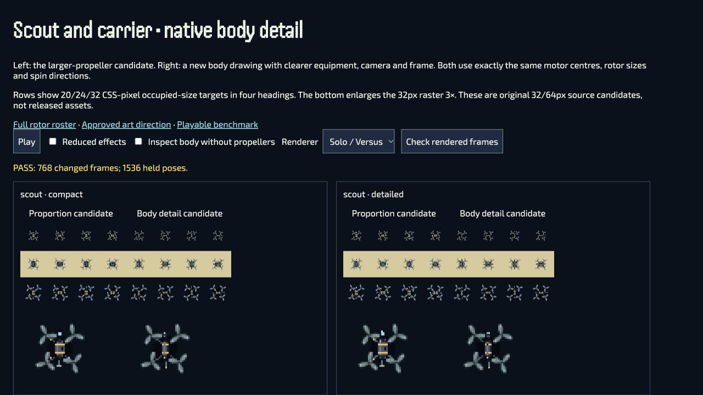
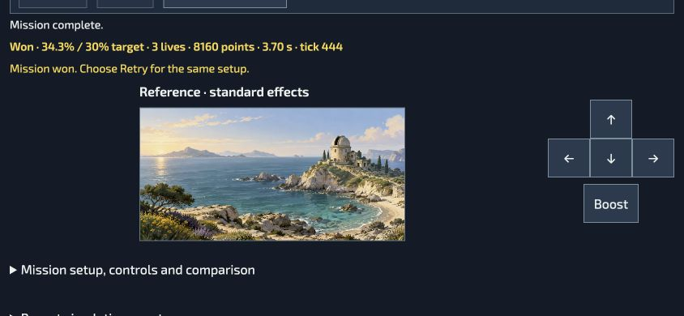

# Native bodies, playable comparison and rotor geometry editing

Reviewed 28 September 2026 as the next bounded commit in draft PR761. Parent source is `f144a0626f3dfaf219cf236544bcfe3874a183dd`; the commit containing this evidence identifies this candidate. The branch is based on `bb9b3640270dc26633d37cfdf4a306aecda277b6`, not the newer publisher source. This is implementation evidence, not public release acceptance.

## Implemented

- Four original Scout/Carrier `reference-v3` PNGs total 1,829 bytes. Native 32/64px equipment, camera, antenna and frame detail retain the exact larger-propeller v2 rigs. No baked blades, copied photograph pixels, white corner brackets or collision changes. Existing v2 and production originals remain unchanged. These assets are unregistered candidates; the playable benchmark uses the approved FPV collection instead.
- Motion Lab now edits normalized hub X/Y and width-relative radius alongside direction and phase. Production geometry validation checks the complete circular sweep, aspect ratio, pivot and every rotor component. Invalid or stale edits retain the accepted draft. Historical rigs load/reset unchanged, with warnings where needed. EN/UK labels and guide/export semantics are documented in the motion handoff.
- A real three-mission comparison uses the current source resolver (`whole-spatial-v25`): First Return, A Return in Reserve and Crossed Bands. One fixed-step simulation feeds both views, with exact originals and a separate approved FPV actor lease. It supports native steering, pause, deliberate Retry, a 600 ms simulation-free ready cue, retained setup, cancellation/rollback, resource disposal and delayed focus that respects intervening navigation. It writes no progress, awards, saves or replay records.

## Focused and rendered checks

The final eleven-file cohort passes **149/149**, with zero failures, skips or cancellations; see [focused.tap](focused.tap). It includes native sprite reproduction/alpha/palette/clearance, reader/render geometry, Motion Lab actual-host edits/restoration, preview lifecycle, real simulation and benchmark input/resource ownership. Do not add its overlapping counts to the earlier batch's 169 tests.

The body review loads hash-checked PNGs through the shared Solo/Versus and Team painters. Four new assets × two backgrounds × two renderers × three sizes × four sample rates × four headings produce **768 changed comparisons / 1,536 held poses, zero failures**. Rates are controlled 4/30/60/120 samples, not physical display-FPS measurement. Dark/light backgrounds are asserted distinct. Checks use disposable animation state and restore the inspected pose. Source frame, bounds and full-body artwork acceptance remain separate from these pixel comparisons.

The review retains 384×302 CSS-pixel canvases inside a local horizontal scroller on narrow screens, so labelled 20/24/32 occupied sizes are not silently scaled down. Labels scroll with their corresponding halves. Body-only inspection preserves the same rotor-based framing.

## Actual browser review

The in-app browser exercised the source checkout through fresh `localhost:8807` after an older warm origin showed stale translation keys. Correct EN/UK labels on the fresh origin and exact generated catalogue tests pass; production update/cache recovery is not claimed.

- **Motion editor:** valid X=-0.2, Y=-0.2, radius=0.2 accepted; X=-0.49 rejected while the accepted JSON/guide remained intact. Reset restored the exact source rig. EN→UK→EN displayed translated labels. Existing export/reimport evidence is in the prior batch; this batch's new geometry round trips are covered by focused tests.
- **Body review:** shared renderer selection, reduced effects, body-only inspection and final frame checks. Desktop screenshot is 1280×720 CSS / DPR2. A separate 1280×800 check used DPR1. At 390×844 the canvas remained 384×302 while document scrollWidth stayed 390.
- **Real keyboard play:** First Return completed at 34.3% against a 30% target, three lives, 8,160 points, tick 414. Retry received focus only after the result; Enter showed the 600 ms ready cue at tick zero, then started automatically with fresh steering required. Escape explicitly paused the new attempt.
- **Native on-screen controls:** First Return completed again using Start and the displayed D-pad. The final corrected run ended at tick 444 / 3.70 seconds, with 34.3%, three lives and 8,160 points. Operation status changed to “Mission complete.”, pressed D-pad styling cleared, and Retry was focused. This was pointer interaction, not physical touch certification.
- **Other missions:** A Return in Reserve loaded its exact original and FPV appearance pin and was started; Crossed Bands prepared its exact original, showed its interception objective, and accepted Start, keyboard steering and explicit Pause. The old result stayed visible during replacement preparation. These are not complete playthroughs. Cancellation completed too quickly for the attempted browser click; successful cancellation/stale/failure assertions are automated evidence, not a browser cancellation claim.
- **Layout correction:** the initial handheld layout clipped the D-pad. The corrected primary view reserves actual header/HUD/control space, moves optional mission configuration into a disclosure, and places controls beside the board in short landscape. The full board, critical HUD and 52×48 direction buttons fit at 1280×800, 390×844 and 844×390 CSS / DPR1 with no horizontal document overflow. Optional second-view comparison may scroll; this is an authoring host, not whole-product navigation qualification.

## Source, build and remaining gates

Repository lint, game/native formatting, scoped tooling formatting/lint, Motion Lab syntax, localization, ordinary validation, metadata formatting, native PNG reproduction and disposition reproduction pass. Full automated long suites remain waived by the committed temporary policy and are not reported as passed. Exact build/asset records are in [evidence.json](evidence.json).

The ordinary build passes with **1,776 files**, distribution SHA-256 `bf30ca6d1915018607ffbb1fcf593650630a53b101fdf6fffd7f0e380172a967`. All fifteen checked tool/runtime outputs match the final source bytes. It retains the branch label v0.141.7 and `sourceRevision: null`, so it is not an exact-source release qualification. The optional Workshop group contains 412 files / 19,713,098 bytes; all nine benchmark files belong to it and are absent from the automatic core cache. Native v3 PNGs and this review remain source candidates, outside release artwork bindings.

The fresh Team production-review guard still reports **1 pass / 1 fail** in [production-review.tap](production-review.tap): changed source is at `source`, not `reviewed`. The dependency-fingerprint assertion passes. Canonical reviewed adoption is required; no historical approval or assertion has been rewritten to make it green. No version, tag, release or selector was allocated by this batch.

The publisher must reconcile this draft onto accepted main, adopt reviewed fingerprints and any accepted body/rig revisions, re-run integrated provenance/build/readiness checks, assign a version, publish immutable bytes and verify ordinary public play. The complete source tree is needed for the benchmark's optional Phase artwork; Workshop alone does not establish offline availability.

Still open: native body visual approval/full-board review, the wider FPV/enemy/Team roster, audio/haptics, workshop/Poltava/Synevyr artwork candidates, controller menu navigation in this authoring host, full-product flows, physical hardware, memory/frame-time baselines and consented player sessions. No claim of improved retention or complete C0–C7 delivery is made.

## Maintainer prompt

> Refine a native actor while keeping the accepted moving-part geometry explicit. Inspect body-only and animated frames at actual occupied sizes; do not substitute scaled concept art. Use the playable benchmark's exact current-source mission and original bindings to compare feedback on one unchanged simulation. Keep optional appearance separate from content identity, retain the previous attempt until preparation succeeds, and require fresh input after Retry. Record source/asset hashes, actual viewport, input category and remaining human/public qualification before expanding the roster.
