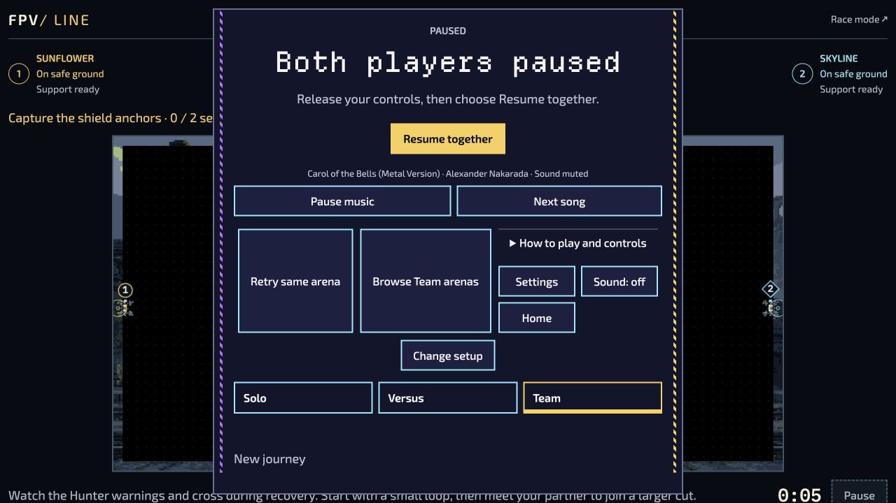

# Bounded actor and Team recovery verification — 30 September 2026

This successor was implemented on `e39b4197a75441d74c35299c8545d8bdfd0a7c61`.
The final GitHub candidate head and subsequent rebase/build records belong to its
PR. It introduces no new artwork, simulation rules, level identity or version.

## Reviewed changes

- Ordinary Sentry projectile loss uses the existing EN/UK projectile cause.
  The legal-route regression retains its original lives, events, checkpoint and
  replay assertions and adds the visible cause assertion.
- Current actor coverage and disposition metadata are refreshed for FPV104:
  91 Solo, 91 Versus and 12 Team owners. No required binding is missing;
  visual approval remains false and review/repair dispositions remain open.
- Exact fpv38/50 imported Team themes use an independently owned, authenticated
  historical host. Candidate failure/cancellation retains the accepted attempt.
  Painter and published audio follow the accepted snapshot; returning to the
  lobby or rolling back restores the matching reader, and disposal invalidates
  readers before retiring hosts. Independent review found and corrected this
  audio handoff issue.
- The two original manifest bodies total 1,946,423 bytes. They are optional in
  `archive:team-import-themes`; all 124 existing exact PNG/font dependencies
  remain in the core/shared/Team closure. Independent review found and corrected
  the missing EN/UK download-title registration. No core budget was raised.

## Browser interaction

Codex in-app Chromium, local source server on port8823, 1280×720 CSS viewport,
normal browser zoom. These are native page/file-picker interactions, not a
physical-device or automated-suite claim.

Reconstructed `.rlteam` fixtures use the unchanged starter pack and original
published picture bytes. They are not recovered user exports:

| Fixture | Bytes | SHA-256                                                            |
| ------- | ----: | ------------------------------------------------------------------ |
| fpv38   | 94020 | `2428642d2af8b8be8a4149cab913b1fa79be905865202f1c68988f4e91442cfe` |
| fpv50   | 94020 | `63c1f2240b3914212cbedd3f7f508a7c4cf783ff3f22d6c0d7b783eeceb836b3` |

Observed: Settings → Gameplay → Created Team packs → file picker immediately
showed preparation, then accepted Local artwork. fpv38 First Connection entered
play with territory objective; Pause → Retry → explicit discard confirmation
returned to a fresh 0:00 attempt. Change setup returned to the lobby. fpv50
accepted its original artwork; choosing Relay Yard entered play with the shield
anchor objective, then Pause. No browser error-level console entries appeared.
After the audio correction, reloading and repeating fpv50 import → Start → Pause
→ Change setup returned focus to Start with no error-level console entries.
This does not claim an actual listening check. The screenshot records the restored stronghold and pause state; the older
presentation fallback is intentional, not new Team-art approval.

## Validation and limitations

Passed during source preparation: syntax, scoped ESLint and formatting, source
validation, localization validation, generated metadata validation, current
coverage/disposition regeneration checks, exact retained manifest/dependency
inspection, and compilation from the unchanged authenticated production ledger.
That compiler produced148 outputs and left every unrelated output byte-identical.
Final committed-source build/capacity results are recorded separately below.

**Not passed:** `produce-field-kit-theme.mjs --check` reports “Stale production
revision ledger.” No historical ledger was rewritten and no new quality
approval was invented. Current source-fingerprint reconciliation and production
reproduction remain required before public acceptance.

**WAIVED_SKIPPED_NOT_PASSED:** full and focused automated suites under the
committed 30 September policy. The new regression sources were authored and
reviewed but not executed. No complete playthrough, offline relaunch, listening,
physical controller/touch, human pilot or cultural/production-art approval is
claimed. Publication, deployed bytes and public play remain with the single
publisher.
