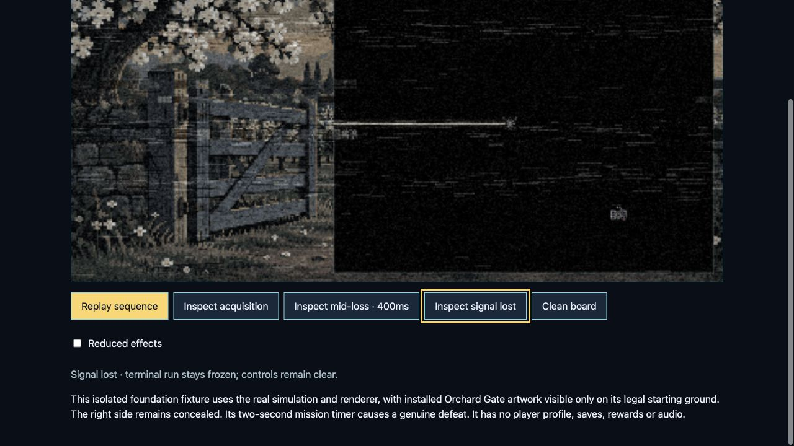
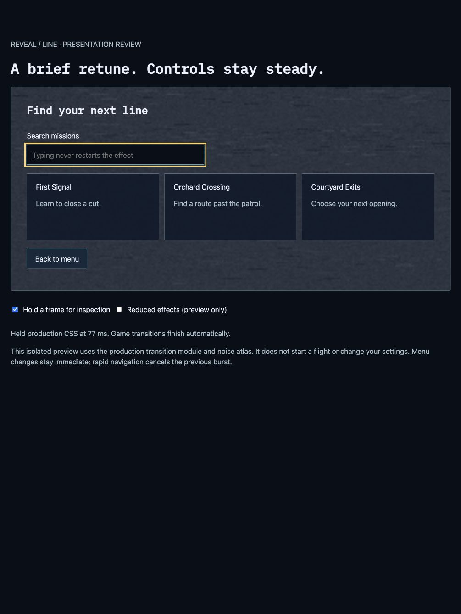

# Analog feed breakup and restrained menu retuning

Implemented and reviewed on 2026-09-29. This refines the [initial reception transitions](signal-reception-2026-09-29.md); it replaces their uniform procedural overlay with degradation of the permitted picture.

## Flight presentation

The effect now copies only the already-masked composed board into a scratch canvas capped at 512 pixels on its longest edge. That bounded copy loses colour and brightness, receives three narrow horizontal sync-slip bands, and uses the same clustered monochrome interference algorithm as ordinary gameplay jammers. Shifted gaps receive neutral opaque pixels. Raw reward artwork is never accepted as the effect's input.

Startup remains 550 ms, with terrain, live cuts and actors drawn afterward. Terminal loss remains 650 ms, including the first 150 ms for reading the wreck. Reception sampling is cached at 12 Hz and holds still when paused or finished. Reduced effects disable positional slips and use weaker static treatment. Readback failure falls back to quiet dimming and is quarantined for the current size. Simulation, save, reward, audio and input behavior are unchanged.

The private composed-feed readback is intentional; the earlier verification note's “no board readback” description applies to the superseded overlay implementation.

## Menu presentation

A 220 ms retune accents committed landing-to-mission-picker changes and Back in the native Solo, Versus and Team menu paths, including the legacy Solo mission and Versus setup paths. It uses the existing locally packaged atlas with stepped frame changes and a smooth opacity envelope, peaking at 18%.

The layer is inert, pointer-transparent and below menu content. Navigation and focus happen immediately. An 800 ms cooldown suppresses repeated bursts during rapid navigation. Settings, hover/focus, typing, filtering, Pause/Resume, reading views and galleries do not initiate retuning. Reduced motion, reduced effects and the existing background-animation preference suppress it. Hidden/disposed/covered menus cancel it; there is no persistent animation observer outside a burst. One document owner retains at most the landing and current picker layers.

See [primary references and examples](analog-menu-references-2026-09-29.md), including FPV manufacturer documentation, recorded-noise research, Microsoft's HyperDot accessibility example and Material menu transitions. Durations and intensities are this project's art direction, not hardware specifications.

## Verification

- **125/125** menu helper, chooser, scene, edition and offline tests passed, including 15 retune cases and module/CSS/atlas packaging closure: `node --test game/test/menu-retune.test.mjs game/test/menu-scenes.test.mjs game/test/mission-library-chooser.test.mjs game/test/edition-runtime.test.mjs scripts/test-offline-core-closure.mjs scripts/test-edition-offline.mjs`.
- Actual Solo committed-picker focus and Versus setup/Settings/Start/Pause host checks passed **2/2**: `node --test game/test/menu-retune-host.test.mjs`.
- The reception cohort covers 18 helper tests, six real-painter integrations, four host tests and two saved-flight tests. Its initial run passed **29/30**; the remaining Team fixture lacked the standard canvas source/drawing methods needed by the new bounded copy. After correcting that test boundary, the targeted Team case passed. No runtime change was needed for that failure.
- Tests cover mask-before-snapshot order, canvas-only input, opaque displacement gaps, hidden transparent colour exclusion, 12 Hz bounded reads, failure quarantine, exact replay/checkpoint preservation, paused/reduced/final caching, saved ticks 1 and 30, and disposal.
- Scoped lint, formatting and `git diff --check` pass. A broader build/native-inventory run encountered unrelated shared-checkout branding changes. After `icon-master.png` appeared, the retry still failed against references to `icon-32.png`/`icon-192.png` and tiny-build fixture omissions of `wordmark.png`/`brand-identity.css`; the existing brand-label assertion still expected `Coupa Village / LINE` while the current catalogue said `Coupa Village`. The retry passed 17/19 selected cases. Retune-specific packaging closure is green, but this is not a claim of a passing full build/native release.

## Browser review

The [flight preview](../../game/test/manual/signal-reception.html) uses installed Orchard Gate artwork on a legal foundation fixture, with concealed territory retained and a real two-second mission-timer loss. Mid-loss, terminal loss, acquisition and reduced effects were reviewed in the browser. The [menu preview](../../game/test/manual/menu-retune.html) uses the production helper/CSS/atlas; its optional inspection control holds the actual CSS at 77 ms. Search and buttons remain sharp and usable. Reduced effects suppress the pulse. Neither preview writes player progress or preferences, and no console warnings/errors were observed on the flight preview.

Additional evidence: [mid-loss](analog-retune-2026-09-29/flight-mid-loss.png), [acquisition](analog-retune-2026-09-29/flight-acquisition.png), [reduced loss](analog-retune-2026-09-29/flight-reduced-loss.png).

The subsequent full-game browser check was stopped when that tab contained an active flight; it was preserved without further input. Physical-device and long-duration qualification were not repeated for this visual refinement.
