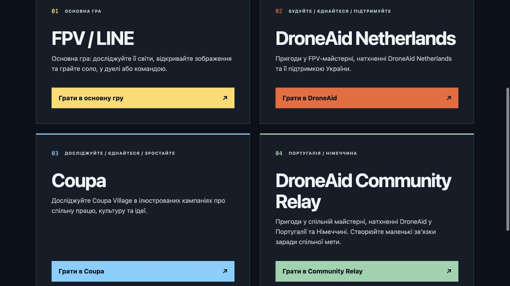

# Community directory and friendly URLs — 2026-09-29

## Delivered behavior

- `/game/communities/` lists FPV / LINE plus all three public catalog brands: Coupa,
  DroneAid Netherlands, and DroneAid Community Relay (Portugal/Germany).
- `/game/communities/coupa/`, `/game/communities/droneaid/` and
  `/game/communities/droneaid-community/` keep their clean address while the shared Solo
  host loads and plays. Same-company narrower editions may retain an `edition` query.
- Old `/game/community/` bookmarks forward to the plural route, preserving query/hash.
  Old company and edition-query links remain supported.
- Company paths reject foreign edition overrides before loading. Provider navigation and
  existing departure validation keep company choices, saved identities and artwork receipts
  within their current boundaries. The main game contains no discovery/switcher control.
- README and website link to the new directory. Creator marketplace remains separate.

## Implementation and packaging

Small entry documents fetch the exact same-origin packaged `game/index.html`, validate it,
rebase resources, and mount it once. There is no iframe, copied game template, additional
simulation host or relaxation of `base-uri 'none'`. HTML/offline paths are rebased; resource
lookups use the common game directory. Reload retains the friendly address and boot recovery
uses the same community. Late or failed loads cannot replace a newer navigation.

Offline Solo preparation includes the directory and entry shells. Company media stays in its
existing optional packages. Pages aliases preserve the project/release prefix, query and hash.
Desktop/iOS staging checks preserve entry/module bytes. Generated entry shells defer install
prompt code to the actual game document, avoiding cached controllers with removed listeners.

## Verification

Focused working-tree cohorts (overlap exists; these are not a unique combined test total):

| Cohort | Result |
| --- | --- |
| Directory, EN/UK markup, shared-host loader and rejection/cancellation | 29 passed |
| Route/provider/navigation/retained identity and startup contracts | 39 passed |
| Actual friendly Solo host: 3 aggregates, narrower Coupa, frozen prefix, foreign override | 6 passed |
| Final friendly-host and Field Guide handoff regression | 12 passed |
| Existing company host isolation/retained progress/all-edition regression | 29 passed |
| Offline closure, Pages aliases and Desktop/iOS staging | 30 passed |
| Packaged offline install-controller ownership regression | Passed |
| Ordinary main game remains without a company/discovery control | Passed |

The earlier ordinary-host run exposed a test-fetch compatibility issue during implementation;
conditional resource rebasing fixed it, and the focused main-host check was rerun successfully.
Scoped lint, formatting, localization catalog validation and whitespace checks passed.

Browser verification on the local shared-source server:

- Slashless `/game/communities` resolves to the directory; the old singular route redirects.
- Coupa, DroneAid Netherlands and Community Relay each reach their own landing at the clean URL.
- Coupa launches actual gameplay, loads artwork, advances time and pauses; its mission chooser
  exposes its 30 missions without foreign communities. No browser error logs appeared.
- English and Ukrainian directory labels render; narrow layout stacks all four cards, retains
  approximately 52px links and has no horizontal overflow. The viewport override was reset and
  the initial Ukrainian language restored. This is browser layout coverage, not physical-device
  qualification.

## Limits and release status

No deployment or frozen release was overwritten. The friendly routes become publicly available
when this source is accepted into a promoted release. Existing immutable snapshots remain intact.
Native evidence covers packaging; physical native devices and a full offline browser run are not
claimed. The existing company Field Guide has a separate theme-catalog mismatch; this slice fixes
its friendly-route iframe base without changing that unrelated lesson-selection behavior. A
broader guide-panel cohort also found a pre-existing sprite-size assertion (56px expected,
71.68px rendered); that unrelated test remains unchanged. The focused route/guide tests pass.

## Scoped release copy

Draft PR #784 targets v0.150.0 and retains `release-train-hold`. Its source was ported onto
accepted main `b5ab06e12542f72e33c45b973ba693a5e1509c1c` independently of the aggregate
checkout. The 15 accepted production-provenance files from #785 retain exact main blobs;
the Steam Deck Confirm guard and regression remain outside this diff.

Exact scoped source validation: 65 route/provider/loader/directory/localization contracts,
11 actual friendly-host checks, 28 offline/Pages/native packaging checks, and one focused
packaged install-owner check passed (105 total). Scoped ESLint, Prettier, localization check
and whitespace verification passed. Raw scoped logs are under
[`community-friendly-urls/scoped/`](community-friendly-urls/scoped/).

An isolated browser preview of this scoped source opened Coupa at the friendly URL and
switched to Inside the Village within that same company path. No console errors appeared.
The current workspace screenshot above includes pending aggregate styling; the scoped PR
intentionally uses accepted-main game styling and omits pending branding/native/demo work.

The first private export omitted generated-format ignore configuration; restoring the
accepted `.prettierignore` made the scoped format check pass. A staged-scope audit also
preserved all newly accepted #785 files before final test runs. Neither issue changed the
shared checkout or discarded user work. No public snapshot or active release was changed.
