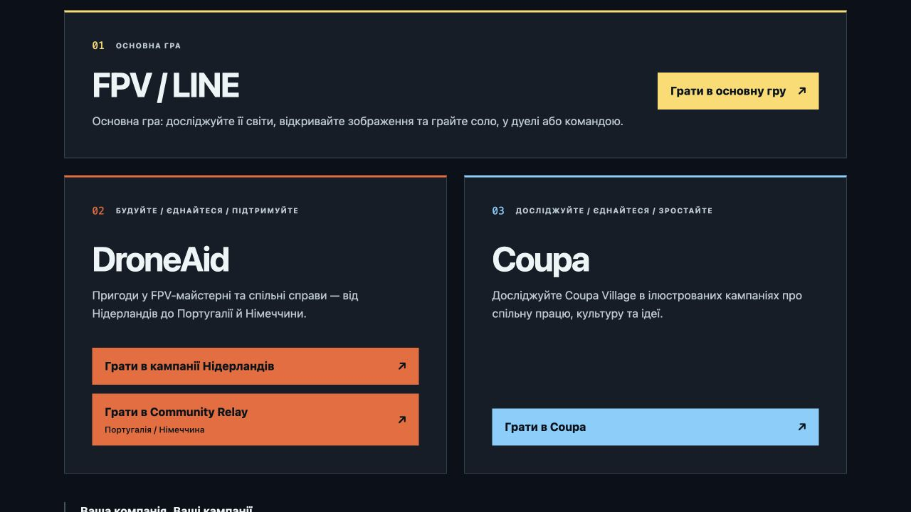

# Grouped DroneAid directory — 2026-09-29

## Result and inventory

The community directory now has three cards: FPV / LINE, DroneAid and Coupa. DroneAid
contains two clearly named play choices, Netherlands campaigns and Community Relay.
The main game uses a full-width card above the two communities on wide screens; all
three cards stack on narrow screens.

The bundled public catalog contains three internal brand records and 14 edition selectors,
covering two user-facing communities and 12 distinct campaigns:

| Community collection | Campaigns | Missions | Existing route |
| --- | ---: | ---: | --- |
| DroneAid Netherlands | 6 | 36 | `game/communities/droneaid/` |
| DroneAid Community Relay | 1 | 3 | `game/communities/droneaid-community/` |
| Coupa | 5 | 30 | `game/communities/coupa/` |

Inventory sources: [`catalog.json`](../../game/editions/catalog.json), the
[company campaign sources](../../game/content/company-campaigns/), and
[main-game themes](../../game/content/themes.json). Aggregate edition selectors duplicate
access to campaigns, not communities. No additional bundled public company was found.
Creator-service publications are a separate live inventory, not claimed to be empty.

Grouping changes discovery only. Both DroneAid routes, gameplay selectors, saved flights,
progress, artwork receipts and existing brand boundaries are preserved. No cross-company
switcher or data migration was added inside the game. README and the community guide now
explain this grouping and the available campaign counts.

## Verification

- All 16 scoped directory and localization-page checks pass, including all public catalog brands remaining
  reachable and both DroneAid routes sharing one card.
- English and Ukrainian reviewed in the browser. At a 390px viewport, all cards stack,
  document width stays 390px, and every play target remains at least 52px high.
- Normal desktop layout reviewed; both DroneAid choices and Coupa remain visible and legible.
- Scoped lint, formatting and generated localization checks pass.
- Review also found Workshop links resolving relative to a friendly community address.
  A one-line correction derives the context from `gameDocumentURL`, preserving the selected
  edition and Journey. Actual-host regressions exercise both production link mounts and all
  nine destinations across three address/selection cases. The friendly-host and Workshop
  return cohort passes all 34 checks. The previous failing URL was reproduced before the fix.
- Combined follow-up qualification: 50 scoped checks (16 directory/localization + 34 host/return),
  ESLint, Prettier and localization validation (10,866 messages). Runtime changes are limited
  to this canonical Workshop URL base; the prior packaging qualification remains applicable.

[Narrow-screen evidence](community-friendly-urls/grouped-droneaid-narrow.png).

## Delivery

This is a follow-up to draft PR #784 for the held v0.150.0 aggregate. No public deployment
or immutable release changed. The earlier four-card screenshots in the friendly-URL report
record the prior iteration and are superseded by this report for directory grouping.
