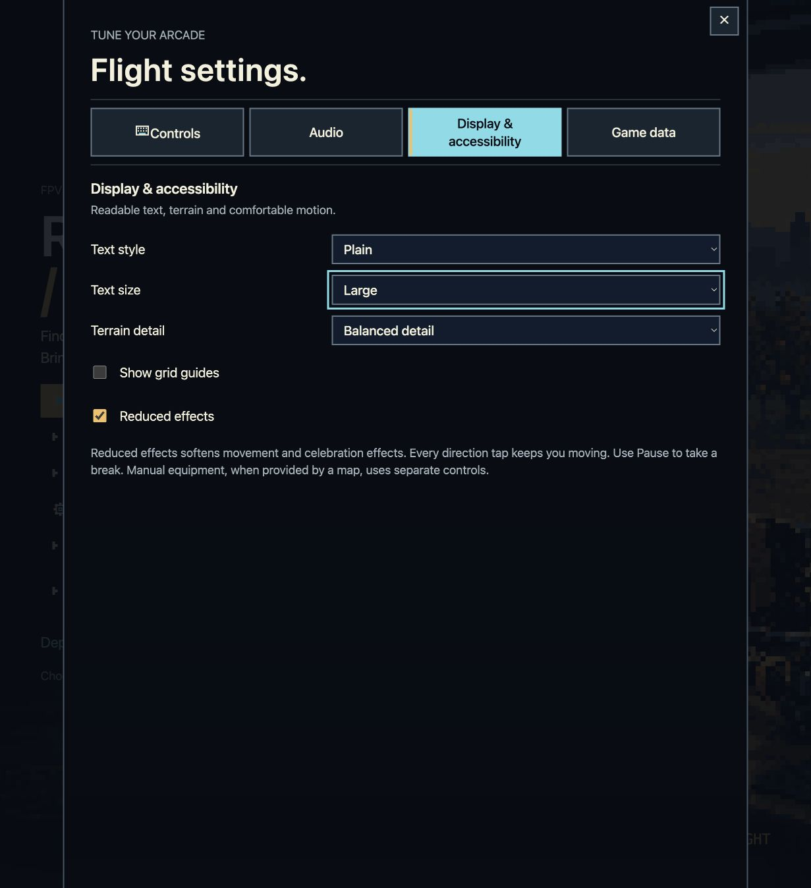
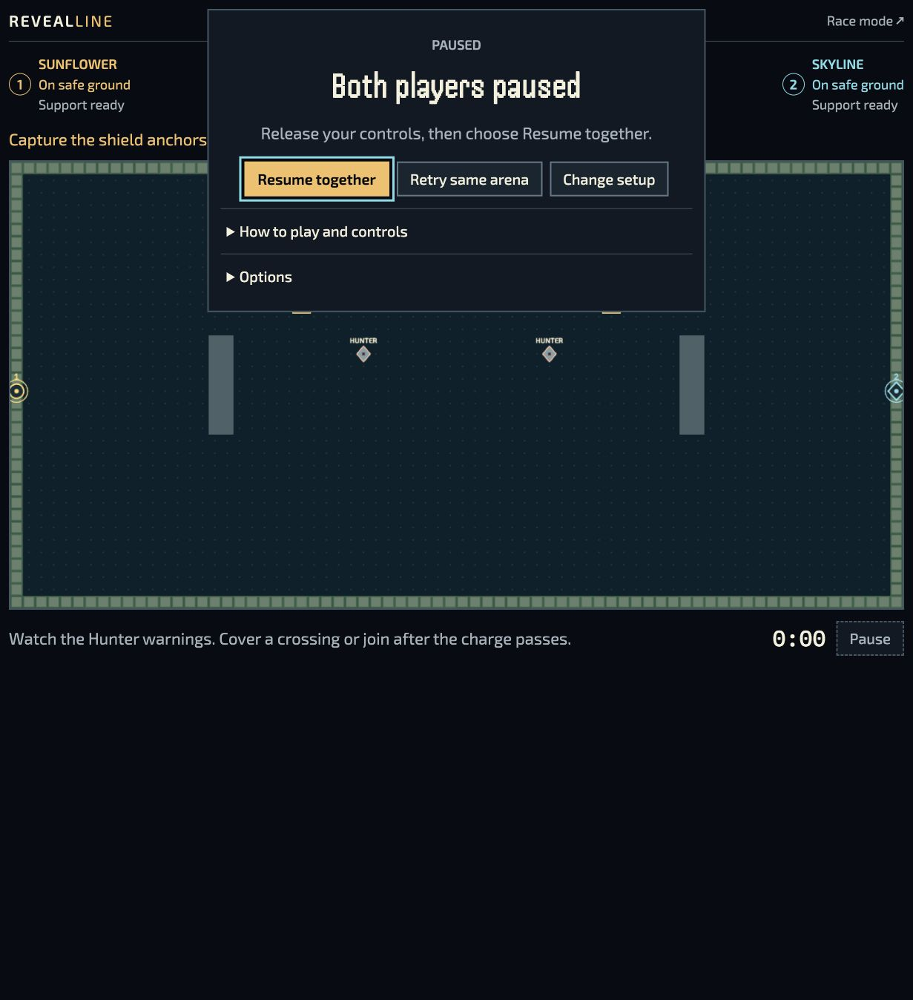

# P05-A scoped native preference journey

On 2026-09-15 root checked source `4700120adbc670cb6632eca00b151080d73aa1ad`
in the local browser preview. This is a bounded desktop source observation,
not release or complete P05 acceptance. [Evidence and hashes](evidence.json)
pin the source, raw-to-retained text transformations, screenshots and focused tests.

| Journey                | Observed result                                                                                                                                                    |
| ---------------------- | ------------------------------------------------------------------------------------------------------------------------------------------------------------------ |
| Solo Settings          | Keyboard selected Plain/Large/Reduced. Root observed a system UI heading at 48px and matching body attributes.                                                     |
| Team entry             | Inherited Plain/Large/Reduced. The heading also resolved to system UI at 48px.                                                                                     |
| Team Options and Pause | Keyboard selected Theme font, retaining Large/Reduced. Start then Pause remained at 0:00; root inspected the readable HUD at a reported1231×1348 desktop viewport. |
| Versus Options         | Inherited Theme/Large/Reduced; keyboard selected Plain/Standard, retaining Reduced.                                                                                |
| Return to Solo         | Settings restored Plain/Standard/Reduced.                                                                                                                          |

The retained [Solo capture](native/solo-plain-large-reduced.txt),
[Team entry](native/team-inherited-plain-large-reduced.txt),
[Team pause](native/team-large-theme-paused.txt),
[Versus inherited state](native/versus-inherited-theme-large-reduced.txt),
[Versus changed state](native/versus-plain-standard-reduced.txt) and
[Solo return](native/solo-restored-plain-standard-reduced.txt) show selected controls
and accessible labels. The exact computed-font observations were reported live by
root; no separate computed-style JSON was retained.

Native select activation initially used Return→Down→Return without changing the
value. Space→arrow→Return worked. This is a retained platform-input observation,
not a reproduced gameplay or keyboard-navigation defect. The controls were reachable
by keyboard. No physical controller or touch input was used for these observations.

## Automated scope and retained failures

The [original verification receipt](automated/verification.json) records 113/113
cases across ten complete files on each Node 20.19.5 and 22.22.2 runtime, plus six
filtered Settings/surface cases on each. It also records focused static checks and
[independent source review](automated/peer-source.json). The final TAP logs and both
initial diagnostics are retained here; original cache-relative paths describe the
source run and are not all duplicated in this evidence folder.

The first host bootstrap stopped at a missing 4,170-byte existing MP3 fixture;
restoring its exact Git bytes enabled the cases. The initial 11-file batch had 119
passes and one failure because the packaging case requires the absent complete
build namespace. That case is still unverified. No game build or large fixture
checkout was performed for this slice.

## Still open

The subsequent [font-byte and Ukrainian specimen check](glyphs/README.md) passed
for the existing local fonts and design atlas. It does not close the remaining
gameplay layout and hardware checks below.

Narrow portrait, short landscape, zoom and cold-font checks remain open, as do
native system-reduction changes, cross-tab storage events, denied saves and
practice/writer failure. This native Team attempt only started and paused at 0:00;
it does not prove preservation of an ongoing cut, score or replay. Those state
boundaries have modeled-host coverage. Full Team artwork adoption, physical-device
acceptance, final integrated producer/CI qualification and public acceptance remain
separate. No simulation, source version or approval was changed by packaging this
observation.
