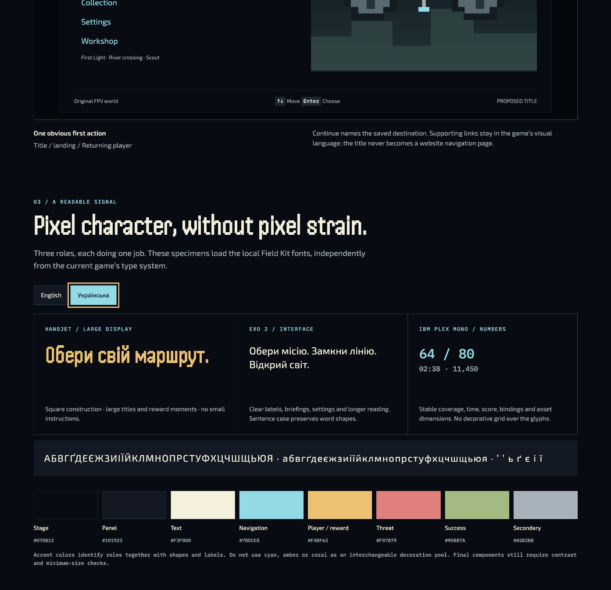

# Local font and Ukrainian specimen check

On 2026-09-15 root verified the unchanged font bytes at source
`f047a46a9a1bb9982600bd7e2682d765a75cb9cc`. This supplements the
[shared-preference journey](../README.md); it is not full P05 acceptance.

The existing `scripts/verify-field-kit-fonts.py` passed using the already installed
`/tmp/revealline-field-kit-font-tools/bin/python`. No font regeneration, package
installation or asset replacement occurred. The binary check covers the 178
required English/Ukrainian characters, punctuation, pinned hashes, licenses,
variable axes and equal-width numeric telemetry. The three source fonts total
154,852 bytes. Source and compiled copies have identical hashes. The local Exo 2
to IBM Plex Mono fallback supplies the hryvnia sign and four direction arrows.

Root then used the existing design atlas at
`http://127.0.0.1:50168/authoring/design-atlas/#type`, selected Українська through
the actual control, and inspected the screenshot below. The atlas reported all
three local font roles loaded. At the reported 1393×1348 desktop viewport, the
large Ukrainian heading, two-line interface text, numbers and alphabet specimen
were legible without visible missing-glyph boxes or overlap.

[Native facts](native-facts.json) retain the displayed text and computed font
families, sizes and weights. [Binary output](binary-verification.txt) retains the
verification results. [Evidence pins](evidence.json) bind these observations to
the source fonts, verifier and atlas files.

The atlas loads specimens independently of the game type system. Its small
annotation labels and numeric specimen's computed 400 weight do not establish
actual gameplay HUD size or weight. This does not qualify all player screens,
Ukrainian localization, cold-font failure, narrow or short layouts, zoom, physical
devices or controllers. Those remain open in P05/P18. An attempted read of the
FontFaceSet through the browser inspection bridge was unsupported; the native
loaded-status observation and independent binary verification are recorded
instead.
