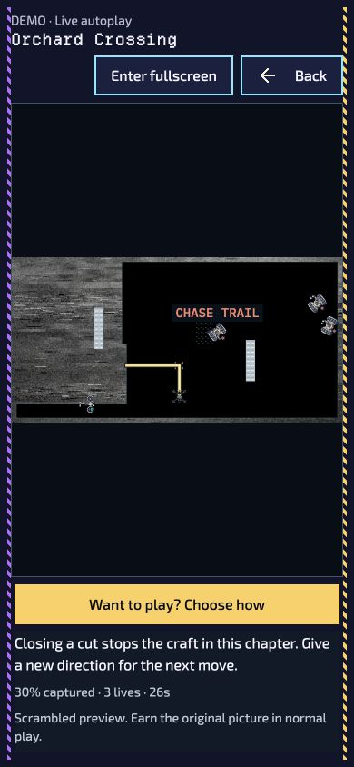

# Analog reception, continuous demo and direct takeover — 2026-09-28

This follow-up refines the existing attract-mode implementation on main a10fcbf8a. It supersedes the static colored signal treatment in `demo-picture-signal-2026-09-28.md` and the earlier interruption-first input behavior. It does not qualify the full feature for release on physical devices.

## Real recorded reference

Visually inspected [AnalogDepth, figures 1 and 3](https://arxiv.org/html/2609.24312v1#S3.F3), by André Amorim and Pedro F. Proença (21 September 2026). Figure 1 contains real analog FPV flight frames; figure 3 compares synthesized noise with a measured noise residual from static FPV recordings. The visible residual has fine monochrome texture, sharp thin horizontal dark streaks grouped into bands, sparse light streaks, and slower brightness variation. These are substantially different from colorful rectangular digital glitches or independent RGB grain. The paper describes a 5.8 GHz FM receiver and lossless recordings. Its underlying footage/noise bank is announced for future release, so no unreleased samples were obtained or copied.

The game uses a procedural approximation of those observed spatial features. A permanently softened, displaced, nearly monochrome picture remains beneath the snow. Noise changes at 12 Hz while concealed scene geometry remains fixed. There is no clear interval or original-image overlay. Whole-frame rolling and brightness flicker were omitted for readability. Reduced effects and gallery views use a static sample; pause freezes the sample. All effects precede territory, trails, actors and hazards. Exact earned-original access remains unchanged through takeover and victory.

## Behavior changed

- Viewport-filling layout, safe areas, portrait/near-square stacking and landscape side controls. Optional browser fullscreen is requested only by its button; rejection/unsupported browsers keep the viewport layout. Only fullscreen owned by this demo is released on exit.
- After a four-second finish recap, the director continues the shuffled qualified pool indefinitely and avoids the same level when possible. Explicit Next starts playing immediately.
- Visible spectator stalls over 250 ms skip elapsed time, without advancing or opening the interruption menu. Hidden, blurred and inactive lifecycle states still suspend explicitly. Practice stalls still pause.
- Fresh mapped gameplay keys, controller inputs or board touch enter verified independent practice and apply the initiating intent once. Completed scenes start exact-level fresh practice. Held input, repeat, reconnect and noise remain gated. Deliberate UI actions keep their roles; Want to play opens the existing start choices.
- Practice controls appear after takeover. Ordinary run checkpoints, recorders, suspended flight, progression and reward operations remain isolated.

## Checks

- Combined picture/fullscreen/input/director/practice/controller/renderer suite: **233/233 passed** (`.cache/demo-analog-final.tap`). Includes monochrome noise, clustered horizontal impulses, stable average frame brightness, 12 Hz reuse, concealment over animated frames, reduced/static output and failed-source quarantine.
- Actual application host and fresh handoff cohort: **20/20 passed** (`.cache/demo-direct-takeover-host.tap`). Exercises keyboard, controller and touch direct takeover, terminal takeover, repeated unattended scenes, lifecycle cancellation, locked/accessible handoffs and ordinary-state/storage isolation.
- Additional relocated-entry regression: **1/1 passed** (`.cache/demo-settings-return.tap`): Home → Settings → Watch, Back restores Settings/focus, then Fresh opens exact ordinary Ready without reopening Settings. The concurrent menu callbacks were preserved unchanged.
- Height-limited contained-board sizing: targeted host check passed (`.cache/demo-host-contained-board.tap`), including missing-height fixture fallback.
- Static/native-path/offline inventory fixture: **3/3 passed** (`.cache/demo-analog-build.tap`). Includes the fullscreen module, Worker and all demo assets with reproducible hashes. Its missing existing Departure Mono font was added to the fixture closure; production font assets were unchanged.
- Spectator Boost uses a fresh physical edge in both Hold and Toggle modes, including when ordinary Toggle Boost is ineligible; watching never arms a gameplay boost latch. The expanded existing Boost suite had one stale frame-schema expectation; it now includes the three confirm/timestamp fields already emitted on main, with normal Boost behavior still asserted.
- Scoped ESLint, formatting and `git diff --check` passed. EN/UK locale build completed; generated catalog bytes and decode were checked against current locale sources after copy updates.
- Node microbenchmark at 512×256: 65.70 ms picture preparation, 0.97 ms median / 1.30 ms p95 noise update across 120 updates, one source readback. This measures pixel processing with an inert canvas writer, not browser GPU/upload time or mobile performance.

A concurrent native-menu update moved Watch demo into Settings → Help & Extras. That work was preserved; the shared translation bundle was regenerated from current sources. Demo entry/return was checked with the relocated control: only the demo dialog remains open during playback, and Back restores Settings with focus on Watch demo. Its heading is scoped above shared typography so the phone header uses 17.6 px text instead of consuming the board area.

## Browser observations

- Keyboard Down changed a running recorded scene directly to Practice, displayed its additional controls and applied steering. Returning to demo restored the recording's independent state and three lives.
- Enter fullscreen changed to Exit fullscreen without taking over. Explicit Want to play opened the choices. Terminal input started fresh exact-level practice with zero elapsed time and full lives.
- Unattended transitions observed from First Signal recorded play into Orchard Crossing live autoplay and back into recorded play; the automated host suite separately exercises repeated full cycles.
- Ukrainian portrait viewport 390×844: dialog/scroll dimensions exactly 390×844, canvas 364×363 with the start choices visible, smallest control 44 px. Landscape 844×390: dialog exactly matches viewport; board element 548×266; caption width equals scroll width; controls panel scrolls vertically (268 px visible / 386 px content), with no horizontal overflow. Original English preference restored.
- Browser capture temporarily exhibited scaling/compositor artifacts immediately after viewport changes; layout dimensions were verified directly. Saved phone preview below is a clean capture after reset. Temporary tabs were closed and viewport overrides reset.

Additional evidence: `analog-fullscreen-orchard.png` (earlier desktop side layout) and `analog-direct-takeover.png` (practice controls). The original verification's physical-device, human-viewing and two-hour rendered-soak release gates remain outstanding; these follow-up tests do not replace them.
