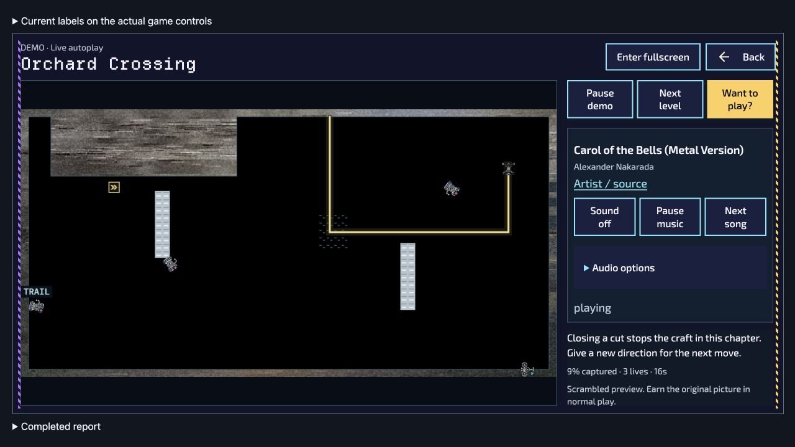

# Demo qualification follow-up — 2026-09-29

This record extends the existing Demo implementation with focused Back handling, production cache coverage, ordinary-win retention checks, browser observation tools and an offline-budget repair. It does **not** establish release acceptance or a completed two-hour browser run. The [historical intake](../local-experience-intake-2026-09-29/README.md) remains separate; its preservation snapshot is not replaced by these results.

The initial checks ran on aggregate `0cc7337a8` with the scoped Demo Back correction. While qualification was underway, PR #781 advanced to `a9edb0c`. Merge `c5e3419ee` preserves that concurrent upstream work, including shared Confirm behavior; it does not overwrite its history. Final merged-source checks and observation are identified separately from the earlier reports below. This follow-up changes neither the product version nor the release hold.

The integrated [Confirm/Back cohort](merged-confirm-cohort.tap) passed **127/127 tests, no skips**, in 79.125 seconds. It covers the real mounted app's practice and spectator Back paths, pad-first and native-before-frame Enter/Space, native-first held-button gestures, neutral keyboard exit, audio UI ownership and existing controller contracts. Its physical events are modeled. Scoped lint, formatting and whitespace checks also passed.

```sh
node --test --test-concurrency=1 game/test/demo-back-host.test.mjs game/test/demo-confirm-host.test.mjs game/test/demo-input.test.mjs game/test/demo-audio-host.test.mjs game/test/controller-confirm-lifecycle.test.mjs game/test/controller-confirm-guard.test.mjs game/test/steamdeck-menu-confirm-host.test.mjs
```

## Completed automated checks

| Evidence                                               | Result       | Boundary                                                                                                                           |
| ------------------------------------------------------ | ------------ | ---------------------------------------------------------------------------------------------------------------------------------- |
| [Core cohort](core-cohort.tap)                         | 63/63 passed | Clock/background, audio, preferences, rendering and cache checks; modeled host/device conditions.                                  |
| [Back cohort](back-cohort.tap)                         | 76/76 passed | Demo/host/input regressions before the concurrent Confirm integration.                                                             |
| [Controller preservation](controller-preservation.tap) | 38/38 passed | Existing controller contracts; not physical-controller acceptance.                                                                 |
| [Ordinary retention](retention-host.tap)               | 2/2 passed   | Mounted ordinary restored wins: manual Keep without automatic opt-in, and automatic retention only after the real Settings opt-in. |
| [Focused Back host](back-host-final.tap)               | 13/13 passed | Includes cases overlapping the Back cohort; do not sum all rows as unique tests.                                                   |

The production IndexedDB adapter tests exercise persistence/reopen, independent atomic writers, abort rollback, quota/error recovery, close/versionchange and the twelve-recording bound through `createDemoIndexedDBStorage`. Their transaction model is not browser disk. The separate [native IndexedDB browser run](browser-library-checks.json) passed eight checks, followed by a [real page-reload check](browser-library-reload.json) that retained the exact document bytes and strictly verified replay. This used Chromium 154 on macOS, a dedicated qualification database and two connections in one page. It does not establish separate-tab/process contention, eviction resistance, Safari/WKWebView behavior, or the ordinary Keep UI; the mounted-host checks cover that UI path separately.

Pre-integration cohort commands:

```sh
node --test --test-concurrency=1 game/test/demo-clock.test.mjs game/test/demo-background.test.mjs game/test/demo-audio.test.mjs game/test/demo-experience.test.mjs game/test/demo-transition-picture.test.mjs game/test/jammer-picture.test.mjs game/test/demo-library-indexeddb.test.mjs game/test/demo-library.test.mjs
node --test --test-concurrency=1 game/test/demo-back-host.test.mjs game/test/demo-input.test.mjs game/test/demo-audio-host.test.mjs
node --test --test-concurrency=1 game/test/controller-confirm-lifecycle.test.mjs game/test/controller-confirm-guard.test.mjs game/test/steamdeck-menu-confirm-host.test.mjs
node --test --test-concurrency=1 game/test/demo-retention-host.test.mjs
```

## Accelerated playback

The refreshed [real-Worker soak](accelerated-soak.json) passed **179 scenes: 92 recorded and 87 live**, covering **7,251.975 simulated seconds in 219.274 elapsed seconds**. Every scene's recording verified exactly. Both steering policies visited all twelve eligible sources. There were **29 expected safe-plan exhaustion handoffs**, zero unexpected errors and zero preparation failures. All player, Worker and adapter-listener counters returned to zero at cleanup; the sampled memory measurements are not a general proof of no leaks.

The report pins 63 source/data files and records no changes during its run. Its inventory concerns the simulation/director/Worker path; it does not qualify all UI, rendering or audio. It is accelerated Node execution, **not two wall-clock hours** or proof of browser execution while hidden or suspended.

```sh
node --expose-gc scripts/soak-demo.mjs --simulation-seconds 7200 --report .cache/demo-qualification-soak.json
```

Run this separately from CPU-heavy suites: the production one-second planning watchdog remains enforced.

## Browser observations and open issue

The read-only [watch harness](../../../game/test/browser/demo-watch.html) embeds the actual Legacy host. It records bounded five-second DOM/canvas samples, timing gaps, optional memory, redacted storage hashes and served source inventories. It does not call playback internals, synthesize controls or certify audible output.

- [Smoke](browser-smoke.json): **30.188 seconds**, 8 samples, stable served inventory; music was paused.
- [Before-packaging observation](browser-observation-before-packaging.json): **330.290 seconds**, 67 samples, stable served inventory, stopped manually before packaging changes.
- [Audio preliminary observation](browser-observation-audio-preliminary.json): **133.486 seconds**, 28 samples, stable served inventory, stopped manually. Selecting **90s Synth → Play style** produced the actual message **“Album download needs direct HTTP 200 at its declared URL.”** This is a failed external album request, not successful style playback. The browser session then returned to local Ukrainian music; that recovery is distinct from proving the external album works or hearing physical output.

Neither preliminary run reached its requested two-hour duration. Every saved sample reports parent and child visibility as **visible**: changing in-app browser tabs did not establish a genuinely hidden page. No hidden-tab or OS-freeze acceptance is claimed.

A browser log contained stackless `MutationObserver.observe` TypeErrors at 02:25:25 and 02:32:50 UTC saying its target was not a Node. Their source remains unknown; continuing samples do not disprove them. The harness's synchronous attachment call was caught, so the available log does not establish that it caused the uncaught error. The revised harness validates targets in the child document's realm, reports observer-attachment failures as incomplete evidence, and captures bounded parent/child error and rejection stacks, filenames and locations without suppressing browser reporting. The earlier JSON files predate those diagnostics.

A fresh two-hour observation on the frozen integrated runtime is now running; [handoff details](browser-observation-handoff.md) identify its owned browser tab and continuation. Initial samples show both recorded scenes and live Orchard Crossing, no attachment failures or JavaScript diagnostics. Explicit music Pause survived Next level; after manually resuming music, Pause demo held the live scene at 15 seconds while the music status remained playing. The demo was then resumed. These are short DOM observations, not a completed soak or physical audio acceptance. The eventual full JSON must retain all later diagnostics, gaps and source changes honestly.

The same run also reached live Courtyard Exits. A real browser ArrowDown gesture on the board automatically opened **Practice · no rewards**, which progressed from 63% to 64% while music retained its playing intent. **Return to demo** restored the preserved spectator position (63%, 42 seconds) and resumed watching. The [practice screenshot](browser-practice-takeover.png) records the separate controls and concealed picture. These UI observations supplement exact-checkpoint and isolation tests; they do not independently prove every stored profile byte was unchanged.



## Packaging and original artwork

The [integrated packaging record](packaging/integrated-c5e3419ee/README.md) records **14/14 standalone editions** under the unchanged 64 MiB core cap and 506 exact source/output/offline checks. The Dutch aggregate previously exceeded that cap, also causing [PR #781's candidate failure at a9edb0c](packaging/pr781-a9edb0c-candidate-failure.log.gz). A separate **493,598-byte lossless WebP** of the supplied **880,307-byte PNG** saves **386,709 bytes**, preserving all decoded RGBA pixels and the 2000 × 1545 dimensions. After integration, the largest edition is **66,932,972 bytes / 693 files**, with **175,892 bytes** of headroom. Both original PNGs and the official SVG remain unchanged. No campaign, retained compatibility asset, frozen replay variant or cap was removed or weakened.

The standard integrated web build passed at `c5e3419eecd564621470a654ce071f0f83d5984f`: **1,893 files**, manifest SHA-256 `cc9a329986242fc136d3a68efe283f3a645625df6e90192e93e5650ee782a515`, independently verified ZIP SHA-256 `a67d0d021851a6e9bbfa416219d9eabc8f998563aa18afad09f87a0de0f0035f`. Desktop and iOS staging/verification passed, including 38 actual desktop-protocol requests and all 34 iOS HTML security transformations. All **1,985 captured source inputs** stayed unchanged across the build, native stages and fourteen edition compilations. The product label remains 0.142.3; this is development qualification, not a new release.

Packaging has its own source inventories and includes retained failed/baseline evidence. It must not be conflated with the browser or Worker inventories. The [earlier packaging record](packaging/final/README.md) predates Confirm integration and is retained separately. Static packaging and CSP checks do not establish executable launch, actual native playback or device behavior.

Large machine inventories are retained as deterministic `.json.gz` archives to keep the review readable. The [archive receipt](packaging/compressed-evidence.json) records every original byte count/hash and compressed file hash; decompression was checked byte-for-byte. Smaller summaries and browser reports remain ordinary JSON. Decode an archived inventory before parsing it, for example with Python's `gzip.open`.

The [executed audit helpers](packaging/audit-scripts/README.md) retain their assertion code and receipt mapping. That archive also discloses a cosmetic metadata correction: the integrated native helper/report's inherited pre-integration label was corrected around completion, and the precise helper label read by that process is uncertain. Both label variants have identical assertions and input paths. The canonical stage/verify receipts and independently retained payload manifests are unaffected; the pre-normalization custom receipt was not retained and no original hash is claimed.

## Remaining acceptance

Use the [viewer and physical-device worksheet](viewer-device-checklist.md) to retain the remaining observations against the exact candidate. It is blank intentionally; no viewer or device result has been fabricated.

1. Complete a two-hour rendered observation on the final frozen source, with the new diagnostics. Separately demonstrate a genuinely hidden page and explicit Pause preservation; record OS suspension as an observation gap, not continued activity.
2. Qualify physical keyboard/controller/touch, reconnect/remap and Hold/Toggle behavior, native wrappers and supported browser engines. Verify enabled audio and track boundaries on real output devices; keep the blocked external album distinct from local recovery.
3. Ask three unfamiliar viewers to identify the capture mechanic, understand tips and distinguish practice from an ordinary progression attempt. Check attraction, readability and motion comfort on small screens and reduced-effects settings.
4. Retain release-coordinator review and final target-specific acceptance before admission. Merged Confirm/Back, web, edition and native static checks are now green; a passed duration, build or modeled test does not remove the release hold.
