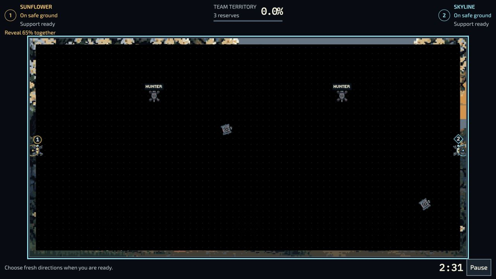
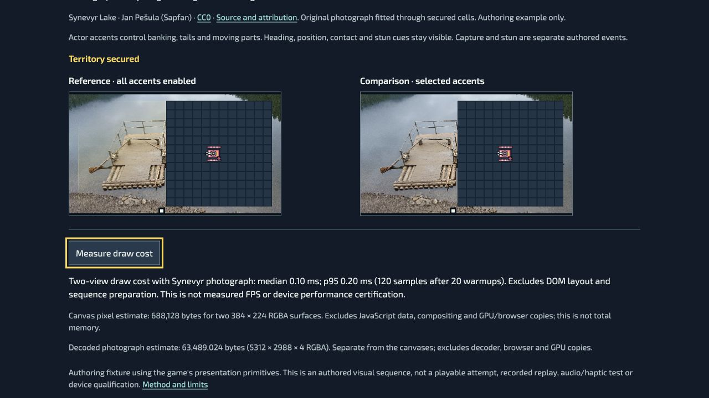

# Combined game-feel and rotor-authoring candidate

Reviewed 28 September 2026 as additional source for draft PR761. Parent source is `21dd36e2a22aff0d4db590e789cb1887a02b9729`; the commit containing this evidence identifies the candidate. This is not a published release or complete C0–C7 acceptance.

## Implemented slice

- C0/C7: reproducible current-entry art/motion work queue, exact owners/bindings and five explicit unknown scopes. See [disposition policies](../actor-motion/README.md).
- C3: prepared Team pilots preserve their bodies by removing duplicate face/centre covers, while retaining the hollow true contact radius and numbered circle/diamond badges. Historical geometric fallback remains available. New `coop-pilot-cues.mjs` is registered in the Team source group; historical approvals are not rewritten.
- C6: actual Motion Lab per-hub direction/phase editing, sweep guide, validated rotor-array JSON export/import, reset, malformed/stale protection and English/Ukrainian labels. Edits are ephemeral authoring state.
- C2/C5 preparation: deterministic two-view visual comparison, independent optional accents, pause/step/seek/reduced effects, bounded draw-cost measurement, and explicitly selected CC0 photographic reveal example. No new game rule, collision, mission, reward or accepted original changes.

## Checks performed

The six-file Team/editor/disposition cohort passes **155/155** in [focused.tap](focused.tap); the non-overlapping game-feel/lifecycle/photo cohort passes **14/14** in [lab.tap](lab.tap). Zero failures, skips or cancellations. Do not add prior overlapping rotor counts to this 169-test cohort.

The browser's candidate raster matrix again reports **1,536 changing comparisons and 3,072 held poses, zero failures**, including the corrected Team cue path. Controlled 4/30/60/120 sampling is not measured device FPS. Prior source-specific rotor evidence remains at [rotor-motion](../rotor-motion/README.md).

Actual browser interactions at **1280×720 CSS / DPR2**:

- Team First Connection through ordinary legacy entry: Start, explicit Pause, Resume and Pause again. Whole board, both craft, functional contact and numbered identity badges inspected. No victory/rescue/full mission or hardware claim.
- Motion Lab: pause, select CCW and 45° phase, inspect guide, reject an out-of-range JSON rig while retaining accepted state, reset, switch EN→UK→EN. Export produces `fpv-body.rotors.json` (421 bytes); the actual downloaded bytes were pasted back and accepted while remaining paused. The download-observation API timed out, but the file and browser export/reimport were independently inspected. No source preset changed.
- A stale same-origin local preview initially showed raw new translation keys. Fresh-origin loading displayed correct EN/UK labels; source and actual-host catalog tests pass. This does not qualify production update/cache behavior.
- Comparison Lab: capture cue, pulse toggle, Synevyr selection, progress/ready status, containment and attribution, measurement and return focus. A bounded run measured **0.10 ms median / 0.20 ms p95** for two-view photo drawing (120 samples after 20 warmups). It excludes layout, simulation, sequence preparation and GPU/browser costs. The dark-background run measured 0.10 / 0.10 ms; this is a local diagnostic, not performance improvement or frame-rate certification.
- At **390×844 CSS**, a 15px horizontal overflow was found and corrected. Fresh measurement gives scrollWidth 390, buttons 44px minimum. The viewport override affected the selected comparison tab only: Motion Lab phone layout is not claimed. Desktop Motion editor's measured main controls are 45–54px high.

The photo original is 4,590,659 bytes, 5312×2988, SHA-256 validated before decoding. Decoded RGBA estimate 63,489,024 bytes is reported separately from the 688,128 bytes for two canvases. Late completion, invalid digest, cancellation/departure and resource release have focused tests. Real browser heap/GPU memory remains unmeasured.

## Source and build gates

Repository lint, game/native formatting, scoped authoring formatting, localization (10,492 messages / 8,304 references), ordinary validation, presentation metadata formatting and Motion Lab syntax pass. The ordinary build completes with 1,766 files and distribution digest `4709550213fdba55db0e07958918f81c05546ce754a9588ba4855b93fb5edc87`; all 17 checked new/changed runtime, lab and photo outputs match source bytes. This uses the branch's existing v0.141.7 label with `sourceRevision: null`, so it is **not** an exact-source release qualification or a new release.

Independent inspection of the completed build confirms the photograph, provenance, comparison lab and rotor editor are in optional `tooling:workshop`, absent from the automatic core cache. The tooling package totals 19,653,325 bytes across 402 files; downloading that package includes the 4,590,659-byte photo even before it is selected for decoding. This distribution cost is separate from runtime image memory.

The fresh production-review guard is **1 pass / 1 fail**, preserved in [production-review.tap](production-review.tap). It correctly rejects changed Team source at `source` rather than `reviewed`. Canonical review/adoption remains required; no assertion or historical review was weakened. See [hashes and measured evidence](evidence.json).

## Remaining acceptance

Canonical integration must adopt reviewed source fingerprints without overwriting historical records, reproduce approved body/rig assets, pass build/provenance/readiness and byte budgets, freeze and publish immutable bytes, and verify actual public play. Larger native sprites remain unregistered candidates. Full boards on all layouts, all Team states, retained saves/replays, offline dependency recovery, physical controls and consented player sessions remain open. Long suites waived by repository policy are not reported as passed. Audio/haptics, three real playable benchmarks, collection-level artwork treatment and broad roster/cohort production remain unfinished.

## Maintainer prompt

> Compare one exact existing mission's visual feedback with and without optional accents while holding its accepted setup, content and timing fixed. Keep functional warnings and contact cues visible in both versions. Record the actual loss/capture source, source/asset hashes, input/viewport and measured costs. A toy sequence is a comparison aid, not a playable benchmark. Use only licensed incorporated art with original bytes and derivative history; keep reference-only museum/community images out of release assets. Add compatible work to the current draft batch while the publisher is occupied, and freeze only the verified subset for admission.
