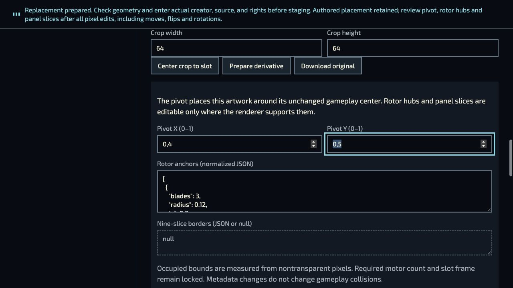
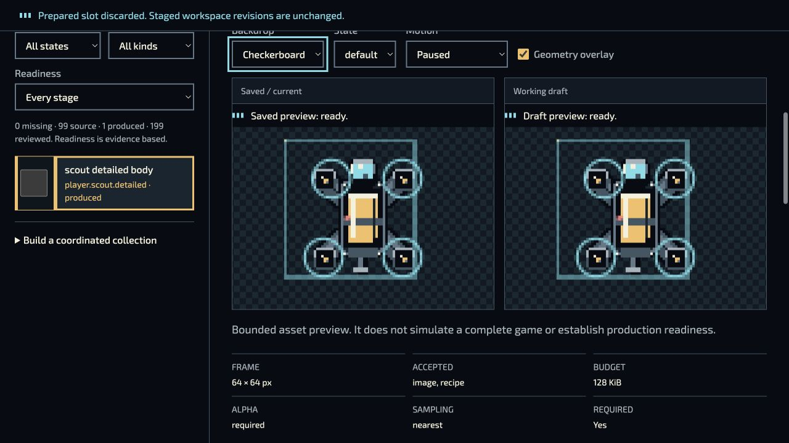

# P04/P17 — native sprite placement and portable transfer

Status: bounded desktop browser journey verified; integration, final release and broader Studio/community qualification remain separate.

Source: `8cffb36b29a38013eb9213845efd675c4864c9d8` plus source-revision correction `bc41e0b01219aec5e173f4e4e81cfb6c8b5d801727e673fbf8096880c9b12da3` and edited-sprite correction `c49429b2958378c9d07cd57be6d0f1d6a20a6e9b27db672c2bfc7144bc407705`. The four served overrides are the final Studio host, helper, sprite panel and inline guide. Every other observed binding matches the committed base.

## Actual browser journey

The test used two fresh local origins, actual desktop pointer/keyboard input, real browser PNG encoding, local Studio persistence and an ordinary file chooser. No DOM event injection or storage seeding was used. Viewports were not overridden; screenshots decode to 1280×720. Both tabs and servers were closed afterward, and neither tab reported console errors.

1. Select **scout detailed body**, edit metadata to pivot X 0.4 and first rotor X 0.3, then stage. The original record remains available.
2. Open **Edit current raster**, paint one amber pixel at (0,0) with Space, then **Prepare edited sprite**. Both authored values remain and the visible status requests placement review.
3. Change crop width from 64 to 60 and prepare. The pivot and first rotor return to slot defaults 0.5/0.25 with an explicit review message. Restore full 64-pixel crop and prepare; values 0.4/0.3 return.
4. Enter truthful QA provenance, stage, Save and Reload. The selected custom revision and geometry persist. Actual decoded PNGs differ at exactly the intended pixel, from transparent to RGBA(244,191,98,255).
5. Export and verify the actual downloaded file exists: 7,406,343 bytes, SHA-256 `45482e2dc5fcf61d8a67178db17921b4b42a6caf7fdc9b9b079a3a9f53fbbea8`. Document r43 contains 1354 asset records and 134 payloads. This is a real native download, unlike the earlier API-created compiler fixture.
6. In a second fresh origin, confirm local save none, import that exact file through the file chooser, inspect the retained geometry, Save and Reload.
7. Bind the earlier approved `player.scout.detailed.field-kit@2`; Undo selects the imported edited revision, Redo selects the approved original, and a final Undo restores the imported edit. No review evidence was fabricated or marked approved.
8. Re-export the imported collection. The actual downloaded file is 7,565,216 bytes, SHA-256 `2cdf5d2086b13db40e21c213181129593828f3c69c52a3085e2618e9f073485e`. All 134 payloads (4,010,515 bytes) are exact. All 1354 prior asset records match after the three explicitly recorded namespace remaps, including every provenance parent.

[UI observations](native-events.json), [download/ancestry](export-receipt.json), [round-trip comparison](roundtrip-receipt.json) and [pixel comparison](pixel-receipt.json) retain the exact outcomes. The source-qualified [native receipt](native-evidence.json) records 297 unique observed bindings per origin, 10,042,970 bytes each. These are deduplicated source bindings, not network traffic totals or request counts. [Origin A bindings](bindings-origin-a.jsonl) and [Origin B bindings](bindings-origin-b.jsonl) retain every hash.

## Compiler handoff

Both Node 20.19.5 and 22.22.2 validate the actual native export and re-export through the ordinary compiler CLI. Node 22 additionally compiles the native export into a new isolated directory: 138 files / 8,297,384 bytes. Every output manifest entry and original payload is verified, and `studio.json` equals the exported document. Manifest SHA-256: `bcfb96cf1691ae094238050671eacd09a89dbb72c91f60e93bfdfdfbdb8a9e9d`.

[CLI commands/results](native-cli-receipt.json) and [unchanged 79-module source proof](compiler-source-proof.json) complement the earlier [portable CLI trial](../p17-theme-review/README.md). The binary inputs/output review tree stay in local QA storage; they are intentionally not adopted into the production collection or frozen release.

## Visual evidence and limits

The additional saved-preview and imported-history screenshots preserve their partial viewport framing; they are not claimed to show every control or history row. Screenshot API bytes were JPEG; an initial receipt incorrectly assumed PNG dimensions. Filenames/dimensions were corrected using actual decoding without altering image bytes, and the prior local receipt remains retained. System Python lacked Pillow; the pixel comparison used the bundled workspace Python instead. Neither correction changed product code or test assets.

This closes the observed native actor edit/prepare/crop/save/reload/download/import/history/re-export path on the exact candidate. It does not qualify every sprite tool, native panel nine-slice, external replacement-file upload, every mode preview, touch-only/controller-only use, physical devices, all failure/race cases, full community production or public deployment. Prior no-op browser tooling attempts remain historical failures; this successful fresh-session trial does not retroactively qualify them.

The QA pivot/rotor offset and corner pixel intentionally test metadata retention; they are not approved new game art. Player saves, earned pictures, immutable releases and public defaults were not changed. Continue normal exact-source qualification and publication before accepting this as a public feature.
