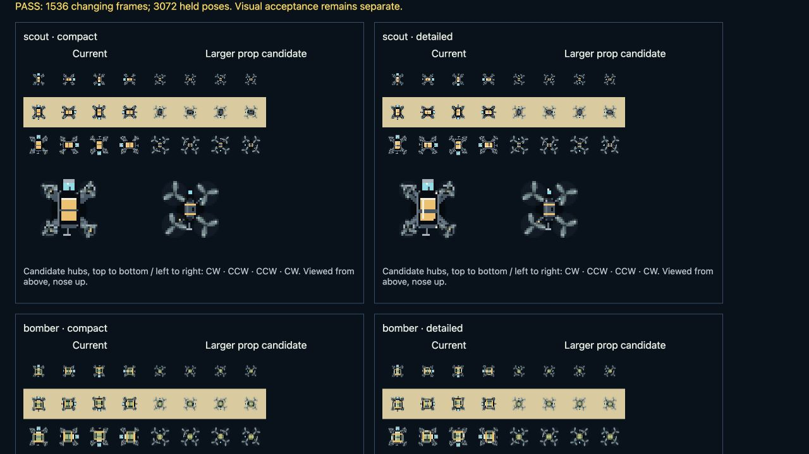
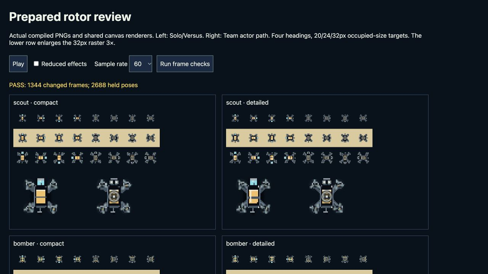

# C1-A declared rotor correction — source evidence

Base: `bb9b3640270dc26633d37cfdf4a306aecda277b6`. Candidate scope: restore the already-declared prepared player rigs across Solo/Versus and Team, use one connected-blade primitive, and make the shared actor sampler alias-aware. No asset bytes, anchors, campaign identities, simulation rules or saved artwork are replaced. Prepared patrol geometry still has no rig; that requires a separate reviewed successor.

## Subsequent proportion and handedness revision — 28 September

The user rejected the first moving rig's small propellers and selected the richer generated roster as the visual target. The earlier C1-A evidence below is a baseline, not current art approval. The [new comparison](proportions.html) uses sixteen separately exported native candidates and the actual `imagePresentation` adapter. [Reference review](../../drone-reference-review.md) records all 22 supplied images and 24 additional official sources, including which photographs were actually inspected.

- Quads: radius 0.205 of the frame versus 0.12, smaller motor bells, and explicit props-in directions. The carrier has six two-blade hubs with independent sweep clearance and alternating directions around its perimeter.
- The shared primitive mirrors opposite-handed blades and tip markings. Both production renderer paths and procedural fallback paths pass explicit handedness; already-signed phase and authored offsets are unchanged.
- Optional `direction`/`phaseDegrees` fields survive the real asset validator/adapter. Missing values preserve historical timing. Old strict readers cannot consume new extended revisions; no old record is rewritten. The CCW painted profile intentionally changes, so unchanged source PNGs do not mean pixel-identical animated frames.
- Fresh browser raster result: **1,536 changed frame comparisons, 3,072 held paused/reduced poses, zero failures** across all sixteen candidates, two shared painter paths, 20/24/32 occupied CSS pixel targets, four headings and 4/30/60/120 sample rates. Controlled sampling is not measured device FPS.
- Current focused runtime/geometry cohort: **148/148**. Renderer/loader cohort: **25/25**, after correcting one stale loader mock. The old mock ignored the image-acquisition predicate and treated metadata requests as image loads; it reproduced without handedness changes. The correction retains every prior assertion and additionally requires the metadata request.
- Independent review found no blocking geometry/reader/provenance issue and reproduced the native files. Both richer generated body studies remain unregistered source artwork with facing, margin, alpha and native-detail preparation work recorded in their metadata.

Keyboard interactions exercised Slow inspection, renderer selection, reduced effects and explicit Pause/Play. Actual screenshot viewport: 1280×720 CSS pixels, DPR 2; each review canvas remains native 384×302 at 384×302 CSS pixels. An exact-label automation lookup failed to locate the renderer select; the observed combobox role succeeded. This is browser interaction, not touch/controller/device certification.

The native candidate body detail is still more restrained than the approved concept. Team's centre/nose overlays visibly obscure equipment detail, as in the baseline. Resolve body richness and this overlay hierarchy before production adoption. Full-board edges/crowding, responsive play, memory/frame-time baseline, retained original journeys and public/device checks remain open. See [the exact source/evidence inventory](proportions-evidence.json). No asset collection, immutable production history, public version or release is changed by this candidate.

## Earlier C1-A browser raster review

Serve the repository and open [review.html](review.html). This fixture decodes the exact fourteen compiled FPV player PNGs, uses the shipped character and Team actor drawing paths, and exposes Pause, reduced effects and controlled sampling. It does not instantiate a full game, measure real device FPS or alter player storage.

On 28 September 2026 the in-app Chromium browser reported **1,344/1,344 changed frame comparisons and 2,688/2,688 held paused/reduced poses**, zero failures: seven classes × two treatments × two renderer paths × three occupied-size targets (20/24/32 CSS pixels) × four headings × four sample rates (4/30/60/120). These are canvas-pixel comparisons, not only phase-clock assertions. The first check's input call timed out while the synchronous raster sweep ran; the next inspection showed successful completion, not a retry or a failed rendering result.

Native visual inspection covered the displayed scout compact/detailed poses on dark and light backgrounds and their enlarged rasters. Attached curved/swept blades are visible without the former outer white corner bars. Broader class-by-class art taste/readability and full-board crowded play remain open; the all-class pixel matrix proves motion and holds only.

## Focused verification and limits

The combined eight-file runtime/geometry/readability/animation/live-inventory cohort
passes **141/141**, zero failures/skips. Repository lint, game formatting, native
formatting, validation and Motion Lab syntax pass. The initial broader run retained
two failures: one obsolete test expected the removed outer rotor circle (corrected
to assert actual connected blade paths), and the production-review assertion below
remains intentionally blocking canonical adoption. Do not add these overlapping
counts together or describe the production guard as passed.

- BoardPainter tests invoke the actual Solo/Versus painter with compiled geometry at 240/390/1152px, compare painted command streams, retain manual override precedence, and verify unchanged simulation/asset data.
- Team tests cover both pilots, playing/paused/downed/reduced, actual connected polygons and alias bounds for 2/3/4 blades at 4/30/60/120 FPS including wrap.
- Primitive tests preserve inherited alpha/canvas state and keep polygons connected to the hub within the declared radius. Prepared radius normalization does not mutate source recipes or geometry.
- The renderer/body-bounds/readability/motion tests retain the physical contact radius and conservative edge envelope. No broad input or campaign playthrough is claimed by these renderer tests.
- The existing production-review guard intentionally reports changed Team source as unreviewed until the canonical publisher adopts the new reviewed fingerprint. Do not change that assertion, rewrite an old approval, or call a source candidate a released theme.

Rerun relevant files and `scripts/test-actor-coverage.mjs`, required lint/format/validate/source/provenance/build gates on the integrated release. Public play, exact deployed bytes, full boards on all required viewports, background restoration, replay/offline and physical devices remain release/qualification work. Long suites are currently waived by repository policy and are not reported as passing.

## Copyable maintainer prompt

> Improve one declared moving-part rig using the shared rotor primitive. Preserve exact original PNGs, pivots, collision radius and accepted picture bindings. Confirm whether the bitmap has baked blades before adding a layer. Use frame-local radius and motor hubs; blades begin at the hub and remain inside their envelope. Bound phase advance for the densest repeating blade pattern, preserve counter-rotation and pause/downed/reduced state. Compare actual decoded render frames at 20/24/32 CSS pixels over bright and dark pictures, four headings and 4/30/60/120 Hz. Register every new renderer source in the consuming provenance groups and retain historical approvals. Report source, raster, whole-game and device evidence separately.

## Independent review

A second agent inspected the final source and the saved browser raster. It found
no additional runtime blocker and confirmed attached hubs, bounded phases, held
states and original-image precedence. It identified a pre-existing C3 concern:
Team's center/contact and nose cues obscure more of a small craft's body than
Solo's. Keep functional contact information, but review that overlay hierarchy
during C3 instead of broadening this rotor correction.

The review fixture now reuses one small raster per entry and yields between
cohorts. Its fresh keyboard-activated rerun reproduced all 1,344 changed and
2,688 held pixel comparisons. This corrects review-tool resource churn and keeps
the check responsive; it is not a measured whole-game performance improvement.
