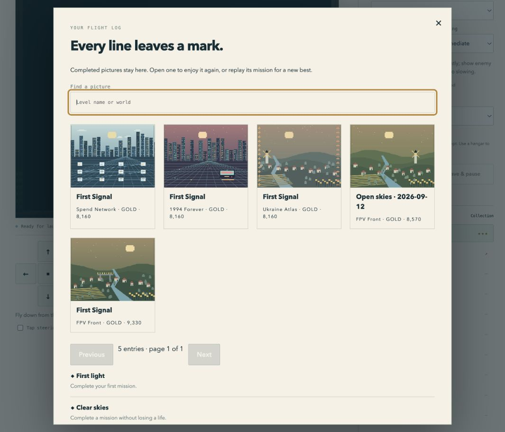
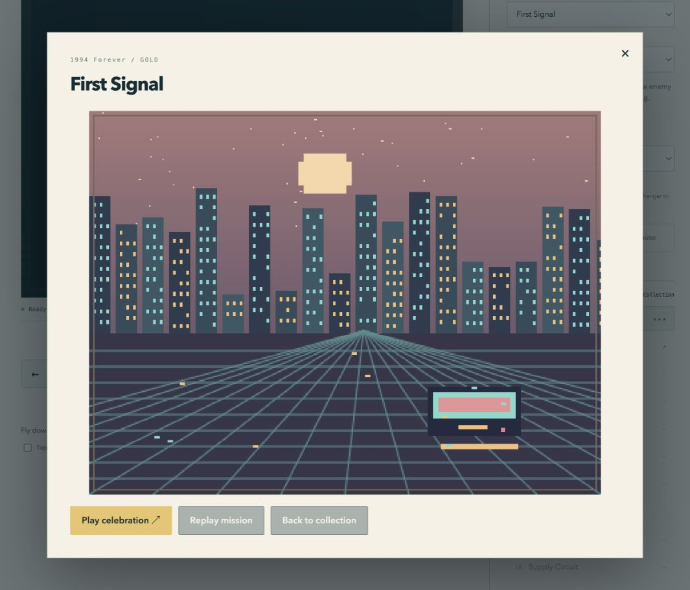
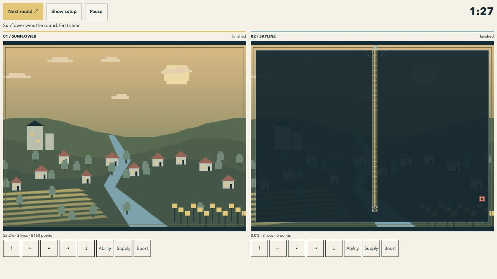
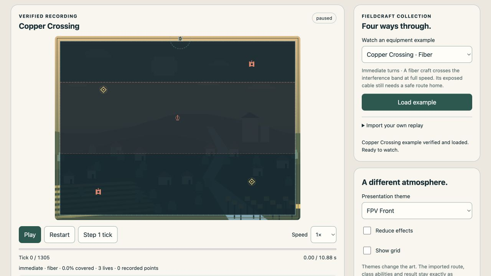

# Round 11 — v0.2.0 browser release verification

Date: 2026-09-12. This record separates deterministic behavior checks, actual browser interaction, responsive layout measurements and deployment/device work that has not been performed. The immutable artifact identity is recorded separately after the source tag is built.

## Delivered scope

- 12 campaign maps and 10 expansion maps across Night Shift, Living Threads and Fieldcraft; four presentation worlds and seven class recipes.
- Immediate and grid-center steering; fixed-tick capture, objectives, patrols, bosses, signal zones, supply pads, support fields, cable/cut/mission limits and safe-hangar class changes.
- Original synth, chiptune, rock, metal and ambient synthesis; volume, previews, pause/mute and reduced-effects controls.
- Animated completion reveal, earned-picture collection, local scoreboards, achievements, dated challenges, portable packs and suspended live-cut continuation.
- One writing profile tab, preserved incompatible data, full-backup replacement/Undo and journaled failure recovery. Session-only pages can export without overwriting another tab.
- Two-player couch races, editable live playground, four verified Replay Theater examples and a static offline distribution.
- Authoring guides, 12 installable project AI skills, prompt variations, source/reference import tooling and immutable release CLI.

These counts describe shipped maps/recipes, not unique hand-painted illustrations for each map. Presentation remains replaceable independently of rules. Uploaded content selects registered behaviors; packs cannot execute arbitrary scripts. Military roles are fictional arcade abstractions. Reference research and Telegram acquisition tooling do not grant redistribution rights to source artwork; Telegram artwork is not bundled.

## Automated evidence

| Check | Result |
|---|---|
| `npm test` | 450 passed, 0 failed/skipped |
| `npm run lint` | Passed, including browser/Node environment checks |
| `npm run format:check` | Passed |
| `npm run validate` | 79 source build files; 12 base maps, 4 themes, 7 classes |
| `node scripts/verify-campaign.mjs` | 24 verified campaign clears |
| `node scripts/verify-packs.mjs` | 20 verified expansion clears |
| `node scripts/verify-specialty.mjs` | 70 records: 8 equipment clears, 56 class/turn fallback clears, 6 matched omission comparisons |
| `node docs/verification/round-11/run-balance-survey.mjs --check` | 252/252 baseline configurations, 504 attempts, 520,128 input ticks reconstructed |
| `python3 -m unittest discover -s authoring/media -p 'test_*.py'` | 24 passed |
| Project skills with installed `quick_validate.py` | 12 validated |

The 252 baseline configurations plus 56 Fieldcraft configurations cover all 22 maps × 7 classes × 2 steering policies. An authored route establishes reachability and equipment behavior; it does not establish human difficulty, enjoyment, spontaneous discoverability or universal performance. The [balance matrix](round-11/balance-matrix.json) records the source fingerprint and route outcomes. Three source-only navigation warnings are intentional: those links are hidden in release builds.

The full suite includes journal interruption/rollback, actual guarded profile replacement from unknown corrupt bytes, stale-writer generations, retained embedded image bytes, replay tampering/cancellation, bounded histories, audio lifecycle, simultaneous couch results, controller input mapping and offline inventory failures. Injected controller/storage cases are not physical-device tests.

## Browser interaction evidence

These checks used the in-app browser and visible controls, rather than injecting progress or reading hidden application state:

- Completed First Signal in all four worlds. The complete artwork opened, scores were shown and the collection retained five earned pictures including a dated challenge. Gallery search found the displayed Ukraine Atlas world name. Gallery Replay mission retains its recorded seed.
- Tested both steering policies. Reloaded progress remained available. Opening settings/help/collections and loss of focus paused play and released input.
- Installed all three example packs. Played Night Shift, suspended an unfinished attempt at 6,105 ticks/50.875 seconds with two lives after changing scout to fiber, then loaded the verified flight. Fieldcraft fiber movement and a saved live cut were exercised through controls.
- Exported a complete backup, imported it and used Undo through native IndexedDB and Web Locks. Malformed imports left the prior data available. A second tab changing its class did not overwrite the owning tab's class preference. Corrupt-store failure injection is covered by the automated suite, not a claim of browser quota exhaustion.
- Checked all five four-second music previews through native AudioContext activation. This verifies UI/audio lifecycle; subjective musical quality and physical speaker output were not measured.
- Finished a three-round couch match 2:1 with separate player controls. Pause stopped both boards; resume and rematch worked. A fresh heavy-carrier round on Switchyard also started and paused after the final bootstrap fix.
- Replay Theater stepped a single tick, restarted, played at 2× and verified Copper Crossing at 1,305 ticks/74.1% and Switchyard at 1,210 ticks/71.1%. Switchyard finished as heavy carrier after starting as light carrier. Final checkpoints matched `861a6de2ffd7e119` and `3ffd4d9c313e9e34`. Changing the presentation to 1994 Forever did not change that result. An invalid import preserved the previous recording. Playback grants no progress.
- Theater playback focus at 1280×720 showed the entire 640×480 board from y≈94 to574 and its transport from y≈590 to634. The visible screenshot is retained below.

## Responsive evidence

[Measurements](round-11/viewports.json) cover 390×844, 844×390, 1024×768, 1280×720, 1065×912 and 320×640 CSS pixels using real same-browser game iframes. All six solo and all six focused couch fixtures reported a visible arena, no horizontal overflow and visible measured gameplay actions. Phone/tablet/window controls measured at least44×44; the desktop mouse layout has a34×28 minimum and coarse-pointer CSS enlarges controls.

These fixtures are not iPhone/Safari, touch-digitizer or game-controller emulation. Settings, collection lists and authoring forms may scroll; the arena/action check is not a claim that the whole document fits one screen. A failed early couch fit is retained in [pre-fix measurements](round-11/viewports-before-final-fit.json). Adding a masthead link subsequently caused compact solo controls to need scrolling; moving it to the footer restored the compact fit.

## Artifact and offline evidence

Pre-tag candidate builds were served under the production CSP and correct MIME types; missing assets returned404. A candidate cached80 verified files, its dedicated preview server was stopped, a fresh page reopened from that cache and a real grid-mode First Signal clear completed. An earlier independent candidate also reopened offline. Those candidates had different bytes from the final source and are not the final release identity. The final tagged distribution requires its own manifest/hash/offline record below or in the companion artifact report.

## Remaining target gates

The browser implementation can be packaged and tested locally. No public host/domain has been provisioned, and no external upload is implied by local release snapshots. Physical iPhone/Safari, hardware controllers, low-memory devices, human sound/feel/accessibility playtests and native/store packaging have not been certified. Network multiplayer remains a documented server-authoritative extension boundary; there is no live network service. Local scores are editable local records, not authenticated competitive rankings.

The latest research review retained background visibility pausing ([MDN](https://developer.mozilla.org/en-US/docs/Web/API/Page_Visibility_API)) and identified full custom input remapping as a useful next accessibility addition ([Game Accessibility Guidelines](https://gameaccessibilityguidelines.com/allow-controls-to-be-remapped-reconfigured/)). Current keyboard alternatives and standard controller mapping do not constitute arbitrary remapping. Do not describe a passing test suite as proof that the game is perfect, universally accessible or guaranteed to retain players. Use the concrete [public-release gate](../public-release.md) for each advertised target.
