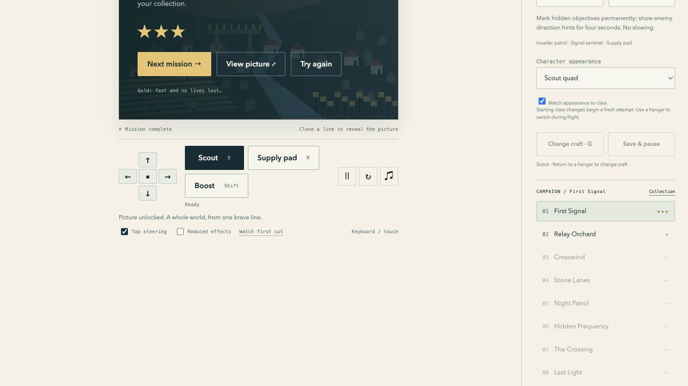

# Frozen v0.2.0 artifact

Source tag `v0.2.0` resolves to `eec303cc67914fa6a90db6bd209d41f2e7195ecb`. This report is a later documentation commit and does not alter or retag the frozen source.

| Artifact | SHA256 |
|---|---|
| Distribution ZIP | `0db2135c8290bcbffa342bcba4768e1ccf80391229495c923364892970f9f429` |
| File manifest | `2bc8c25e70e691b32b57efb30534bbb036733eaec5e2ea3466ec5b853fdefe18` |
| Exact source archive | `6ec3cf2fde57a4d478ab0c5e4593588baede255a6020bc80ad416acad9496de5` |

The distribution manifest lists91 files and8,157,540 uncompressed bytes. Each file's size and SHA256 matched, ZIP CRC checks passed, and rebuilding the extracted source archive independently produced the same ZIP and manifest bytes. [Machine-readable result](release-integrity.json).

Earlier v0.1.0, v0.1.1 and v0.1.2 distribution hashes still match their saved release metadata. They remain independently playable in the local version index. Compare profile state using separate origins where isolation is needed.

The frozen website was served at a dedicated local origin, `http://127.0.0.1:8793/`, with the generated production CSP/MIME headers. The landing page displayed the exact source revision and links to solo, couch, Replay Theater, playground, privacy and credits. Missing assets returned404.

Through the game's Settings, **Prepare offline play** verified88 shipped cache files. The owned8793 preview process was then stopped; `curl` returned connection failure/status000. The following checks used that stopped origin:

- A grid-mode First Signal cut completed at52.2%,8,160 points and three lives, with its picture added to the collection.
- A fresh navigation reopened the solo page and retained earned progress. With Tap steering explicitly enabled, Immediate mode completed the same real cut and reward.
- Couch loaded, started both boards and paused both through its visible controls.
- Replay Theater loaded Copper Crossing, played it at2× and matched final checkpoint `861a6de2ffd7e119` at1,305 ticks/74.1%.
- The playground and its real practice iframe loaded from the cache.

This tests loss of the preview server, not every network/device failure. Browser storage eviction can remove cached files and saves. Native iPhone/Steam packages, physical touch/controllers, a production host and human enjoyment/accessibility playtests remain outside this evidence. See the [round report](../round-11.md) and [public-release gate](../../public-release.md).

Known follow-up found during this pass: v0.2.0 derives Tap steering from the pointer type on each reload; it does not persist an explicit override. A later iteration will preserve that preference and add configurable keyboard bindings. The frozen artifact remains unchanged.

On the existing source server, play at `http://127.0.0.1:8767/releases/v0.2.0/site/game/` or open the sibling site root for all modes. Download `releases/v0.2.0/site/distribution.zip`; preserve the adjacent release metadata and source archive. No public host was provisioned or uploaded by this verification.
