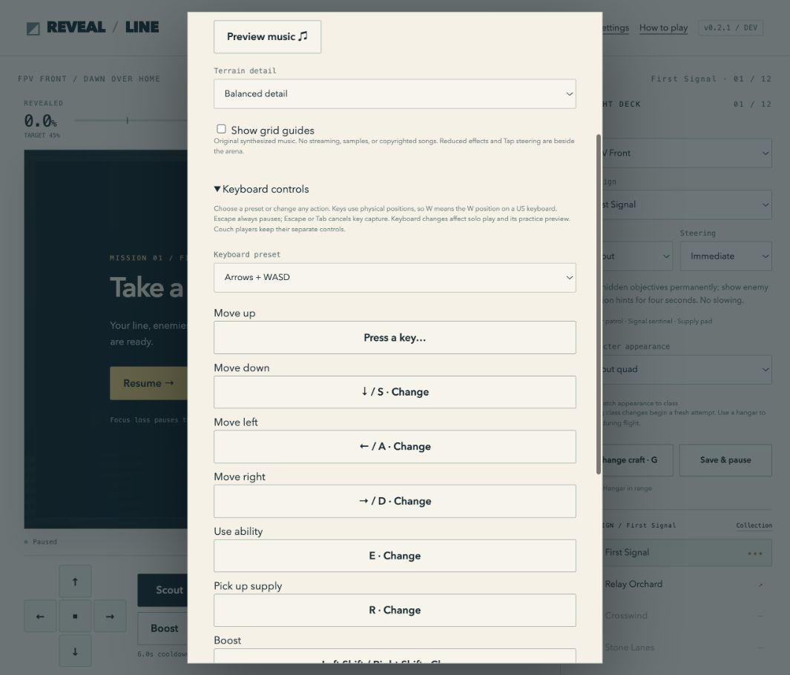

# Round 12 — persistent, configurable controls

Date:2026-09-12. This iteration follows the immutable v0.2.0 artifact and preserves it unchanged.

## Result

v0.2.1 adds ten configurable solo keyboard actions, three presets, a validated capture UI, dynamic key hints and persistent Tap steering. Escape remains available for pause. Tab/Enter/Space and browser/system key combinations retain native behavior. Keyboard capture cancels on Escape, Tab, another control receiving focus, dialog closure or window blur. Existing rules, maps, class recipes and replay command formats are unchanged.

New packaged versions use their own build label in profile, pack and suspended-slot channels. This avoids forward-schema changes affecting old executable versions. A complete backup transfers a previous collection into a new release; there is no automatic destructive migration of an archived version's storage. Solo and couch use the same version-specific pack channel. See [controls](../controls.md) and [versioning](../versioning.md).

## Automated checks

- `npm test`:486 passed, zero failures/skips.
- `npm run lint` and `npm run format:check`:passed.
- `npm run validate`:81 included source files; all literal build references valid apart from the same three intentional source-only navigation warnings.
- Key-binding tests cover all actions, bounded hostile data, duplicate/reserved keys, physical Ukrainian-layout events, legacy fallback, holds/releases/remap transactions and equal authoritative checkpoints in both turn modes.
- Input adapter tests cover remapped movement, equipment impulses, ignored chords/composition, custom Stop/Pause, release after focus moves to an editor and clearing held commands during remapping.
- Settings-controller tests cover validated adoption, failed/cancelled capture, presets, session-only warnings, shortcut preservation, focus changes and teardown.
- Library tests cover additive old-profile migration, tap tri-state, detached keyboard data, export/storage round trips, invalid preference atomicity and protection from unrelated stale saves.

The broader campaign/Fieldcraft proofs from [round11](round-11.md) remain relevant because this change does not alter their hashed simulation/content inputs. A keyboard remap is normalized before reaching the recorder or simulation.

## Native browser interaction

Using the live source UI:

1. Assigning D to Ability was rejected because D already moved right. The old E mapping remained.
2. Escape cancelled capture and kept Settings open. Valid V→Ability and J→Hangar assignments changed the displayed hints.
3. After a full reload, V/J and the explicitly enabled Tap steering checkbox remained. Earned progress and installed expansions were retained.
4. During an actual flight, V displayed the scout's marked-objective/direction-hint feedback. J opened the hangar and paused the flight.
5. Right-hand preset applied, Tab cancelled a pending change without trapping focus, and Restore default keys returned to Arrows+WASD/E/R/G/X/Escape/P.

[Six responsive measurements](round-12/viewports.json) again show the whole arena, no horizontal overflow and visible measured actions from320×640 to1280×720. They are same-browser CSS fixtures, not physical iPhone/controller/accessibility certification. Keyboard settings are scrollable inside the modal; their buttons retain at least44px height.

## Release boundary

The final frozen tag, artifact integrity and cross-version backup check are recorded after packaging in the companion release report. v0.2.0's hash/offline evidence is preserved [here](round-11/release-v0.2.0.md). Network multiplayer, arbitrary controller remapping, native/store projects, physical-device playtesting and external hosting are not supplied by these keyboard changes. The [public-release gate](../public-release.md) still applies to each advertised target.
