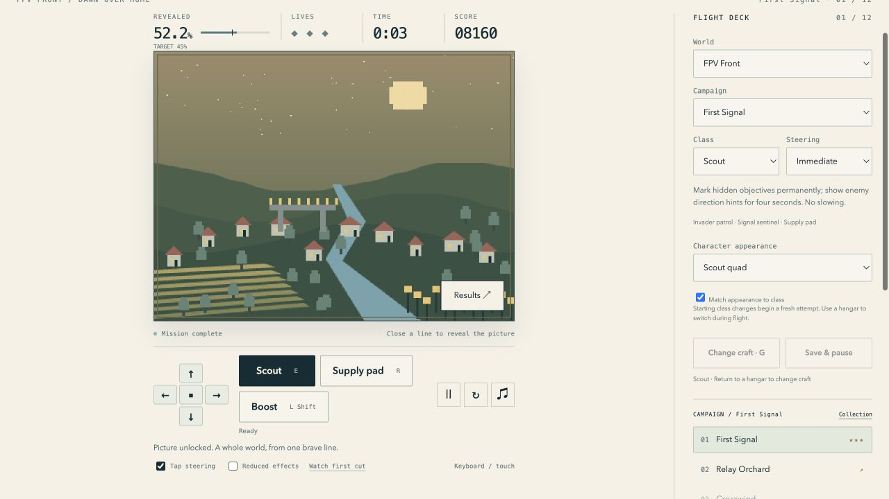

# Frozen v0.2.1 artifact

Tag `v0.2.1` resolves to `147616ff1ac6f272193eb15ca9df9d1c158e8d29`. This later verification record does not alter that tag or the archived files.

| Artifact | SHA256 |
|---|---|
| Distribution ZIP | `1a0c88d4758e65826af0c1fcebdb55181cd3f2d77ea6f7b8413a1894997daafd` |
| File manifest | `76f6d6e3a36a3d2b14411a76c8fb59560e7bbe3b19e5614722b22fd10a1f0774` |
| Source archive | `97323071e6a38e8ebe61797a12e8adda25a3087253e40915589d0617a715dc57` |

All 93 manifest files/8,183,970 uncompressed bytes matched their recorded hashes. ZIP member hashes and CRC checks passed. An independent build from the extracted source archive produced the identical ZIP and manifest. [Machine-readable evidence](release-integrity.json). Distribution hashes for all five playable archives, v0.1.0 through v0.2.1, still match their preserved metadata.

## Saved collection transfer and isolation

On the same source-server origin, the v0.2.0 page initially displayed00/12 campaign completions. A fresh v0.2.1 page received an earlier complete backup through **Library & saves → Saves & loads → Load this JSON**. The native browser import succeeded and offered Undo. Its capacity display showed two pictures and two campaign records; the saved slot identified the unfinished Midnight Channel flight. These are the backup's actual contents, not all currently shipped example packs.

Opening v0.2.1 Couch race on that origin exposed the imported Night Shift and Living Threads maps, confirming that solo and couch resolve the same new pack namespace. Returning to v0.2.0 produced the exact same visible DOM snapshot as before the transfer, including00/12 and its original campaign selector. The older collection had not been overwritten.

## Packaged offline interaction

The frozen v0.2.1 site was served on an owned dedicated preview origin at `http://127.0.0.1:8794/`. Its new key-binding module returned the correct JavaScript MIME type under the generated production CSP. **Prepare offline play** verified90 shipped cache files.

That preview server was stopped and connection checks returned status000/connection failure. A grid-mode First Signal cut completed at52.2%,8,160 points and three lives. A fresh navigation reopened the game from its cache with the earned progress and explicit Tap steering setting retained. Changing to Immediate mode then completed a second real cut without re-enabling Tap steering. The full picture and result controls remained available.

The [round12 report](../round-12.md) records486 passing tests, native remapping interactions and six responsive fixtures. The broader [round11 report](../round-11.md) covers campaign/equipment proofs, couch matches, four worlds, gallery/backups and Replay Theater. Those simulation/content proofs were not rewritten by keyboard preferences.

This is a locally verified browser artifact. It is not a claim of a public deployment, native/store package, live network service, hardware-controller or iPhone/Safari certification, or proven player retention. Keep the [target-specific release gate](../../public-release.md) with the artifact.

Play on the existing source server: `http://127.0.0.1:8767/releases/v0.2.1/site/game/`. The site root exposes all modes; `releases/v0.2.1/site/distribution.zip` is the portable static distribution. Preserve its sibling release metadata and exact source archive for reproducibility and rollback.
