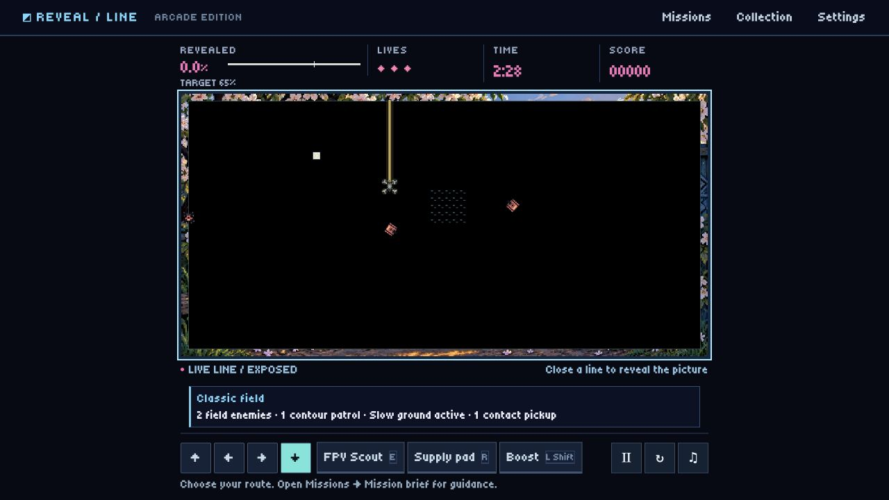

# First Light R2: playtest revision

Status: **v0.25.0 is a verified local playtest release**, frozen from `da557b2d5926017943ade53bf365d8f1f247160b`. All six exact-source gates passed, with 2,152 tests passing and none skipped. This release addresses the latest feedback; the full roadmap is not complete. This is the response to the eight deficiencies reported in v0.23, not completion of the whole P0–P9 roadmap.

## Change and evidence register

| Requirement | Change | Acceptance evidence |
| --- | --- | --- |
| Stop on closing a cut | Optional `rules.stopOnCapture` in level.v4; solo/couch clear intent before the next substep | 12 core checks; actual solo save/load/both turning policies; four couch keyboard/controller multi-substep regressions. Archived recipes unchanged. |
| Stronger pressure | Separate 65/75/85% R2 chapter; faster field motion, contour, rover, erosion, terrain/pickups and telegraphed lanes | 12 normal-input verified routes; release tick after each nonterminal capture. Old timed routes fail on R2, and remain valid in their own edition. Human challenge assessment still pending. |
| Character animation and size | Facing-aware four-theme enemy bodies, moving treads/rotors, CSS-size compensation for enemies and player | 97 affected presentation/host checks, including a real-host detached-canvas regression and two expected pre-fix failures; separate contact markers and Pause/Freeze/reduced-effects support. Browser inspection performed; no physical-device claim. |
| Cut and capture feedback | Bright contrast core, bounded short tails and newly secured-cell sweep | Cosmetic effects never modify coverage/score; replay checkpoints unchanged. |
| Keyboard/controller menus | Actual top-modal order, opener restoration, neutral gate after native handoff, Help/achievement readers, ordinary audition controls | 133 affected navigation checks. Actual browser keyboard Title→Missions→Collection→Escape restored Missions and its Collection opener without resuming. |
| Consistent native presentation | Bundled pixel font, sharp controls, full-screen briefing/pause, dark panels; chapter/mission picker enhancement | Desktop and phone browser checks found and corrected legacy arena caps, small-text fallbacks, clipped briefings and landscape overflow. Native chapter arrows/Enter, original-chapter selection and Flight setup/Escape passed. Live-flight layouts fit measured 320×568, 375×666, 390×640, 390×844, 844×390 and 1280×720 CSS viewports; targets remain visible. |

## Scope boundaries

R2 deliberately reuses the three original First Light pictures. It does not count them as additional illustrations or claim a finished video library. P5 shared media storage remains a separate prepared source change and is excluded from this revision. Browser audio backup/download qualification, physical controllers, actual phones/handhelds, signed packages, network play and public deployment retain their separate gates.

The prior v0.23 and v0.24 releases remain independently playable. The [source gates](source-gates.json), [independent artifact audit](integrity.json), [eight frozen HTTP checks](http-delivery.json) and [existing shared-server delivery](shared-server.json) passed. [Requirement/priorities register](../../implementation-roadmap.md) and [reference decisions](../../research/first-light-playtest-r2.md) record why this revision takes priority over bulk production.

## Iteration record

- `adf34d7`: 2,146/2,149 tests passed. Two catalog/difficulty checks were stale and the R2 landing launch card was missing. The release was not frozen. Full failed evidence remains in `.cache/round-34/revision-verification-adf34d7db1d0/`.
- `5d9d83e`: all 2,152 tests and six gates passed after catalog and offscreen-canvas sizing fixes. Browser inspection then caught a wrapping phone objective caption; this candidate was superseded before freezing.
- `6d4e5dc`: all 2,152 tests and six gates passed. A live-flight check at short phone heights exposed overflow not present in the paused view. Width/height-based compact controls corrected it before the final candidate.
- `da557b2`: final candidate includes the tested compact controls. The [source-browser measurements](source-responsive.json) record real UI inputs and public layout data, separately from physical-device evidence.

The sizing negative control removed only the visible-canvas handoff from a temporary app copy: both 306px and 600px actual-host cases failed as expected. No shared source was modified by that negative run. Raw positive/negative logs are in `.cache/round-34/display-width-final/`.

## Frozen verification

Play [v0.25.0](http://127.0.0.1:8767/releases/v0.25.0/site/game/) and choose **First Light · Revised challenge**. The isolated test copy is also running at http://127.0.0.1:8878/game/. Tag `v0.25.0` is annotated object `e51019404f4798c75e0efeacafc54360e67d6750`. No public deployment was performed.

- Independent fresh Git archive and tested source archive are byte-identical: 1,249 files. An independent build from that archive matches all 185 frozen loose files; 182 ZIP entries, CRCs and payloads match.
- All 29 earlier release trees (3,565 files) and 30 earlier tags remain unchanged. The release index contains exactly the prior entries plus v0.25.0.
- Offline artifact identity passes for 178 files / 56,163,539 bytes. This is artifact verification, not a new server-stopped v0.25 browser-installation claim. The actual frozen v0.24 offline MP3 check remains separately recorded in round-33.
- Frozen browser: directional title navigation → R2 install/briefing → keyboard tap-to-fly → live cut → Pause. Bundled font loaded; opaque black field, enlarged FPV/enemies and bright cut inspected.
- Frozen nested menus: Missions → Collection → Escape restores the Collection opener inside Missions and stays paused. Settings → Sound Studio → Escape restores its opener and stays paused.
- Frozen chapter picker: ArrowDown/Enter installs the original First Light, which shows its own 60% goal and continuous-capture contract. Selecting R2 restores 65% and the cut-stop contract.
- Frozen Studio opens and reads its saved library on a fresh origin. This pass does not claim another actual MP3 upload/download round-trip or physical-controller certification.

The separate prepared P5 manager was persisted after this release in `dd6c1f7`. Its [73 focused checks](p5-prepared.json) passed, including current host integration and modeled archived-adapter compatibility. It is absent from the v0.25 archive. Real migration/recovery, poster/video authoring, receipts, Undo and end-to-end media qualification remain open.
