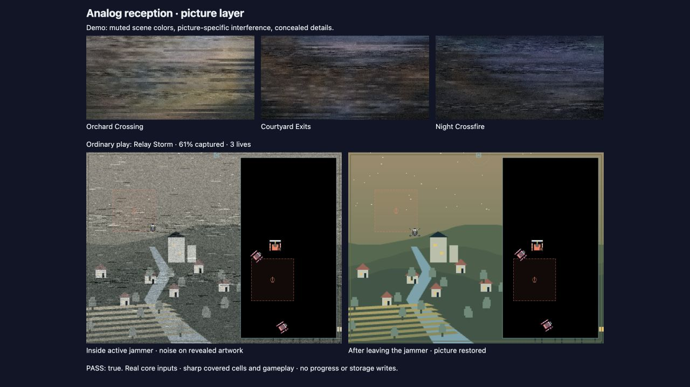
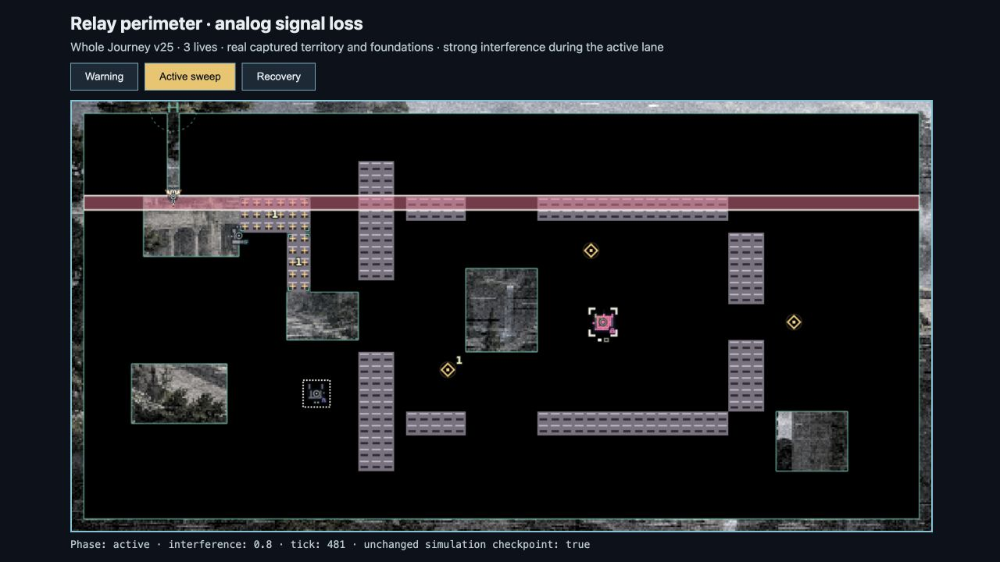

# Picture variety and ordinary jammer reception — 2026-09-29

Implemented on the shared main checkout; unrelated concurrent changes were preserved.

## Picture behavior

- Demo: the existing fixed softening, horizontal displacement and dropouts remain. A 42% blend of **heavily blurred broad chroma**, then dimming, retains roughly one-third of source saturation. Fine chromatic detail is excluded. Monochrome snow amplitude is 0.68, and the exact picture fingerprints its noise sequence. Related source palettes remain related; the effect does not invent different reward art.
- Ordinary gameplay: the same shared procedural noise is applied to the picture only when the core's resolved `signal` reports an active received jammer and no resistance. Slowdown and blocked controls scale intensity. The original returns immediately on recovery, suppression, immunity, terminal states or full reveal.
- Covered territory, trails, terrain, actors and zone warnings are drawn after the affected picture. Pause freezes time; reduced effects is static and weaker. This rendering introduces no simulation, save or progression changes.
- Independent bounded caches are released on look/level replacement and disposal. Ordinary unreadable sources fall back to the permitted original, while the separate demo policy remains fail-closed.

## Automated verification

120/120 tests passed in 6.35 seconds:

```sh
node --test game/test/analog-signal.test.mjs game/test/demo-picture.test.mjs game/test/jammer-picture.test.mjs game/test/presentation-backdrop.test.mjs game/test/renderer-readability.test.mjs game/test/presentation-renderer.test.mjs game/test/core-systems.test.mjs game/test/boot-build.test.mjs
```

This includes 26 demo/shared-noise tests and 10 jammer tests. Tests cover broad warm/cool separation at equal luminance; concealment of synthetic fine chromatic patterns in individual frames and their 24-frame average; deterministic picture-specific noise; actual signal entry/exit, resistance and suppression; unchanged non-picture draw commands and authoritative checkpoints; alpha footprint; source failure/readiness; reduced effects, pause, recovery, gallery and cache ownership. The tiny actual-module build checks both new modules in its offline byte/hash inventory. Scoped ESLint and Prettier passed on all eight changed runtime/test files.

The synthetic detail tests establish those inputs, not a formal confidentiality guarantee for arbitrary artwork. The protection continues to allow broad scene atmosphere intentionally.

## Browser observation

In the local Codex browser, a temporary authoring page used the actual production `BoardPainter` and picture filter. The top row renders the installed Pressure Lines artwork for Orchard Crossing, Courtyard Exits and Night Crossfire, all concealed. The bottom row runs normal inputs through the unmodified Relay Storm simulation: 628 ticks, seed 1, Interceptor, immediate steering, 60.87% captured and three lives, inside `north-emitter`. A second independent run follows the same inputs, then moves down until reception clears. Both remain running. No profile or storage API is used by this fixture.

The [ordinary input trace](signal-picture-2026-09-29/relay-storm-inputs.json) was independently recorded and strictly replay-verified in Node. The browser fixture re-executed those inputs; its visible checks confirmed active/recovered signal states and an unchanged checkpoint after rendering. Animation and freeze were exercised. This is renderer raster evidence, not a claim of physical-device coverage.



The open game was refreshed and Watch demo restarted to load the new modules. Existing physical device, unfamiliar-viewer and rendered two-hour release gates were not repeated for this visual follow-up.

## Follow-up: timed sweeps on Relay perimeter

The user's next screenshot showed a horizontal sentinel warning stripe. The live paused flight's **Field details** identified **Relay perimeter**, despite its URL retaining a previous `signal-remix` selection. The former zone-only gate could not affect this encounter because it has no `signalZones`.

`jammerPictureStrength` now also follows the authoritative `lane-boss.bossPhase` and the matching relay sentinel's `encounter.phase`. Warning strength is 0.24, active strength is 0.8, and other phases are clear. A missing source, nonfinite lane, defeated sentinel, active enemy freeze or individual stun suppresses that source. Zone strength is resolved independently (including Fiber resistance), and concurrent sources use the maximum. No core, input, persistence or actor drawing code changed.

134/134 tests passed in 11.39 seconds:

```sh
node --test game/test/jammer-picture.test.mjs game/test/analog-signal.test.mjs game/test/demo-picture.test.mjs game/test/encounter-view.test.mjs game/test/encounter-core.test.mjs game/test/renderer-readability.test.mjs game/test/presentation-backdrop.test.mjs game/test/boot-build.test.mjs
```

The 14 jammer tests now include a real Whole Journey v25 Relay perimeter phase cycle, a legacy lane-emitter cycle, freeze timing, stun, missing/defeated sources, Fiber semantics, maximum source strength, and exact non-picture draw-command parity on the sentinel board. Scoped lint/format checks passed; independent code review found no blocking issue.

Browser evidence used the exact current v25 mission, Standard gameplay tuning, its `sentinel-crown-actors-v1` theme and its original assigned artwork. Normal inputs (seed 1, Scout, immediate steering; down for 102 ticks, then neutral through tick 610) create a naturally closed cut. Snapshots at ticks 241/481/565 show warning/active/rest, each with three lives and 395 safe cells including foundations. The Node-recorded input trace strictly replay-verifies. The temporary browser fixture only renders independently simulated snapshots and confirms their checkpoints remain unchanged after drawing; it does not access player progress or storage.



[Warning frame](signal-picture-2026-09-29/relay-perimeter-warning.png) and [recovered picture](signal-picture-2026-09-29/relay-perimeter-recovery.png) document the lighter lead-in and immediate clearing. The user's existing flight was left paused, without reloading or replacing it. Its already-loaded JavaScript receives the change on the next page load.
